# 📱 Android Interview Preparation Guide

> [!TIP] **Master the fundamentals** across 44 sections spanning Kotlin, Architecture, Android Core, UI, Data & Networking, Performance, Testing, and Interview Strategy. Use the mindmap below to navigate your study path.

---

## 🗺️ Study Areas Overview

```mermaid
mindmap
  root((🎯 Android Interview))
    📚 Kotlin Essentials
      Language Deep Dive
      Concurrency & Coroutines
      Data Structures & Big O
    🏗️ Architecture & Design
      Architecture Patterns
      Dependency Injection
      Design Patterns
      🤖 Android Core
      Components & Lifecycles
      Fragments & Navigation
      Services & Background Work
      Permissions & Storage
    💎 UI & Graphics
      Jetpack Compose
      RecyclerView
      Animations
      Custom Views
    📡 Data & Networking
      Room Database
      Retrofit & APIs
      SSL/TLS Security
      RxJava vs Coroutines
    ⚡ Performance & Memory
      Memory Optimization
      Battery Optimization
      Weak References
      GC & Heap
    ✅ Testing & Build
      Testing Pyramid
      Gradle & Build
      ProGuard/R8
    🎓 Interview Strategy
      Communication Tips
      Live Coding
      System Design
      Common Gotchas
```

<strong>Click to expand: Interactive Study Roadmap</strong>

---

## 📂 Browse by Folder

| 📁 Folder | 📝 Description | Files |
|:----------|:--------------|:------|
| **[🏛️ kotlin/](kotlin/)** | Kotlin language, coroutines, data structures | 3 files + README |
| **[🏗️ architecture/](architecture/)** | Clean Architecture, DI, Design Patterns | 3 files + README |
| **[🤖 android-core/](android-core/)** | Lifecycles, Fragments, Services, Permissions | 7 files + README |
| **[💎 ui/](ui/)** | Compose, RecyclerView, Animations, Views | 6 files + README |
| **[📡 data-networking/](data-networking/)** | Room, Retrofit, Security, RxJava | 7 files + README |
| **[⚡ performance/](performance/)** | Memory, Battery, Optimization | 3 files + README |
| **[✅ build-testing/](build-testing/)** | Testing strategies, Gradle, ProGuard/R8 | 5 files + README |
| **[🎓 interview-strategy/](interview-strategy/)** | Communication, System Design, Gotchas | 11 files + README |

---

## 🚀 Quick Links by Topic

### 📚 Fundamentals
- [Data Structures & Big O](kotlin/data-structures.md)
- [Kotlin Language Deep Dive](kotlin/kotlin-language.md)
- [Concurrency & Kotlin Coroutines](kotlin/coroutines.md)

### 🏗️ Architecture & Design
- [Architecture & Clean Principles](architecture/architecture-patterns.md)
- [Dependency Injection (DI)](architecture/dependency-injection.md)
- [Design Patterns & Strategic Questions](architecture/design-patterns.md)
- [Memory & Performance](performance/memory-performance.md)

### 🤖 Android Core
- [Android Components & Lifecycles](android-core/components-lifecycles.md)
- [Fragments & Navigation](android-core/fragments-navigation.md)
- [Permissions & Scoped Storage](android-core/permissions-storage.md)
- [Camera & Media Integration](android-core/camera-media.md)
- [Push Notifications & FCM](android-core/fcm-notifications.md)
- [App Shortcuts & Widgets](android-core/shortcuts-widgets.md)
- [Version Compatibility & Graceful Degradation](android-core/version-compatibility.md)

### 💎 UI & Graphics
- [Jetpack Compose Advanced Patterns](ui/compose-advanced.md)
- [RecyclerView Optimization](ui/recyclerview.md)
- [Animations & Transitions](ui/animations-transitions.md)
- [Custom Views & Canvas Drawing](ui/custom-views-canvas.md)
- [Accessibility & Localization](ui/accessibility-i18n.md)
- [Data Binding & View Binding](ui/data-binding.md)

### 📡 Data & Networking
- [Networking & API Design](data-networking/networking-api.md)
- [Room Database Advanced Patterns](data-networking/room-database.md)
- [SSL/TLS & Network Security](data-networking/ssl-network-security.md)
- [RxJava vs. Coroutines Comparison](data-networking/rxjava-vs-coroutines.md)
- [Biometric Authentication & In-App Billing](data-networking/biometric-billing.md)
- [Feature Flags & A/B Testing](data-networking/feature-flags-ab.md)
- [Analytics & Crash Reporting](data-networking/analytics-crash.md)

### ⚡ Performance & Memory
- [Battery Optimization & Doze Mode](performance/battery-optimization.md)
- [Weak References & Memory Management](performance/weak-references.md)

### ✅ Testing & Build
- [Testing Essentials](build-testing/testing-essentials.md)
- [Testing Strategies by Scenario](build-testing/testing-strategies.md)
- [Instrumentation Tests & UI Testing](build-testing/instrumentation-testing.md)
- [Gradle & Build Tooling](build-testing/gradle-build.md)
- [ProGuard/R8 Obfuscation Gotchas](build-testing/proguard-r8.md)

### 🎓 Interview Strategy
- [Interview Strategy & Communication Tips](interview-strategy/interview-communication.md)
- [Live Coding Strategy](interview-strategy/live-coding.md)
- [System & Feature Design](interview-strategy/system-design.md)
- [Platform Changes & Security](interview-strategy/platform-changes.md)
- [Common Interview Gotchas](interview-strategy/common-gotchas.md)
- [Code Organization & Architecture](interview-strategy/code-organization.md)
- [App Bundle vs. APK Distribution](interview-strategy/app-bundle-apk.md)
- [Lint Warnings to Watch](interview-strategy/lint-warnings.md)
- [Common Interview Red Flags](interview-strategy/red-flags.md)
- [Last-Minute Interview Prep](interview-strategy/last-minute-prep.md)

---
