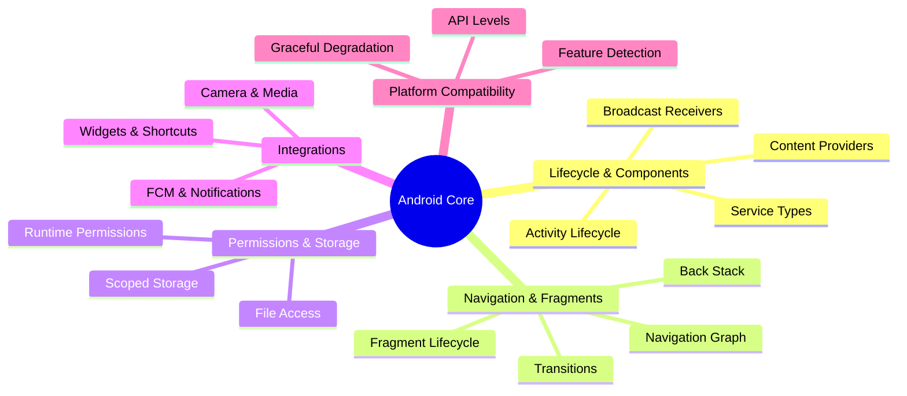

# 🔧 Android Core Features

[← Back to main index](../README.md)

> [!IMPORTANT] **The beating heart of Android development.** Lifecycle management and component communication show deep platform knowledge. Interview frequency: **CRITICAL**.

---

## 📋 Core Features Map

<strong>Android Platform Essentials</strong>

---

## 📂 Files in This Folder

| File | Topic | Description | Key Interview Topics |
|:-----|:------|:-----------|:---------------------|
| **[components-lifecycles.md](components-lifecycles.md)** | Android Components & Lifecycles | Activities, Services, lifecycle callbacks | Activity lifecycle, configuration changes, process death |
| **[fragments-navigation.md](fragments-navigation.md)** | Fragments & Navigation | Fragment lifecycle, Navigation graph | Back stack, fragment transitions, shared element animations |
| **[permissions-storage.md](permissions-storage.md)** | Permissions & Scoped Storage | Runtime permissions, file access | Runtime permission flow, scoped storage pitfalls, MediaStore |
| **[camera-media.md](camera-media.md)** | Camera & Media Integration | ExoPlayer, Camera2, MediaStore | Camera2 state machine, ExoPlayer architecture |
| **[fcm-notifications.md](fcm-notifications.md)** | Push Notifications & FCM | Firebase messaging, notification channels | FCM delivery guarantees, notification priority, channels |
| **[shortcuts-widgets.md](shortcuts-widgets.md)** | App Shortcuts & Widgets | AppWidgetProvider, RemoteViews | Widget update frequency, RemoteViews serialization |
| **[version-compatibility.md](version-compatibility.md)** | Version Compatibility & Graceful Degradation | API levels, feature detection | Feature detection patterns, API level conditionals |

---

## 🔗 Jump to other folders

| 🚀 Kotlin | 🏗️ Design | 🔨 Build |
|:---------|:---------|:--------|
| [Kotlin](../kotlin/README.md) | [Architecture](../architecture/README.md) | [Build & Testing](../build-testing/README.md) |

| 🌐 Data | 💡 Strategy | ⚡ Performance |
|:--------|:-----------|:--------------|
| [Data & Networking](../data-networking/README.md) | [Interview Strategy](../interview-strategy/README.md) | [Performance](../performance/README.md) |

| 🎨 UI |
|:------|
| [UI & Graphics](../ui/README.md) |
