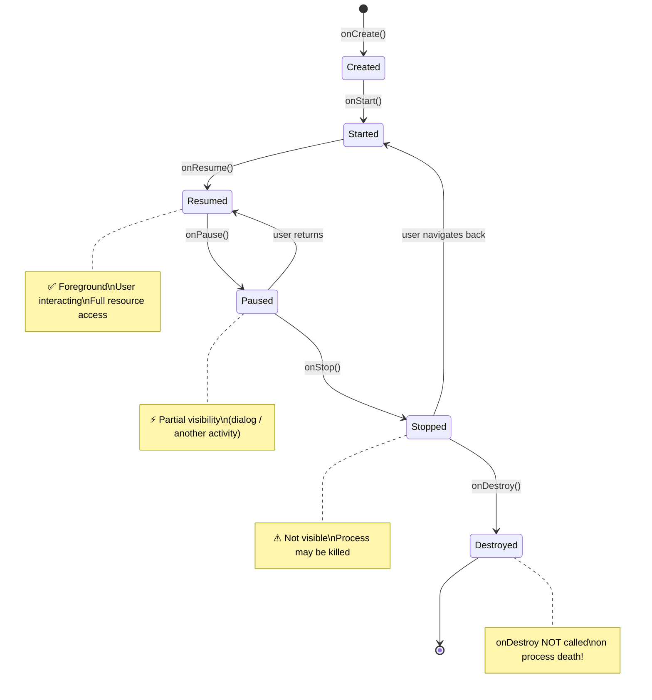
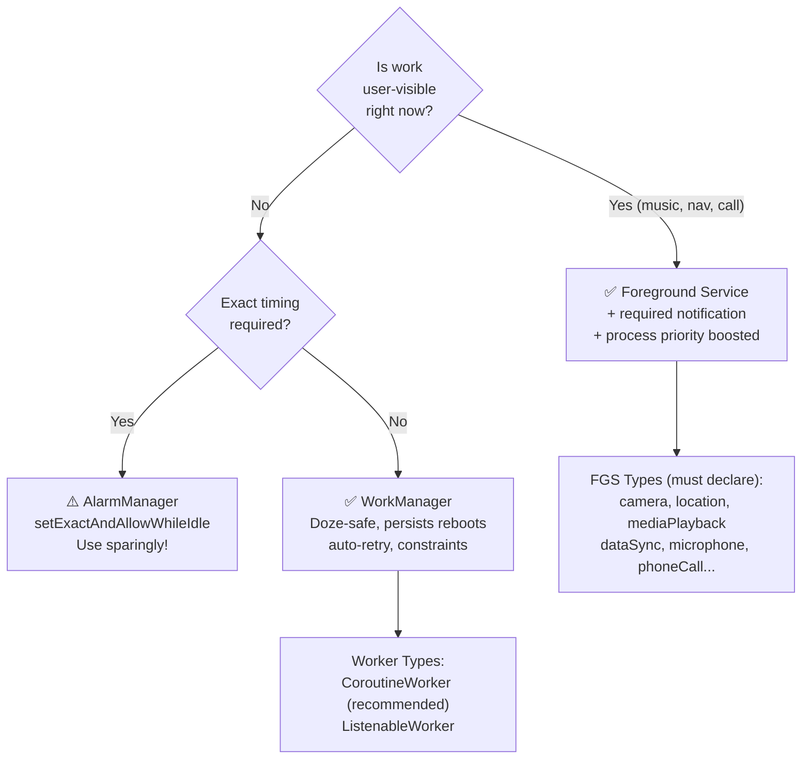
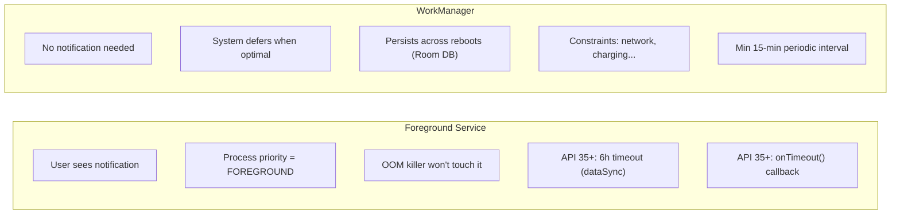
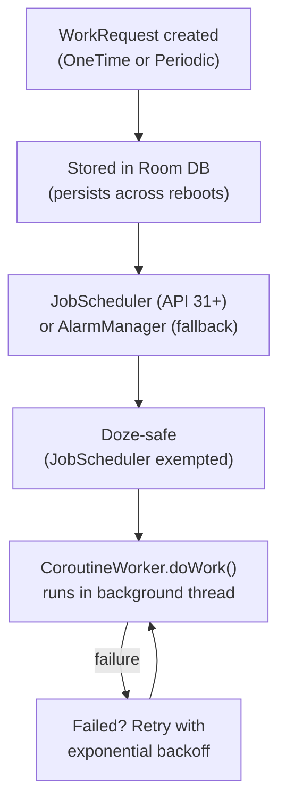
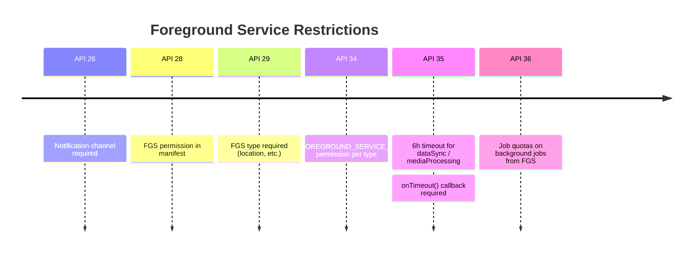
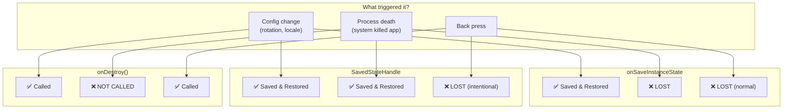
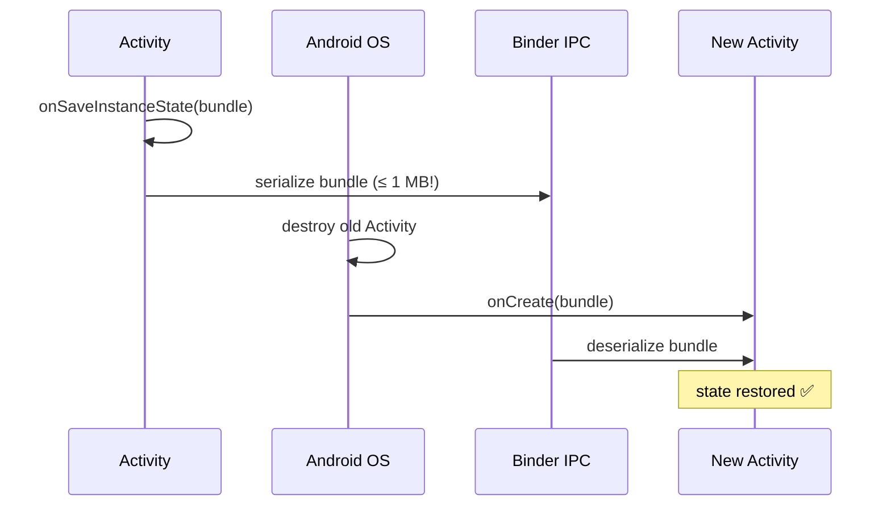
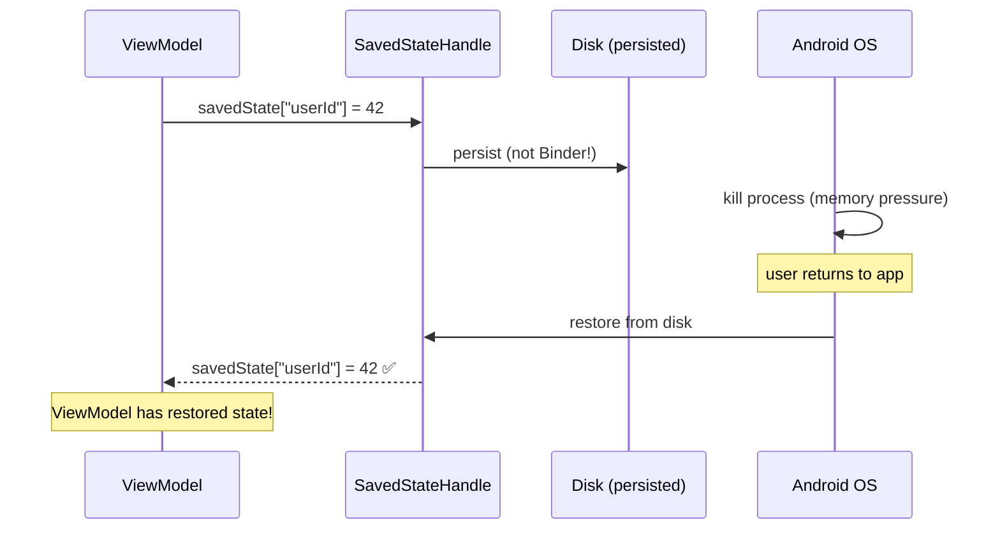
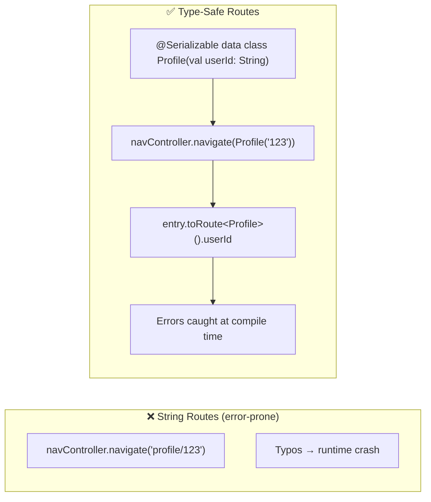
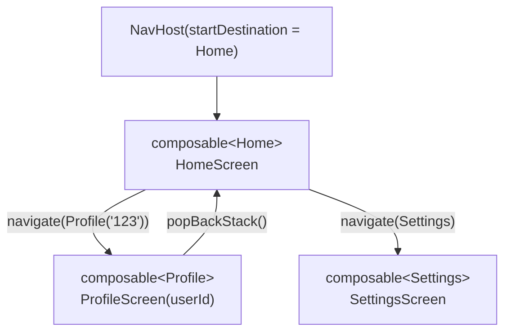

[← Back to components-lifecycles.md](components-lifecycles.md) | [← Back to folder](README.md)

---

# Android Components & Lifecycles — Visual Reference

> Visual companion to `components-lifecycles.md`. Every concept rendered as a diagram.

---

## Activity Lifecycle State Machine



---

## Services vs WorkManager — Decision Tree



### FGS vs WorkManager Comparison



### WorkManager Scheduler Pipeline



---

## FGS Restrictions Timeline (2026)



---

## Lifecycle Saving — Config Change vs Process Death



### Binder Bundle — Config Change Flow



### SavedStateHandle — Process Death Flow



---

## Navigation Compose — Type-Safe Routes



### NavHost Graph



---

## Android Components Mental Map

```mermaid
mindmap
    root((Components))
        Activity
            onCreate/onStart/onResume
            onPause/onStop/onDestroy
            Config change = recreate
            Process death = no onDestroy
        Services
            FGS = user-visible + notification
            API 35+ = 6h timeout (dataSync)
            onTimeout() = graceful shutdown
            WorkManager preferred for bg
        WorkManager
            Doze-safe
            Persists reboots (Room DB)
            Constraints support
            Min 15-min periodic
        LifecycleSaving
            onSaveInstanceState = Binder (1MB limit)
            SavedStateHandle = disk (no limit)
            onStop = always called
            onDestroy = NOT on process death
        Navigation
            Type-safe routes (Serializable)
            popUpTo + inclusive
            Back stack managed by NavController
            Type-safe args via toRoute()
```
