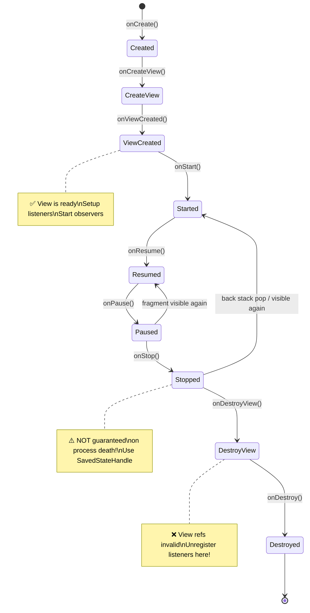
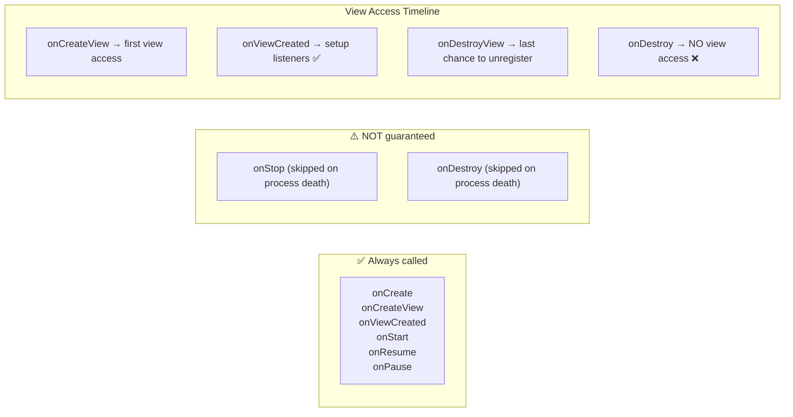
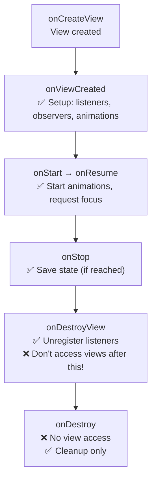
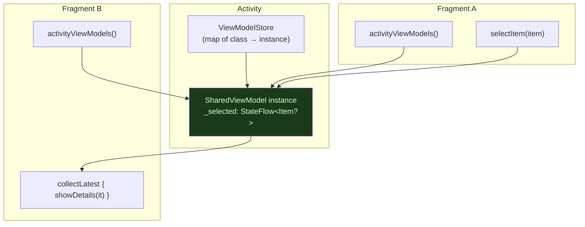
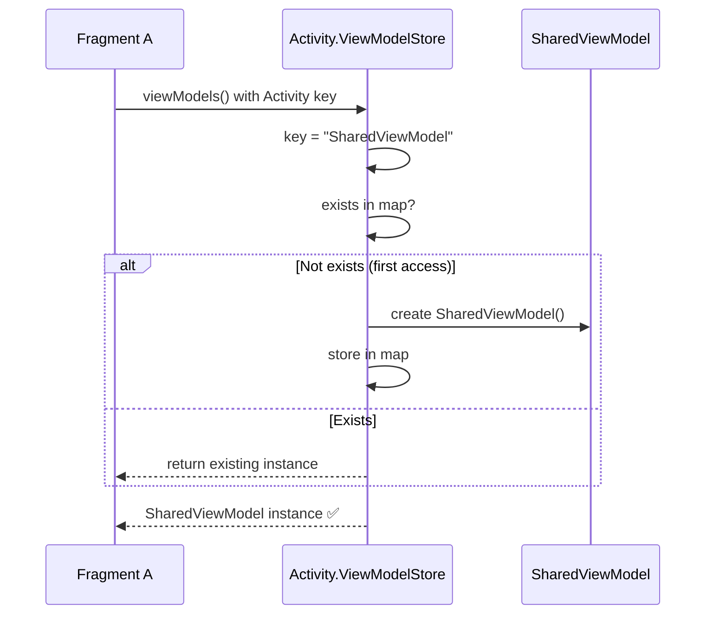
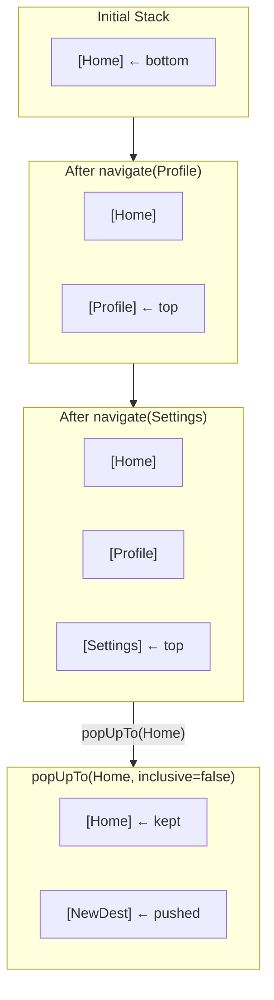
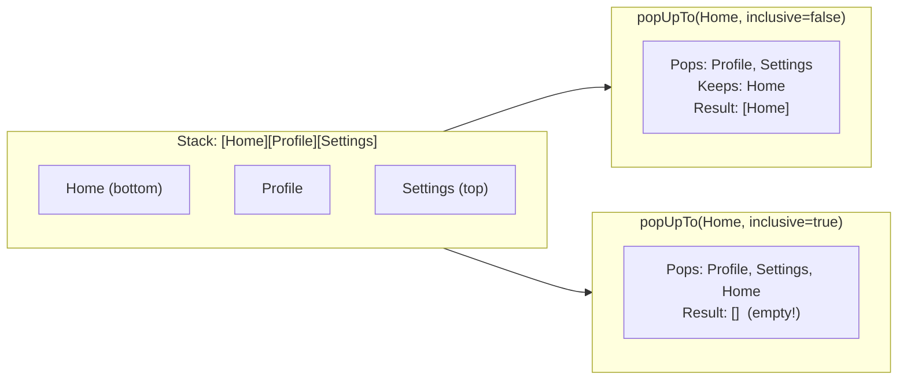
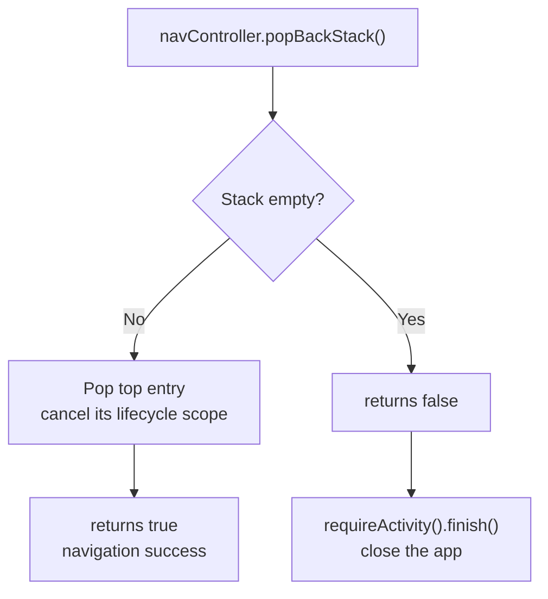
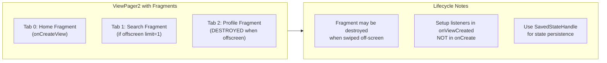
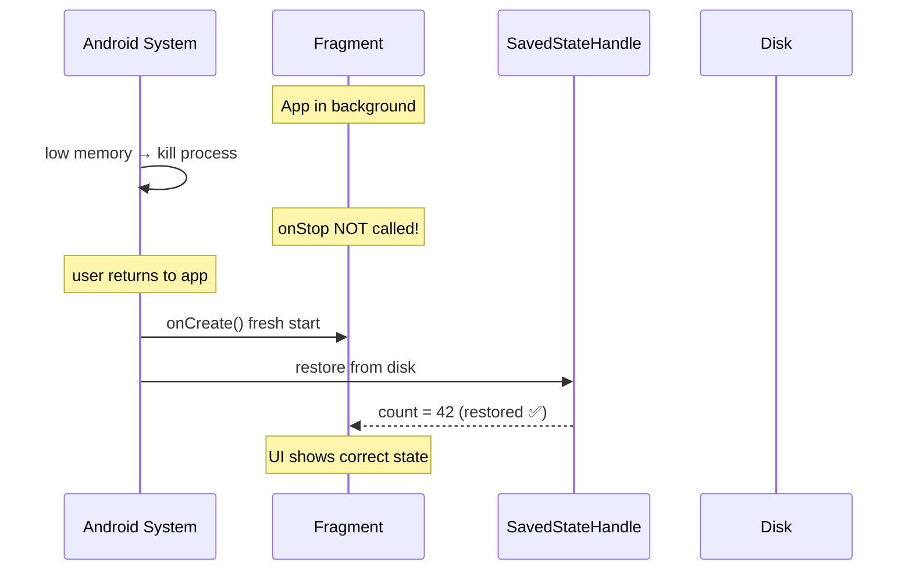

[← Back to fragments-navigation.md](fragments-navigation.md) | [← Back to folder](README.md)

---

# Fragments & Navigation — Visual Reference

> Visual companion to `fragments-navigation.md`. Every concept rendered as a diagram.

---

## Fragment Lifecycle State Machine



---

## Fragment Lifecycle — What's Safe When



### View Access Safety



---

## Shared ViewModel — Fragment Communication



### activityViewModels() — Resolution Path



---

## Back Stack Management



### popUpTo — Inclusive vs Non-Inclusive



### NavController.popBackStack() Flow



---

## Fragment Back Stack — ViewPager Edge Case



---

## Process Death — Fragment State Recovery



---

## Navigation Mental Map

```mermaid
mindmap
    root((Navigation))
        FragmentLifecycle
            Created → ViewCreated → Resumed
            onStop NOT guaranteed (process death)
            onDestroyView = unregister listeners
            onDestroy = cleanup only
        SharedViewModel
            activityViewModels()
            Stored in Activity.ViewModelStore
            Survives fragment replacement
            Cleared on Activity.onDestroy
        BackStack
            navigate() = push to stack
            popBackStack() = pop top
            popUpTo() = pop multiple
            inclusive = pop target too
        ProcessDeath
            Skip onStop/onDestroy
            SavedStateHandle = disk-persisted
            Restored BEFORE onCreate
            No Binder limit (vs Bundle)
```
