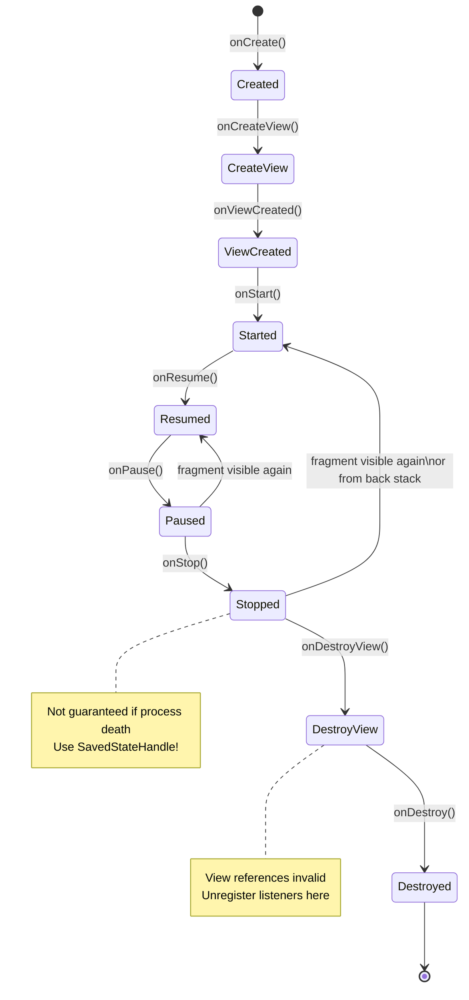

[← Back to main index](../../README.md) | [← Back to folder](../README.md)

---

## 19. Fragments & Navigation

<details open>
<summary><strong>🔄 Fragment Lifecycle & Back Stack</strong></summary>



</details>

---

### Fragment Lifecycle (Common Pitfalls)

> [!WARNING]
> **`onCreate` → `onCreateView` → `onViewCreated` → `onStart` → `onResume`.** KEY GOTCHA: `onStop()` NOT
> guaranteed on process death—use `SavedStateHandle` for persistence.

Only guaranteed if fragment visible · View access timeline matters · Process death edge case

|Lifecycle|Guaranteed|View Access|Use For|
|---|---|---|---|
|`onCreate`|✅|❌|Initialize, restore bundle|
|`onCreateView`|✅|✅ (first)|Create/inflate views|
|`onViewCreated`|✅|✅|Setup listeners, observers|
|`onStart`|✅|✅|Start animations, foreground|
|`onResume`|✅|✅|Request focus, media playback|
|`onPause`|✅|✅|Pause media, unregister|
|`onStop`|❌ (process death)|✅|Save state to SavedState|
|`onDestroy`|❌|❌|Cleanup only|

<details>
<summary>🔩 Under the Hood</summary>

### Why onStop() Not Guaranteed

**Process death scenario:**
- App in background, system kills process to free RAM
- onPause/onStop never called (no time)
- On resume: onCreate/onViewCreated called again
- State lost unless saved

**Solution: SavedStateHandle**
```kotlin
val savedStateHandle: SavedStateHandle
val count = savedStateHandle.getLiveData("count", 0)
count.observe(this) { /* restored value */ }
```

### What it reuses & relies on

- **Fragment back stack:** Managed by FragmentManager (part of Activity state)
- **SavedStateHandle:** Automatic persistence via lifecycle component
- **Process death resilience:** Android framework checks `isFinishing` during destruction

### User vs Understander

| A user knows | An understander also knows |
|---|---|
| "onStop not guaranteed" | Process can be killed by system. onStop is not a reliable hook. Must use SavedStateHandle (which auto-saves to Bundle during onPause). |
| "Use onViewCreated for setup" | Fragment lifecycle can restart multiple times. Each onCreate/onViewCreated gets fresh view instance from Fragment#mView. |
| "Activity death = Fragment death" | Fragment lifecycle tied to activity. Activity destruction cascades onDestroyView → onDestroy. No Fragment outlives activity. |

### Gotchas at depth

- **Retained Fragments:** `setRetainInstance(true)` (deprecated in Fragments 1.3+). Better: Explicit state retention via SavedStateHandle.
- **View pager fragment destruction:** Fragment in ViewPager may be destroyed when off-screen (depending on offscreen limit). Setup listeners in onViewCreated, not onCreate.
- **Memory leaks from listeners:** If listener holds reference to fragment, and fragment not destroyed, memory leak. Always unregister in onDestroyView.

</details>

### Shared ViewModel Between Fragments

> [!TIP]
> Use `activityViewModels()` to get ViewModel scoped to Activity lifetime. Survives Fragment replacement. Both
> fragments read/write same state.

`activityViewModels()` · StateFlow for state · Activity-scoped lifetime

<details>
<summary>💻 Code Example</summary>

```kotlin
class SharedViewModel : ViewModel() {
    private val _selected = MutableStateFlow<Item?>(null)
    val selected = _selected.asStateFlow()
    fun selectItem(item: Item) { _selected.value = item }
}

class FragmentA : Fragment() {
    private val viewModel: SharedViewModel by activityViewModels()
    override fun onViewCreated(view: View, savedInstanceState: Bundle?) {
        super.onViewCreated(view, savedInstanceState)
        itemList.setOnItemClick { viewModel.selectItem(it) }
    }
}

class FragmentB : Fragment() {
    private val viewModel: SharedViewModel by activityViewModels()
    override fun onViewCreated(view: View, savedInstanceState: Bundle?) {
        super.onViewCreated(view, savedInstanceState)
        lifecycleScope.launch {
            viewModel.selected.collectLatest { item -> item?.let { showDetails(it) } }
        }
    }
}
```

</details>

<details>
<summary>🔩 Under the Hood</summary>

### How activityViewModels() Works

**Fragment creation:**
```
Fragment A created → activityViewModels() retrieves from activity's ViewModelStore
Fragment B created → activityViewModels() retrieves SAME instance from same ViewModelStore
```

**ViewModelStore:** Activity holds a map of ViewModels keyed by class name. All fragments accessing same key get same instance.

**Why it survives fragment replacement:**
- Fragment can be destroyed (onDestroy called)
- Activity still holds ViewModelStore
- Replace with new fragment → new fragment gets same ViewModel instance
- State preserved across fragment navigation

### User vs Understander

| A user knows | An understander also knows |
|---|---|
| "activityViewModels() = shared state" | ViewModel scoped to Activity. Stored in Activity#mViewModelStore (Map<String, ViewModel>). Multiple fragments access same instance. |
| "Survives fragment replacement" | Fragment lifecycle independent of ViewModel lifecycle. Fragment #onDestroy destroys view but NOT ViewModel. Activity#onDestroy clears ViewModelStore. |
| "Better than static fields" | ViewModel injection is cleaner than global state. DI framework can replace with test mock. Static fields can't be mocked. |

### Gotchas at depth

- **Fragment back stack:** If Fragment A is on back stack (not visible), ViewModel still active. Memory cost persists.
- **Activity death:** Activity configuration change (rotation) doesn't destroy ViewModel. Process death does (need SavedStateHandle for recovery).
- **Hilt scoping:** With Hilt, use @ActivityScoped. Without Hilt, manually scope to activity via activityViewModels().

</details>

### Back Stack Management

> [!TIP]
> `navigate()` adds to back stack (default). `popUpTo()` pops previous entries. `popBackStack()` returns false
> if no stack left → finish activity.

`navController.navigate()` · `popUpTo()` · `inclusive` flag · Check return value

<details>
<summary>💻 Code Example</summary>

```kotlin
val navController = findNavController()

// Navigate (adds to back stack)
navController.navigate(R.id.destFragment)

// Navigate & clear back stack to home
navController.navigate(R.id.home, navOptions {
    popUpTo(R.id.home) { inclusive = false }  // Keep home, pop others
})

// Pop back stack programmatically
if (!navController.popBackStack()) {
    requireActivity().finish()  // No stack left
}
```

</details>

<details>
<summary>🔩 Under the Hood</summary>

### Navigation Component Back Stack

**Back stack structure:**
```
[home] ← (bottom, won't pop)
[profile]
[settings] ← (top, pops first)
```

**popUpTo(R.id.home, inclusive=false):**
- Pop [settings] and [profile]
- Keep [home]
- Navigate to destination (new [dest] pushed)

**popUpTo(R.id.home, inclusive=true):**
- Pop [settings], [profile], AND [home]
- Navigate to destination (new [dest] is now alone)

### Why Back Stack Matters

- Android expects back button to work (UX standard)
- NavController manages stack automatically
- Without proper popUpTo, app can get "stuck" with many stacked destinations

### User vs Understander

| A user knows | An understander also knows |
|---|---|
| "popUpTo clears previous entries" | NavController maintains a Deque of NavBackStackEntry. popUpTo removes entries until matching ID, then navigates. |
| "inclusive flag determines if target stays" | inclusive=true removes the target too. inclusive=false pops up TO (but not including) the target. |
| "popBackStack() returns false if empty" | NavController checks if stack is empty before popping. If empty, navigation stack is destroyed; app must close. |

### Gotchas at depth

- **Deep linking:** NavDeepLinkBuilder synthesizes a back stack. If app killed and relaunched via deep link, back stack is artificial (may not match previous session).
- **popBackStack() in Fragment:** Must call on navController, not FragmentManager. FragmentManager back stack is separate (can cause inconsistency).
- **Navigation lifecycle:** Each destination in back stack has its own lifecycle scope. Popped fragments' lifecycleScope is cancelled (important for Flows).

</details>

---

