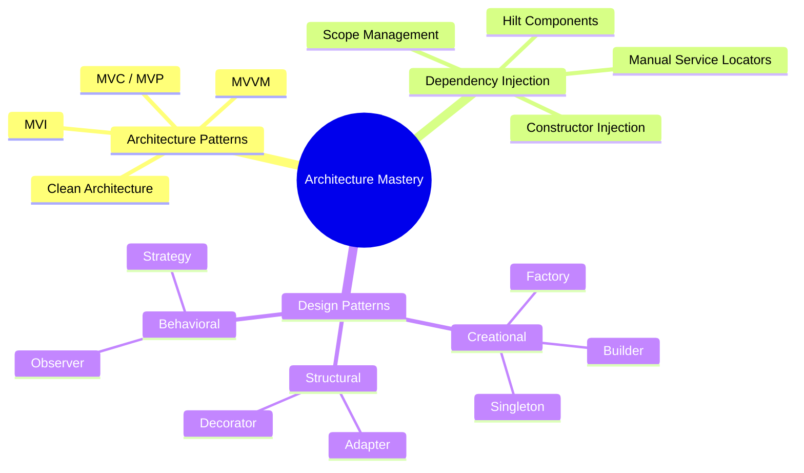

# 🏗️ Architecture & Design

[← Back to main index](../README.md)

> [!IMPORTANT]
> **Design patterns and DI separate senior engineers from juniors.** This is where you demonstrate system
> thinking in interviews. Interview frequency: **CRITICAL**.

---

## 🎯 Architecture Roadmap

<strong>Pattern Relationships</strong>

---

## 📂 Files in This Folder

| File | Topic | Description | Key Interview Topics |
|:-----|:------|:-----------|:---------------------|
| **[architecture-patterns.md](architecture-patterns.md)** | Architecture & Clean Principles | MVC, MVP, MVVM, MVI, Clean | Testability, separation of concerns, unidirectional flows |
| **[dependency-injection.md](dependency-injection.md)** | Dependency Injection (DI) | Manual DI, Hilt, Dagger | Component hierarchy, scope lifecycle, @Provides |
| **[design-patterns.md](design-patterns.md)** | Design Patterns | Creational, structural, behavioral | When to use each, Android-specific implications |

---

## 🔗 Jump to other folders

| 🚀 Kotlin | 🔧 Core | 🔨 Build |
|:---------|:--------|:--------|
| [Kotlin](../kotlin/README.md) | [Android Core](../android-core/README.md) | [Build & Testing](../build-testing/README.md) |

| 🌐 Data | 💡 Strategy | ⚡ Performance |
|:--------|:-----------|:--------------|
| [Data & Networking](../data-networking/README.md) | [Interview Strategy](../interview-strategy/README.md) | [Performance](../performance/README.md) |

| 🎨 UI |
|:------|
| [UI & Graphics](../ui/README.md) |
