[← Back to architecture-patterns.md](architecture-patterns.md) | [← Back to folder](README.md)

---

# Architecture Patterns — Visual Reference

> Visual companion to `architecture-patterns.md`. Every concept rendered as a diagram.

---

## MVI vs MVVM — Data Flow Comparison


### MVI Unidirectional Flow

```mermaid
sequenceDiagram
    participant User
    participant UI
    participant VM as ViewModel
    participant Reducer
    participant State as StateFlow&lt;UiState&gt;

    User->>UI: tap "Search"
    UI->>VM: intent(Search("cats"))
    VM->>Reducer: reduce(currentState, Search("cats"))
    Reducer-->>VM: UiState(loading=true, query="cats")
    VM->>State: emit new state
    State->>UI: recompose
    UI->>User: show loading spinner

    Note over VM: Side effect: launch API call
    VM->>VM: launchSearchEffect("cats")
    VM->>Reducer: reduce(state, ResultsLoaded(items))
    Reducer-->>VM: UiState(loading=false, results=[...])
    VM->>State: emit
    State->>UI: recompose
    UI->>User: show results
```

### State Explosion — MVVM Problem

```mermaid
flowchart TD
    subgraph INVALID_STATES["Invalid State Combos in MVVM"]
        S1["loading=true\nuser=Alice\nerror=null\n✅ valid"]
        S2["loading=true\nuser=Alice\nerror='oops'\n❌ INVALID"]
        S3["loading=false\nuser=null\nerror=null\n❓ initial or stale?"]
    end
    subgraph MVI_STATES["MVI — Sealed State"]
        MS1["Loading\n(single state)"]
        MS2["Success(user=Alice)\n(single state)"]
        MS3["Error('oops')\n(single state)"]
    end
```



---

## Clean Architecture — Layer Diagram


### Dependency Rule — What Can Import What

```mermaid
flowchart LR
    PRES["Presentation\n(imports Domain)"]
    DOMAIN["Domain\n(imports nothing)"]
    DATA["Data\n(imports Domain)"]

    PRES -->|"✅ allowed"| DOMAIN
    DATA -->|"✅ allowed"| DOMAIN
    PRES -->|"❌ NOT allowed"| DATA
    DATA -->|"❌ NOT allowed"| PRES

    style DOMAIN fill:#1a3a1a,color:#cfc
```



### Gradle Module Structure


---

## KMP: expect / actual Compilation Flow


### expect/actual Signature Mismatch Error

```mermaid
flowchart LR
    COM["commonMain\nexpect fun get(): String"]
    AND["androidMain\nactual fun get(): Int  ← WRONG TYPE"]
    ERR["🚨 Compile Error\nExpected: String\nFound: Int"]
    COM -->|"compile"| AND
    AND --> ERR
```



---

## KMP Sharing: ViewModel Architecture


### SKIE: StateFlow → Swift AsyncSequence

```mermaid
sequenceDiagram
    participant KT as Kotlin (commonMain)
    participant SKIE as SKIE Plugin
    participant SWIFT as Swift

    KT->>SKIE: StateFlow&lt;SearchState&gt;
    SKIE->>SKIE: generate Swift extension
    SKIE->>SWIFT: asAsyncSequence(): AsyncSequence&lt;SearchState&gt;
    SWIFT->>SWIFT: for await state in viewModel.state.asAsyncSequence()
    Note over SWIFT: Native Swift async/await semantics
```

---

## KMP Project Structure


---

## Full Architecture Mental Map


