[← Back to dependency-injection.md](dependency-injection.md) | [← Back to folder](README.md)

---

# Dependency Injection — Visual Reference

> Visual companion to `dependency-injection.md`. Every concept rendered as a diagram.

---

## Hilt Component Hierarchy

```mermaid
flowchart TD
    APP["SingletonComponent\n@Singleton\n♾️ App lifetime"]
    ARC["ActivityRetainedComponent\n@ActivityRetainedScoped\n🔄 Survives config change"]
    VM_COMP["ViewModelComponent\n@ViewModelScoped\n📱 ViewModel lifetime"]
    ACT["ActivityComponent\n@ActivityScoped\n🎬 Activity lifetime"]
    FRAG["FragmentComponent\n@FragmentScoped\n🧩 Fragment lifetime"]
    VIEW["ViewComponent\n@ViewScoped\n🖼️ View lifetime"]
    SVC["ServiceComponent\n@ServiceScoped\n⚙️ Service lifetime"]

    APP --> ARC & SVC
    ARC --> VM_COMP & ACT
    ACT --> FRAG
    FRAG --> VIEW

    style APP fill:#5c1a1a,color:#fff
    style ARC fill:#1a1a5c,color:#fff
    style VM_COMP fill:#1a5c1a,color:#fff
    style ACT fill:#3d3d00,color:#fff
    style FRAG fill:#2d1a4d,color:#fff
```



### Component Lifetime Visualization


---

## Hilt vs Dagger vs Koin — Decision Tree

```mermaid
flowchart TD
    START([Choosing DI Framework])
    START --> Q1{KMP project?\n(iOS + Android)}
    Q1 -->|Yes| Q2{Simple graph\n< 50 classes?}
    Q1 -->|No| Q3{Legacy Dagger\nalready used?}

    Q2 -->|Yes| MANUAL["Manual DI\n(AppContainer)\nZero overhead, full KMP"]
    Q2 -->|No| KOIN["Koin\nKMP-ready DSL\nRuntime reflection"]

    Q3 -->|Yes| DAGGER["Dagger 2\n(legacy, keep if large)\nManual graph"]
    Q3 -->|No| HILT["Hilt ✅\n(Android standard)\nKSP codegen"]
```

### Compile-time vs Runtime Safety

```mermaid
flowchart LR
    subgraph HILT_SAFE["Hilt / Dagger (compile-time)"]
        H1["@Provides OkHttpClient"]
        H2["@Provides Retrofit(httpClient: OkHttpClient)"]
        H3["Missing binding → 🚨 BUILD FAILS\n(caught before app ships)"]
        H1 --> H2 --> H3
    end
    subgraph KOIN_SAFE["Koin (runtime)"]
        K1["single { OkHttpClient() }"]
        K2["single { Retrofit.Builder().client(get()).build() }"]
        K3["Missing binding → 🚨 CRASH AT RUNTIME\n(caught when code path hit)"]
        K1 --> K2 --> K3
    end
```



---

## Hilt: KSP Codegen Pipeline


### Generated Code Structure


---

## @Provides vs @Binds

```mermaid
flowchart LR
    subgraph BINDS["@Binds (simple delegation)"]
        B_CODE["@Binds\nabstract fun bind(impl: UserRepositoryImpl): UserRepository"]
        B_GEN["Generated Factory:\nfun get() = impl  ← minimal code"]
        B_CODE -->|"generates"| B_GEN
    end
    subgraph PROVIDES["@Provides (factory logic)"]
        P_CODE["@Provides\nfun provide(client: OkHttpClient): Retrofit =\n  Retrofit.Builder().client(client).build()"]
        P_GEN["Generated Factory:\nfun get() = NetworkModule.provide(httpClient)"]
        P_CODE -->|"generates"| P_GEN
    end
```



### When to Use Which

```mermaid
flowchart TD
    Q{"Need custom\ninitialization logic?"}
    Q -->|Yes| PROVIDES["@Provides\nCustom logic, multiple deps\nConditional creation"]
    Q -->|No| Q2{"Just wrapping\nImpl → Interface?"}
    Q2 -->|Yes| BINDS["@Binds\nSimpler, less generated code\nAbstract module required"]
    Q2 -->|No| PROVIDES2["@Provides\ncomplex scenario"]
```



---

## Scope Binding — Lifetime Rules

```mermaid
flowchart TD
    subgraph SINGLETON["@Singleton\n(app lifetime)"]
        DB["Room Database\nOkHttpClient\nSharedPreferences"]
    end
    subgraph VM_SCOPE["@ViewModelScoped\n(screen lifetime)"]
        REPO["UserRepository\nSearchUseCase\nApiService"]
    end
    subgraph ACT_SCOPE["@ActivityScoped\n(activity lifetime, rare)"]
        NAV["Navigator\nActivity-specific state"]
    end
    subgraph NONE["Unscoped\n(new each injection)"]
        MAPPERS["Mappers\nFormatters\nSimple helpers"]
    end

    SINGLETON -.->|"injected into"| VM_SCOPE
    VM_SCOPE -.->|"injected into"| ACT_SCOPE

    note["⚠️ Can't inject short-lived\ninto long-lived scope\n(memory leak!)"]
```



### Scope Lifetime Mismatch (Bug Pattern)

```mermaid
flowchart LR
    SINGLETON_OBJ["@Singleton ApiManager\n♾️ lives forever"]
    ACTIVITY_OBJ["@ActivityScoped Listener\n🎬 destroyed with Activity"]

    SINGLETON_OBJ -->|"holds reference to"| ACTIVITY_OBJ
    ACTIVITY_OBJ -->|"Activity destroyed\nbut still referenced"| LEAK["🚨 MEMORY LEAK\nActivity can't GC"]
```



---

## Manual DI — Object Graph Construction


### DI Framework Comparison


> Lines: Hilt | Dagger | Koin | Manual DI

---

## Koin Module DSL


---

## Hilt Entry Points (Escape Hatch)


---

## Full DI Mental Map

```mermaid
mindmap
    root((DI))
        Hilt
            KSP codegen at compile time
            Android lifecycle scopes
            @HiltAndroidApp + @AndroidEntryPoint
            @Provides for factories
            @Binds for delegation
            Android-only
        Dagger
            Manual component graph
            JSR 330 annotations
            Verbose but explicit
            Legacy projects
        Koin
            Runtime reflection
            DSL: single/factory/viewModel
            KMP-ready
            verify() for early detection
        ManualDI
            AppContainer pattern
            Constructor injection
            Zero framework
            Full KMP
            Scales to ~50 classes
        Scopes
            Singleton = app lifetime
            ViewModelScoped = screen
            ActivityScoped = rare
            Unscoped = new each time
```
