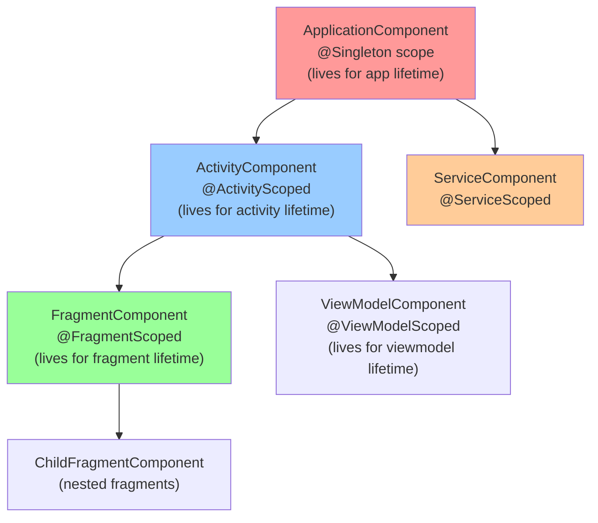

[← Back to main index](../../README.md) | [← Back to folder](../README.md)

---

## 5. Dependency Injection (DI)

<details open>
<summary><strong>🏛️ Hilt Component Hierarchy</strong></summary>



</details>

---

### Hilt vs Dagger vs Koin

> [!TIP]
> **Hilt = Android standard (codegen). Dagger = legacy (complex). Koin = KMP-friendly (runtime reflection).**
> For 2026: Hilt if Android-only, Koin if KMP, kotlin-inject if lightweight.

`Hilt` standard · `Dagger` legacy · `Koin` KMP · `Codegen vs runtime` · `Compile-safety vs flexibility`

| Feature | Hilt | Dagger | Koin |
|---|---|---|---|
| **Setup** | `@HiltAndroidApp` + annotations | Manual Dagger components | DSL block |
| **Code generation** | KSP (compile-time) | KSP (compile-time) | Runtime reflection |
| **Android lifecycle scopes** | ✅ Built-in | ❌ Manual | ✅ androidContext |
| **KMP support** | ❌ Android only | ❌ JVM only | ✅ Full KMP |
| **Compile-safety** | ✅ Missing bindings = error | ✅ Missing bindings = error | ⚠️ Runtime error (call verify()) |
| **Performance** | Fast (generated code) | Fast (generated code) | Moderate (reflection) |

**Emerging options:** Metro (compile-time KMP), kotlin-inject (lightweight KSP-based).

<details>
<summary>💻 Code Example</summary>

```kotlin
// Hilt (standard for Android)
@HiltAndroidApp
class App : Application()

@AndroidEntryPoint
class MainActivity : AppCompatActivity()

// Koin (KMP projects)
startKoin {
    modules(appModule)
}

val viewModel: SearchViewModel by viewModel()
```

</details>

<details>
<summary>🔩 Under the Hood</summary>

### Hilt: KSP codegen pipeline

**Compilation phases:**
```
1. Annotation processing: @HiltAndroidApp, @AndroidEntryPoint, @Module scanned
2. KSP plugin: Generates Dagger components + injection factories
3. Generated files: HiltComponents.java (component interfaces), ViewModel_Factory, etc.
4. Linking: build combines generated code with compiled sources
```

**Generated code (simplified):**
```java
// Input:
@HiltAndroidApp
class MyApp : Application()

// Generated:
class Hilt_MyApp extends MyApp {
    private GeneratedComponent component;

    public void onCreate() {
        super.onCreate();
        component = DaggerGeneratedComponent.builder().app(this).build();
    }
}
```

### Dagger: Manual component graph

**Explicit dependency graph:**
```kotlin
@Component(modules = [NetworkModule::class])
interface AppComponent {
    fun inject(activity: MainActivity)
}

// Build explicitly:
val component = DaggerAppComponent.create()
component.inject(mainActivity)
```

**Problem:** Verbose. Every component, module, scope must be wired by hand.

### Koin: Runtime reflection

**Module definition:**
```kotlin
val appModule = module {
    single { OkHttpClient() }  // Single instance
    single { Retrofit.Builder().client(get()).build() }  // get() = resolve OkHttpClient
    factory { UserRepository(get()) }  // New instance each time
}

startKoin { modules(appModule) }
```

**At runtime:**
- Koin scans module, builds object graph via reflection
- `get()` = look up binding by type + qualifier
- Lazy initialization: bindings created on first request

**Gotcha: no compile-time safety**
```kotlin
factory { UserRepository(get()) }  // ❌ If OkHttpClient not registered, error happens at runtime (first use)
// Mitigation: koin.verify() at app start to catch early
```

### What each reuses

**Hilt:**
- Dagger library (Hilt is wrapper, generates Dagger components)
- KSP (compiler plugin interface)
- Android lifecycle components (for scoped bindings)

**Dagger:**
- JSR 330 (javax.inject standard interfaces)
- Compile-time APT (code generation)

**Koin:**
- Kotlin reflection API (runtime type inspection)
- Coroutine scope integration (for lifecycle-aware singletons)

### Why these designs were chosen

**Hilt = Dagger simplified:**
- Dagger powerful but boilerplate-heavy
- Hilt pre-configures Android components (reducing decisions)
- Standard Android recommendation (Google, Google Play plugins)

**Dagger = explicit graph:**
- Before Java 5 annotations → components were wiring code
- Still used in legacy/complex projects with many dynamic bindings

**Koin = developer friction reduction:**
- DSL more readable than annotation chains
- Reflection cost acceptable for most apps
- KMP support (only option for commonMain)

### User vs Understander

| A user knows | An understander also knows |
|---|---|
| Hilt uses KSP | Hilt plugin + KSP = generates Dagger components at compile time (no runtime cost) |
| Koin resolves types via `get()` | Koin uses Kotlin reflection to look up bindings by type + qualifier at runtime |
| "Hilt scopes" = Android components | Hilt maps @ViewModelScoped to ViewModelComponent, which Dagger manages (tied to ViewModel lifecycle) |
| Dagger is "manual" | Explicit: you write components, modules, @Provides functions. Hilt generates these. |

### Gotchas at depth

- **Hilt + Dagger conflict:** If project already uses Dagger, adding Hilt can cause double-generation (duplicate bindings). Requires migration.
- **Koin verify() false sense of safety:** `verify()` finds unused bindings but not type mismatches (Kotlin reflection doesn't catch `get<String>` when String not bound).
- **Android plugin requirement:** Hilt requires `com.google.dagger:hilt-android-gradle-plugin`. Forget it = cryptic "Hilt not found" errors.
- **Metro/kotlin-inject immaturity:** Emerging alternatives (2025+) but not battle-tested like Hilt (use if starting fresh KMP).

</details>

### Hilt Component Hierarchy

> [!TIP]
> Component = Dagger component scoped to Android lifetime (Application, Activity, Fragment, ViewModel).
> Hierarchy determines when bindings are created/destroyed.

`SingletonComponent` app-life · `ViewModelComponent` screen-life · `ActivityComponent` activity-life · `Scoped binding` · `Lifetime management`

| Component | Scope Annotation | Lifetime | Use For |
|---|---|---|---|
| `SingletonComponent` | `@Singleton` | Application | API clients, databases, preferences |
| `ActivityRetainedComponent` | `@ActivityRetainedScoped` | Survives config change | Shared ViewModel state |
| `ViewModelComponent` | `@ViewModelScoped` | ViewModel lifetime | Repository, use cases tied to screen |
| `ActivityComponent` | `@ActivityScoped` | Activity lifetime | Activity-specific (rare) |
| `FragmentComponent` | `@FragmentScoped` | Fragment lifetime | Fragment-specific (rare) |

<details>
<summary>💻 Code Example</summary>

```kotlin
@Module
@InstallIn(SingletonComponent::class)
object ApiModule {
    @Provides
    @Singleton
    fun provideApiService(): ApiService = Retrofit.Builder().build()
}

@Module
@InstallIn(ViewModelComponent::class)
object RepositoryModule {
    @Provides
    fun provideUserRepo(api: ApiService): UserRepository = UserRepositoryImpl(api)
}
```

</details>

<details>
<summary>🔩 Under the Hood</summary>

### Dagger component graph & scoping

**Component hierarchy (Dagger):**
```
SingletonComponent (root)
  ├── ActivityRetainedComponent (survives rotation)
  ├── ViewModelComponent (per-ViewModel)
  └── ActivityComponent (per-Activity)
       └── FragmentComponent (per-Fragment)
```

**Scope enforcement:**
```kotlin
@Singleton  // Only in SingletonComponent
fun provideDb(): Database = Database()

@ViewModelScoped  // Only in ViewModelComponent + children (ActivityComponent, FragmentComponent)
fun provideRepo(db: Database): UserRepository = UserRepositoryImpl(db)

// ❌ Error: ViewModelScoped binding can't be used in SingletonComponent
// (scope lifetime mismatch: ViewModel lives shorter than Singleton)
```

**Implicit scoping:** If function has no @Scope, it's **unscoped** (new instance each injection).

### Lifetime management

**SingletonComponent:**
- Created once at app start (in HiltAndroidApp.onCreate())
- Destroyed when app killed
- All @Singleton bindings persist for app lifetime

**ViewModelComponent:**
- Created when ViewModel created (by Hilt)
- Destroyed when ViewModel cleared (onCleared())
- All @ViewModelScoped bindings scoped to that ViewModel

**FragmentComponent:**
- Created when Fragment created
- Destroyed when Fragment destroyed
- All @FragmentScoped bindings scoped to that Fragment

### What it reuses & relies on

- **ViewModel#onCleared()** — Hilt clears ViewModelComponent when ViewModel cleared
- **Activity lifecycle** — Hilt clears ActivityComponent on Activity destruction
- **Fragment lifecycle** — Hilt clears FragmentComponent on Fragment destruction
- **Dagger scoped provider** — generates SingletonHolder if @Singleton (thread-safe double-check locking)

### Why this hierarchy

**Problem:** If all bindings were Singleton, they'd persist even after Activity destroyed (memory leak).

**Solution:** Hierarchy allows scoped lifetimes:
- Short-lived (Fragment) bindings created per-fragment, destroyed with fragment
- Long-lived (Singleton) bindings created once, shared across all activities

### User vs Understander

| A user knows | An understander also knows |
|---|---|
| "Use @Singleton for expensive objects" | @Singleton = Dagger double-checked locking provider (thread-safe, one instance in memory) |
| "ViewModelScoped tied to ViewModel" | Hilt's ViewModelComponent linked to ViewModel.onCleared() callback (auto-cleanup when ViewModel cleared) |
| "Can't use ViewModelScoped in Singleton" | Scope mismatch: Singleton lives longer than ViewModel. If Singleton held ViewModel-scoped instance, leak after ViewModel cleared. |
| "Fragment bindings are unscoped" | If no @FragmentScoped on binding, each injection call gets new instance (no caching) |

### Gotchas at depth

- **ActivityRetainedComponent confusion:** Doesn't survive Fragment transactions (only config changes). Easy to misuse for "keep-alive" logic.
- **Scope lifetime leaks:** If Singleton binding holds reference to Activity-scoped binding, Activity can't GC (common bug).
- **No parent scope injection:** Child component can't inject from parent (design choice). Must explicitly pass via constructor.
- **Unscoped overhead:** If binding is unscoped, each inject() call constructs new instance (no caching). Can be performance issue if constructor expensive.

</details>

### Hilt Modules: @Provides vs @Binds

> [!TIP]
> `@Provides` = factory function (custom logic). `@Binds` = simple wrapper (impl to interface). Use Binds when
> no logic needed (less generated code).

`@Provides` factory · `@Binds` wrapper · `Abstract modules` · `Code generation` · `When each`

<details>
<summary>💻 Code Example</summary>

```kotlin
// @Binds: delegation (no custom logic)
@Module
@InstallIn(SingletonComponent::class)
abstract class RepositoryModule {
    @Binds
    @Singleton
    abstract fun bindUserRepository(impl: UserRepositoryImpl): UserRepository
}

// @Provides: factory (custom logic)
@Module
@InstallIn(SingletonComponent::class)
object NetworkModule {
    @Provides
    @Singleton
    fun provideRetrofit(httpClient: OkHttpClient): Retrofit =
        Retrofit.Builder().client(httpClient).build()
}
```

</details>

| Pattern | Use | Generated Code Size |
|---|---|---|
| `@Binds` | Impl → Interface, no logic | Small (delegation only) |
| `@Provides` | Factory, custom initialization | Larger (logic included) |

**Rule of thumb:** Binds for repository/simple implementations, Provides for complex factories (Retrofit, database builders).

<details>
<summary>🔩 Under the Hood</summary>

### Generated factory classes

**What you write:**
```kotlin
@Binds
@Singleton
abstract fun bindUserRepository(impl: UserRepositoryImpl): UserRepository
```

**Generated code (simplified):**
```java
public class RepositoryModule_BindUserRepositoryFactory implements Factory<UserRepository> {
    private final UserRepositoryImpl impl;

    public RepositoryModule_BindUserRepositoryFactory(UserRepositoryImpl impl) {
        this.impl = impl;
    }

    public UserRepository get() {
        return impl;  // Simple wrapper
    }
}
```

**What you write:**
```kotlin
@Provides
@Singleton
fun provideRetrofit(httpClient: OkHttpClient): Retrofit =
    Retrofit.Builder().client(httpClient).build()
```

**Generated code (simplified):**
```java
public class NetworkModule_ProvideRetrofitFactory implements Factory<Retrofit> {
    private final OkHttpClient httpClient;

    public NetworkModule_ProvideRetrofitFactory(OkHttpClient httpClient) {
        this.httpClient = httpClient;
    }

    public Retrofit get() {
        return NetworkModule.provideRetrofit(httpClient);  // Calls your function
    }
}
```

### Binding key resolution

**How Dagger matches dependencies:**
```kotlin
fun provideRetrofit(httpClient: OkHttpClient): Retrofit
// Key = (Retrofit, no qualifier)
// When injecting Retrofit, Dagger looks up this key

@Provides
@Named("baseUrl")
fun provideBaseUrl(): String = "https://..."
// Key = (String, qualifier="baseUrl")
// When injecting @Named("baseUrl") String, Dagger looks up this specific key
```

**Binding precedence:**
1. Scoped binding (@Singleton, @ViewModelScoped, etc.)
2. Unscoped binding
3. If ambiguous → compilation error

### Module installation

**@InstallIn:**
```kotlin
@Module
@InstallIn(ViewModelComponent::class)  // This module's bindings available in ViewModelComponent
object RepositoryModule {
    @Provides
    fun provideUserRepository(): UserRepository = UserRepositoryImpl()
}

// Dagger generates:
class DaggerViewModelComponent implements ViewModelComponent {
    // Installs RepositoryModule's bindings
    private final RepositoryModule repositoryModule = new RepositoryModule();
}
```

### What it reuses & relies on

- **Dagger annotation processing** — @Provides/@Binds triggers factory generation
- **KSP** — generates factory classes at compile time
- **Java generics** — Factory<T> is parameterized interface

### Why @Binds vs @Provides

**@Binds optimization:**
- Smaller generated code (just delegation)
- Compiler can inline better (less function indirection)
- Cleaner intent (user just wrapping impl in interface)

**@Provides necessity:**
- Custom logic (can't just delegate)
- Multiple instances (e.g., @Named qualifiers)
- Complex initialization

### User vs Understander

| A user knows | An understander also knows |
|---|---|
| "Use @Binds for simple wrapping" | @Binds generates minimal factory code; @Provides includes your function logic in factory |
| "Qualifiers distinguish same types" | @Named, @Qualifier are binding keys; Dagger matches String + @Named("url") separately from plain String |
| "@Provides receives dependencies" | Function parameters are injected by Dagger (provideRetrofit(httpClient) → httpClient auto-injected) |
| "Abstract modules with @Binds" | @Binds requires abstract function (no implementation); Dagger generates impl (factory). @Provides requires concrete object. |

### Gotchas at depth

- **Binding shadowing:** If two modules provide same type without qualifier, build fails (ambiguous). Qualifiers (@Named, custom) required to distinguish.
- **Circular dependencies:** If RepositoryA depends on RepositoryB and vice versa (rare), Dagger detects and errors. Use lazy injection (Provider<T> instead of T) to break cycle.
- **Missing @Singleton on Provides:** If @Provides fun createDb() doesn't have @Singleton, new Database created every injection (often unintended).
- **Module duplication:** If @Module installed twice (rare), bindings duplicated (cryptic error). Ensure @InstallIn components don't overlap.

</details>

**Entry Points** = inject into non-injectable classes (Application, custom services). Rare in modern Compose apps.

<details>
<summary>💻 Code Example</summary>

```kotlin
@EntryPoint
@InstallIn(SingletonComponent::class)
interface AnalyticsEntryPoint {
    fun analytics(): Analytics
}

// Use when Hilt can't auto-inject (e.g., Application onCreate)
class MyApp : Application() {
    override fun onCreate() {
        super.onCreate()
        val entryPoint = EntryPoints.get(this, AnalyticsEntryPoint::class.java)
        entryPoint.analytics().init()
    }
}
```

</details>

**Scope selection:**
- **Singleton:** Expensive, app-wide (API, database)
- **ViewModelScoped:** Per-screen (repository, use case)
- **ActivityScoped/FragmentScoped:** Rare; only if truly activity/fragment-specific

### Manual DI — Constructor Injection without Framework

> [!TIP]
> Hand-written AppContainer with constructor injection. No codegen overhead, fully transparent. Scales to ~50
> classes comfortably; beyond that, framework (Hilt/Koin) helps. Best for KMP shared code.

`Constructor injection` · `AppContainer` · `Zero magic` · `Fully KMP` · `Simple, scales ~50 classes`

<details>
<summary>💻 Code Example</summary>

```kotlin
// commonMain
interface UserRepository { suspend fun getUser(id: Int): User }
class UserRepositoryImpl(val api: ApiService) : UserRepository

// Shared AppContainer
class AppContainer(val api: ApiService) {
    val userRepository: UserRepository = UserRepositoryImpl(api)
    val userUseCase = GetUserUseCase(userRepository)
    val viewModelFactory = SearchViewModelFactory(userUseCase)
}

// androidApp
val container = AppContainer(OkHttpApiService())
val viewModel = container.viewModelFactory.create()
```

</details>

| Approach | Setup | Overhead | KMP | Scales |
|---|---|---|---|---|
| **Manual DI** | Hand-written | None | ✅ | ~50 classes |
| **Hilt** | Annotations | KSP codegen | ❌ Android-only | 1000+ |
| **Koin** | DSL | Runtime reflection | ✅ | 500+ |

<details>
<summary>🔩 Under the Hood</summary>

### Object graph construction

**Graph at runtime:**
```
AppContainer
├── ApiService (OkHttpApiService)
├── UserRepository (UserRepositoryImpl <- ApiService)
├── GetUserUseCase (GetUserUseCase <- UserRepository)
└── ViewModelFactory (SearchViewModelFactory <- GetUserUseCase)

// When requesting viewModel:
container.viewModelFactory.create()
  → SearchViewModelFactory(GetUserUseCase(...))
    → GetUserUseCase(UserRepositoryImpl(ApiService))
```

**Manual vs Framework:**
```kotlin
// Manual: explicit construction order
val container = AppContainer(
    api = createApi(),  // Step 1
    repo = UserRepositoryImpl(api),  // Step 2
    useCase = GetUserUseCase(repo),  // Step 3
    viewModel = SearchViewModel(useCase)  // Step 4
)

// Hilt: implicit (codegen handles order)
class SearchViewModel @Inject constructor(useCase: GetUserUseCase)  // Dagger figures out GetUserUseCase deps
```

### Constructor injection pattern

**Principle:** Dependencies passed via constructor (no setters, no service locator).

**Example:**
```kotlin
class UserRepositoryImpl(
    private val api: ApiService,  // Constructor injection
    private val cache: UserCache  // All deps passed in
) : UserRepository { }

// Usage:
val repo = UserRepositoryImpl(
    api = OkHttpApiService(),
    cache = InMemoryUserCache()
)
```

**Benefits:**
- All dependencies visible in constructor (inspectable)
- Testable (pass mocks in constructor)
- Immutable (no runtime changes to deps)

**Drawback:** If dependency tree is deep (50+ classes), manual wiring becomes tedious.

### Lazy initialization pattern (for circular deps)

```kotlin
class AContainer {
    val serviceA = ServiceA(lazy { serviceB })  // Lazy<ServiceB>
    val serviceB = ServiceB(lazy { serviceA })
}

// At runtime:
// serviceA gets lazy reference to serviceB
// Only resolved when accessed (lazy.value)
// Avoids circular construction
```

### What it reuses & relies on

- **Kotlin delegation** — can use delegation patterns for optional deps
- **Lazy<T>** — enables lazy initialization and circular dep breaking
- **Visibility modifiers** — package-private constructor can enforce DI (no public ctors)
- **Interfaces** — enables swapping implementations (test doubles, production)

### Why this design chosen

**Motivation:**
- No framework overhead → works on all Kotlin targets (JVM, Native, JS, WASM)
- Fully transparent (no code generation) → easy to debug
- KMP support (frameworks lag)

**Scalability tradeoff:**
- <20 classes: Manual DI is simpler than Hilt boilerplate
- 20-50 classes: Manual DI acceptable but boilerplate noticeable
- >50 classes: Framework (Hilt/Koin) worth investment (auto-wiring saves ~30% boilerplate)

### User vs Understander

| A user knows | An understander also knows |
|---|---|
| "Constructor injection = pass deps in" | Constructor param order matters (not really); dependencies are just function arguments (no magic) |
| "AppContainer is app graph" | AppContainer is hand-written factory; instantiating AppContainer walks entire dependency tree (all objects created eagerly) |
| "Manual DI works on KMP" | No Android-specific annotations; object construction is pure Kotlin (works on all targets) |
| "Pass mocks in constructor for testing" | Tests can pass different implementation in constructor (e.g., FakeUserRepository). No reflection or service locator needed. |

### Gotchas at depth

- **Eager initialization:** Manual container creates all objects when instantiated (not lazy). If AppContainer has 100 classes, all created upfront (can be slow). Mitigation: use Lazy<T> or factory functions.
- **Missing dep error:** If you forget to add a dependency, constructor call fails at runtime with ParameterMismatchException (caught early if running tests, but not by compiler).
- **Circular deps without Lazy:** If ServiceA needs ServiceB and vice versa, constructor fails (StackOverflow). Must use Lazy<T> or factory functions to break cycle.
- **No validation:** Unlike Hilt/Koin, no "verify all bindings" check. If you wire incorrectly, only found when code path executed.

</details>

**When manual DI makes sense:**
- Small modules/libraries (<30 classes)
- KMP shared code (no Hilt support)
- Onboarding (zero framework learning curve)
- Debugging (explicit construction order)

**When framework needed:**
- >50 classes (boilerplate burden too high)
- Complex scoping rules (Android lifecycle tiers)
- Large teams (consistency enforcement)

---

