[← Back to design-patterns.md](design-patterns.md) | [← Back to folder](README.md)

---

# Design Patterns — Visual Reference

> Visual companion to `design-patterns.md`. Every concept rendered as a diagram.

---

## GoF Patterns Classification

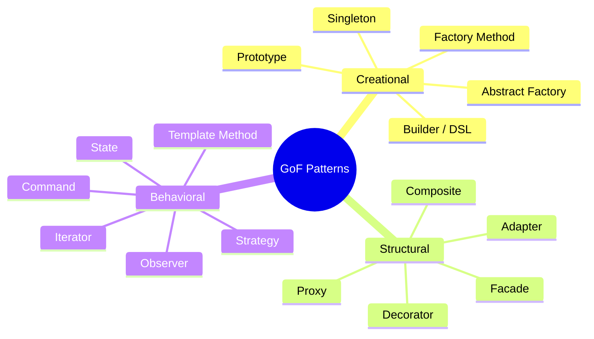

---

## Singleton — Kotlin `object` Code Generation

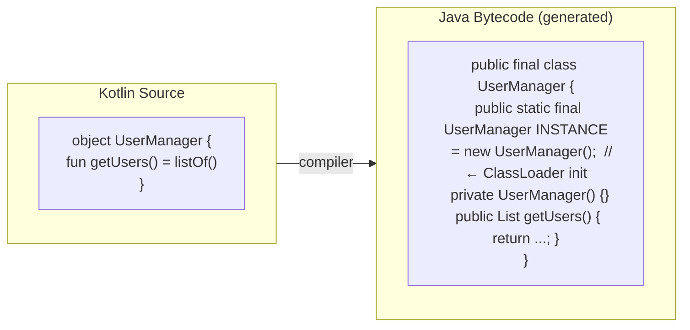

### Singleton Thread Safety

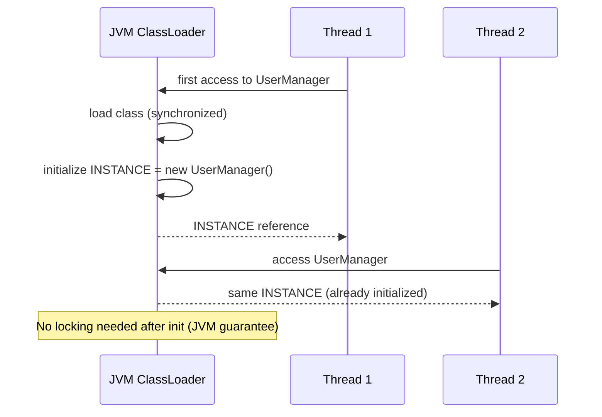

### Singleton: Testing Problem

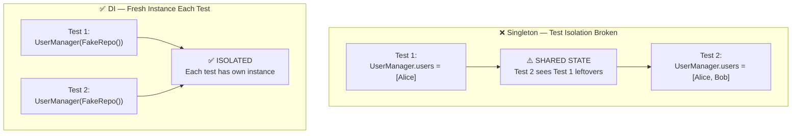

---

## Observer Pattern — Callbacks vs Flows

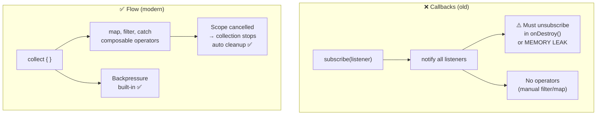

### Memory Leak: Callback vs Flow

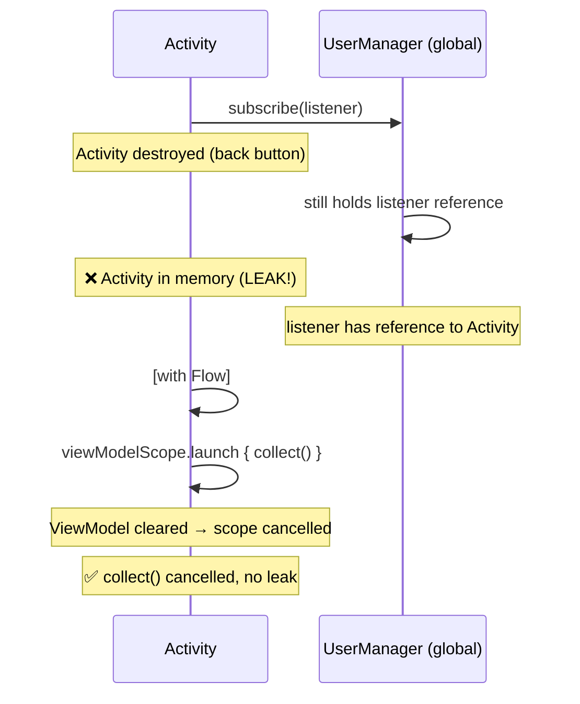

### Flow Backpressure

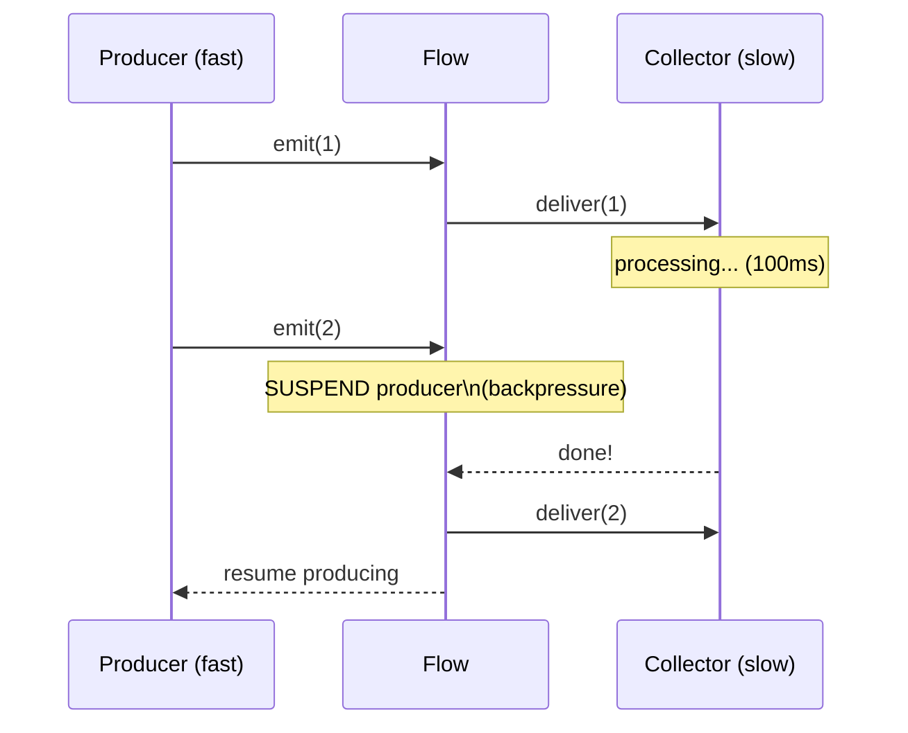

---

## Factory Pattern

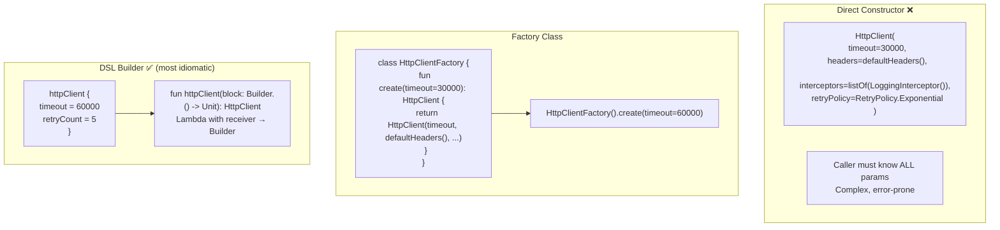

### DSL Builder — Receiver Scope

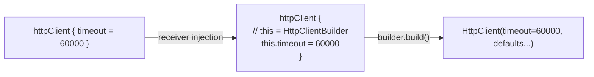

### Factory vs DI

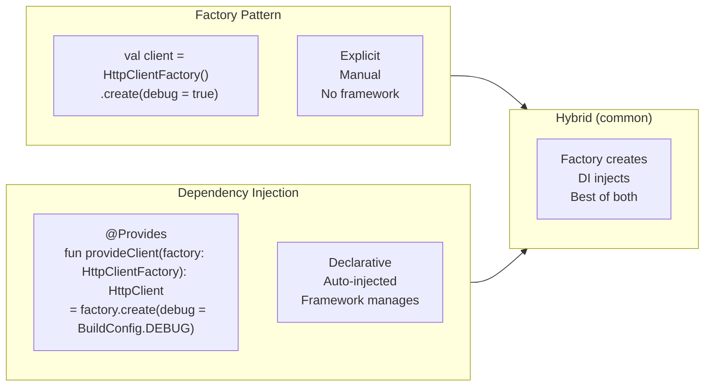

---

## Repository Pattern

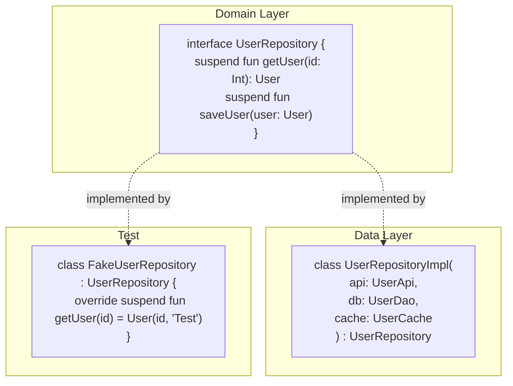

### Cache-Through Strategy

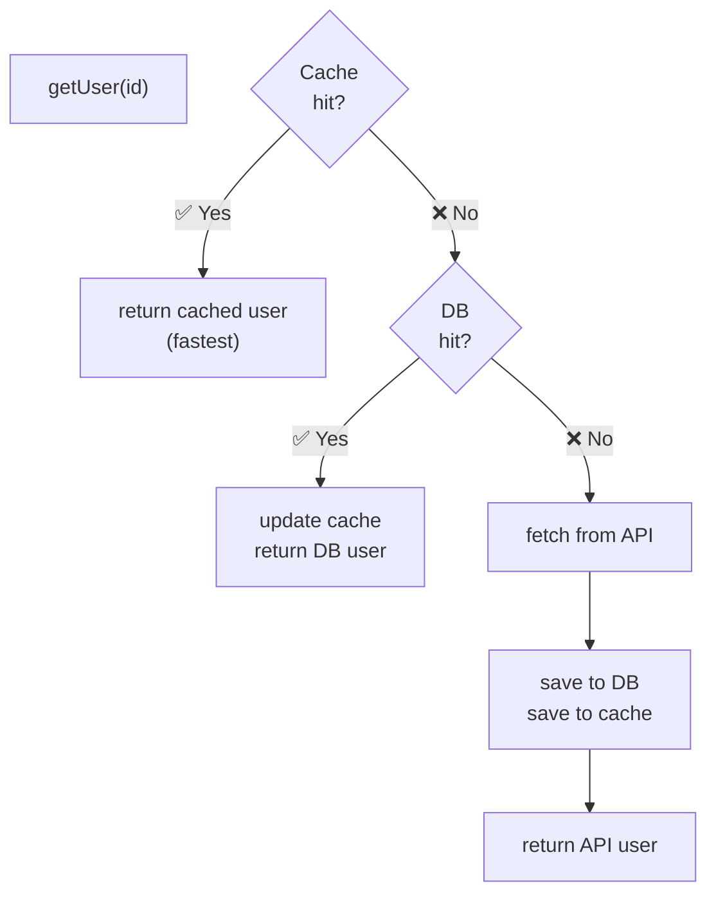

### Repository as Anti-Corruption Layer

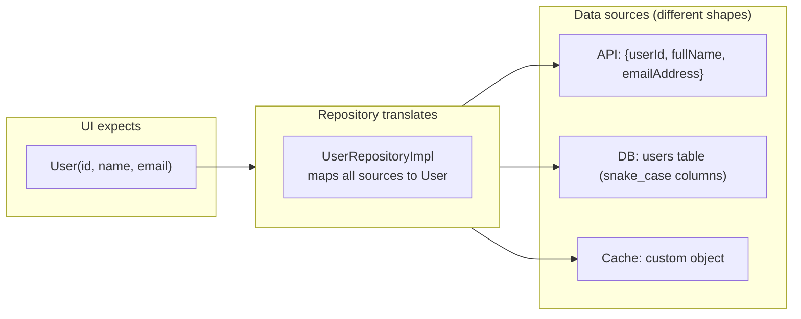

### Repository — Testability

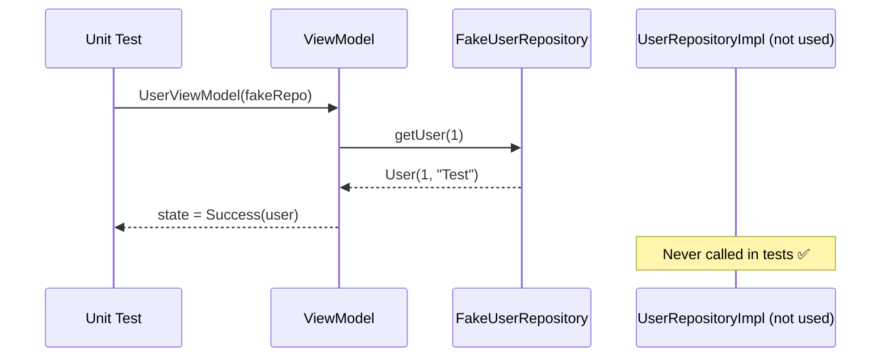

---

## Strategy Pattern in Android

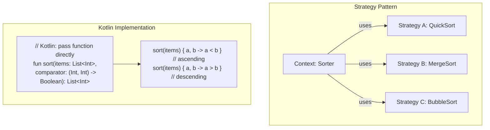

---

## State Pattern

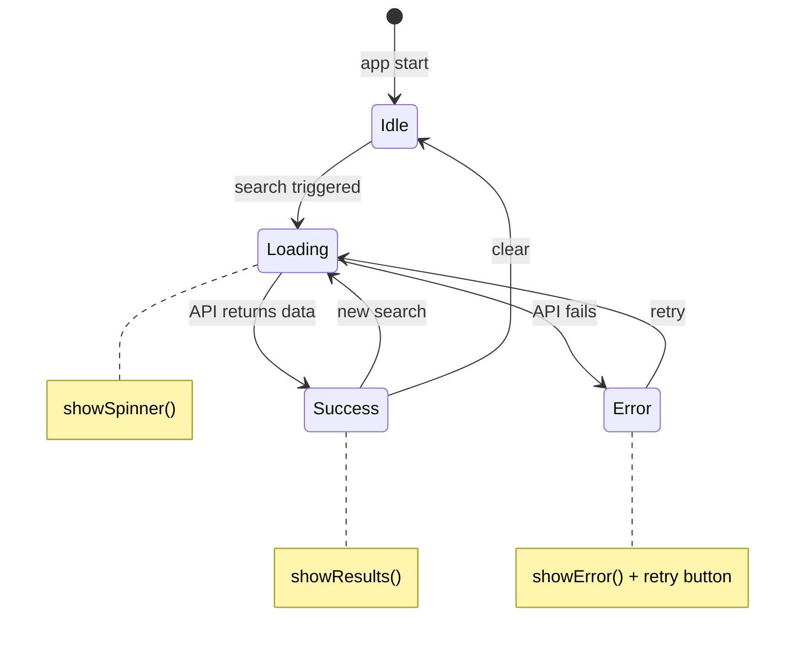

### State Pattern in Sealed Class

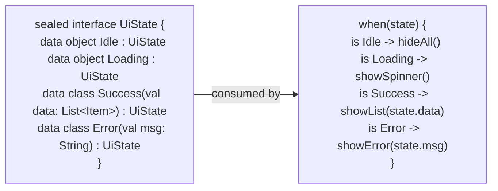

---

## Adapter Pattern

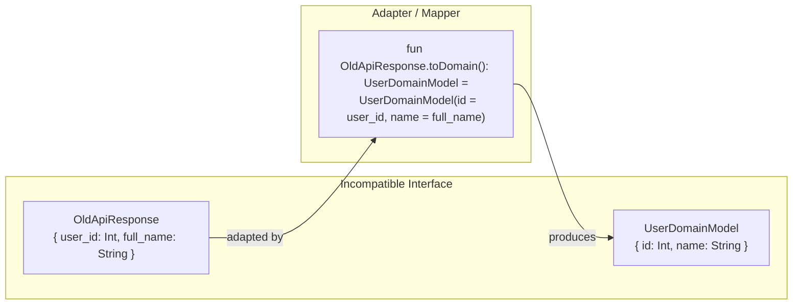

---

## Decorator Pattern

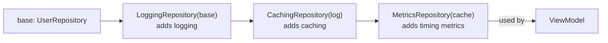

---

## Design Patterns — Quick Reference

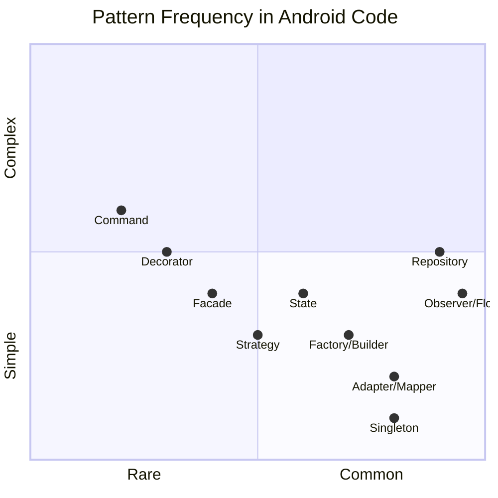
