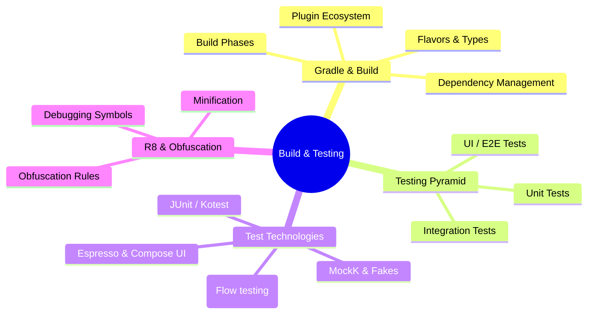

# 🔨 Build & Testing

[← Back to main index](../README.md)

> [!TIP] **Testing pyramid separates engineers from hackers.** Strong test coverage + fast feedback loops are staff-level expectations. Gradle mastery shows deep platform knowledge. Interview frequency: **MEDIUM-HIGH**.

---

## 🧪 Testing & Build Strategy

<strong>Testing & Build Essentials</strong>

---

## 📂 Files in This Folder

| File | Topic | Description | Key Interview Topics |
|:-----|:------|:-----------|:---------------------|
| **[gradle-build.md](gradle-build.md)** | Gradle & Build Tooling | Build types, dependencies, plugins | Build phases, dependency tree, version conflicts |
| **[testing-essentials.md](testing-essentials.md)** | Testing Essentials (Staff Level) | Unit tests, integration tests | Testing pyramid, mock strategies, test isolation |
| **[testing-strategies.md](testing-strategies.md)** | Testing Strategies by Scenario | Test planning and execution | Coverage targets, flaky test prevention |
| **[instrumentation-testing.md](instrumentation-testing.md)** | Instrumentation Tests & UI Testing | Espresso, ActivityScenarioRule | UI automation, synchronization, custom matchers |
| **[proguard-r8.md](proguard-r8.md)** | ProGuard/R8 Obfuscation Gotchas | Minification, obfuscation | Keep rules, reflection impacts, debugging |

---

## 🔗 Jump to other folders

| 🚀 Kotlin | 🔧 Core | 🏗️ Design |
|:---------|:--------|:---------|
| [Kotlin](../kotlin/README.md) | [Android Core](../android-core/README.md) | [Architecture](../architecture/README.md) |

| 🌐 Data | 🎨 UI | ⚡ Performance |
|:--------|:-----|:-------------|
| [Data & Networking](../data-networking/README.md) | [UI & Graphics](../ui/README.md) | [Performance](../performance/README.md) |

| 💡 Strategy |
|:-----------|
| [Interview Strategy](../interview-strategy/README.md) |
