[← Back to main index](../../README.md) | [← Back to folder](../README.md)

---

## 11. Gradle & Build Tooling

```mermaid
flowchart LR
    Init["1️⃣ Initialization<br/>settings.gradle found<br/>Projects discovered"]
    Config["2️⃣ Configuration<br/>build.gradle executed<br/>Tasks created<br/>Dependency graph resolved"]
    Exec["3️⃣ Execution<br/>Requested tasks run<br/>Outputs generated<br/>APK/AAB created"]

    Init --> Config
    Config --> Exec

    classDef phase fill:#e1f5ff,stroke:#01579b,stroke-width:2px
    class Init,Config,Exec phase
```

<details open>
<summary><strong>🔨 Gradle Build Phases</strong></summary>



</details>

---

### Kotlin DSL vs Groovy

> [!TIP]
> **Kotlin DSL (`.kts`) = type-safe, IDE support, modern. Groovy (`.gradle`) = dynamic, legacy.** Use Kotlin DSL
> for new projects (AGP 9+ default). Groovy works but not recommended.

`Kotlin DSL` type-safe · `Groovy` dynamic · `IDE autocomplete` · `Convention plugins` · `AGP 9+ default`

<details>
<summary>💻 Code Example</summary>

```kotlin
// Kotlin DSL (build.gradle.kts) - Type-safe
android {
    compileSdk = 35
    defaultConfig { applicationId = "com.example.app" }
}
dependencies {
    implementation(libs.androidx.core)  // Type-safe reference
}

// Groovy (build.gradle) - Dynamic
android {
    compileSdkVersion 35
    defaultConfig { applicationId "com.example.app" }
}
dependencies {
    implementation libs.androidx.core  // String-based, autocomplete weak
}
```

</details>

| Feature | Kotlin DSL | Groovy |
|---|---|---|
| **IDE autocomplete** | ✅ Full | ⚠️ Limited |
| **Type checking** | ✅ Compile-time | ❌ Runtime errors |
| **Syntax errors** | ✅ Caught by IDE | ❌ Found at gradle sync |
| **2026 default** | **Yes** | Supported only |
| **Performance** | Slightly faster (compiled) | Slightly slower (interpreted) |

<details>
<summary>🔩 Under the Hood</summary>

### Gradle configuration model & DSL generation

**Kotlin DSL compilation:**
```
build.gradle.kts
  ↓ (Kotlin compiler at sync)
  ↓ Type-checks against Project API
  ↓ Generates build.gradle.kts.jar (compiled Kotlin bytecode)
  ↓ Gradle loads JAR, executes configuration
  Result: Type errors caught before gradle runs
```

**Groovy interpretation:**
```
build.gradle
  ↓ (Gradle reads as DSL text)
  ↓ Method resolution at runtime (dynamic dispatch)
  ↓ If method not found: error during sync
  Result: Errors found later, harder to debug
```

### Lazy vs Eager task configuration

**Eager (Groovy, old pattern):**
```groovy
tasks.create("myTask") {
    doLast {
        println "Task running"
    }
}

// Problem: Task created immediately, even if not used
// Large build.gradle = many unused tasks created upfront
```

**Lazy (Kotlin DSL, recommended):**
```kotlin
tasks.register("myTask") {  // register() instead of create()
    doLast {
        println "Task running"
    }
}

// Benefit: Task created only if referenced/used
// Faster configuration phase (skips unused tasks)
```

**Configuration phase optimization:**
```
Gradle configuration phase:
  1. Read all build.gradle files
  2. Register tasks (but don't execute yet)
  3. Build task graph
  4. Execute tasks

Eager tasks: All created in step 2 (slower config phase)
Lazy tasks: Only registered if actually used (faster config phase)
```

### Convention plugins (Kotlin DSL requirement)

**Pattern:**
```kotlin
// plugins/build-logic/src/main/kotlin/MyConvention.gradle.kts
plugins {
    id("com.android.library")
}

android {
    compileSdk = 35
    defaultConfig {
        minSdk = 24
    }
}

// App's build.gradle.kts:
plugins {
    id("com.example.my-convention")  // Reusable configuration
}

// Benefit: Share build config across modules (DRY)
```

**Requires Kotlin DSL:** Convention plugins must be `.kts` (Groovy plugins deprecated).

### What it reuses & relies on

- **Kotlin compiler** — type-checks `.kts` at sync time
- **Gradle Plugin API** — Project, Task, Extension interfaces
- **Groovy interpreter** — Groovy `.gradle` evaluated at runtime
- **Build model** — task graph, configuration vs execution phases

### Why this design was chosen

**Kotlin DSL benefits:**
- Type-safe: IDE prevents mistakes
- Faster configuration: lazy registration
- Convention plugins possible (modern build architecture)

**Groovy legacy:**
- Pre-Kotlin era (simpler dynamic syntax seemed appealing)
- No compile-time checks (worked fine until projects got large)
- Now superceded by Kotlin DSL (static typing + tooling)

### User vs Understander

| A user knows | An understander also knows |
|---|---|
| "Kotlin DSL has better IDE support" | `.kts` compiled by Kotlin compiler; type errors caught at sync. `.gradle` interpreted at runtime. |
| "Use register() instead of create()" | register() = lazy (only creates if used). create() = eager (creates immediately). Faster config phase with lazy. |
| "Convention plugins are .kts" | Convention plugins (reusable build logic) require Kotlin DSL. Groovy plugins being deprecated. |
| "Kotlin DSL is default" | AGP 9+ defaults to `.kts` for all generated files. Groovy still works but not recommended for new code. |

### Gotchas at depth

- **Type safety can be overly strict:** Sometimes you want dynamic behavior (Groovy lets you). Kotlin DSL requires more explicit types.
- **Kotlin DSL sync slower first time:** Compilation adds overhead. Subsequent syncs faster (caching). Groovy syncs always fast (no compilation).
- **Mixed .gradle + .kts:** Both can coexist but confusing. Pick one (ideally all `.kts`). IDE autocomplete weak if mixed.
- **AGP version compatibility:** Older AGP may not support all Kotlin DSL features. Keep AGP updated for best compatibility.

</details>

### Version Catalogs

> [!TIP]
> `gradle/libs.versions.toml` centralizes all versions and dependencies. Single source of truth. Gradle
> generates type-safe `libs.*` accessors. AGP 9+ default.

`TOML format` · `Centralized versions` · `Type-safe accessors` · `No string magic` · `Easy updates`

<details>
<summary>💻 Code Example</summary>

```toml
# gradle/libs.versions.toml
[versions]
kotlin = "2.0.0"
androidx-core = "1.13.1"

[libraries]
androidx-core = { module = "androidx.core:core", version.ref = "androidx-core" }
kotlinx-serialization = "org.jetbrains.kotlinx:kotlinx-serialization-json:1.6.3"

[bundles]
androidx = ["androidx-core"]

[plugins]
android-application = { id = "com.android.application", version = "8.2.0" }
```

</details>

<details>
<summary>💻 Code Example</summary>

```kotlin
// build.gradle.kts - type-safe usage
dependencies {
    implementation(libs.androidx.core)          // Single lib
    implementation(libs.bundles.androidx)       // Bundle
}

plugins {
    id(libs.plugins.android.application)
}
```

</details>

| Pattern | Example | Benefit |
|---|---|---|
| **Single version** | `[versions]` + `version.ref` | Update once, used everywhere |
| **Type-safe ref** | `libs.androidx.core` | IDE autocomplete, no strings |
| **Bundles** | `libs.bundles.androidx` | Group related deps |
| **Plugins** | `libs.plugins.android.application` | Reusable plugin versions |

<details>
<summary>🔩 Under the Hood</summary>

### TOML parsing & generated accessors

**What Gradle does:**
```
gradle/libs.versions.toml (TOML file)
  ↓ (Gradle reads at sync)
  ↓ Parser: [versions], [libraries], [plugins], [bundles]
  ↓ Generates: build/.gradle/generated/gradle/libs/Libs.kt
  ↓ Exposes: libs.androidx.core, libs.bundles.androidx, etc.
```

**Generated accessors (pseudocode):**
```kotlin
// Generated in build/.gradle/generated/gradle/libs/Libs.kt
object Libs {
    object Androidx {
        val core = "androidx.core:core:1.13.1"
    }
    object Bundles {
        val androidx = listOf(Libs.Androidx.core)
    }
}

// So you write:
dependencies {
    implementation(libs.androidx.core)  // IDE sees this, autocompletes
}
```

**Naming transformation:**
```
TOML: androidx-core
→ Property: androidx.core (dash to nested property)

TOML: [plugins] android-application
→ Property: libs.plugins.android.application

Naming convention makes hierarchical structure accessible
```

### Why centralized versions matter

**Before Version Catalogs (scattered):**
```kotlin
// build.gradle.kts (app module)
dependencies {
    implementation("androidx.core:core:1.13.1")
}

// build.gradle.kts (lib-a module)
dependencies {
    implementation("androidx.core:core:1.12.0")  // Different version!
}

// Problem: Two modules use different versions (potential conflicts)
```

**After Version Catalogs (centralized):**
```toml
[versions]
androidx-core = "1.13.1"
```
All modules reference same version. No conflicts.

### Type-safe accessors vs strings

**String approach (error-prone):**
```kotlin
dependencies {
    implementation("androidx.core:core:1.13.1")  // Typo: "androidx.cor" → unnoticed until runtime
    implementation("androidx.core:core:1.12.0")  // What version? Have to scroll up
}
```

**Type-safe accessors (safe):**
```kotlin
dependencies {
    implementation(libs.androidx.core)  // IDE catches typo immediately (androidx.cor doesn't exist)
    // Version is in TOML, single update point
}
```

### What it reuses & relies on

- **TOML parser** — Gradle includes TOML support natively
- **Kotlin code generation** — generates accessor .kt files at sync
- **Gradle plugin API** — Extension model to define libs object
- **Classpath** — accessors added to buildscript classpath automatically

### Why this design was chosen

**Problem:** 20+ dependencies across modules, versions scattered everywhere.

**Solution:** Single TOML file as source of truth. Gradle generates type-safe code.

**Benefits:**
- One place to update versions (no copy-paste)
- Type-safe access (IDE prevents typos)
- DRY (don't repeat versions)
- Bundles for common groups (androidx, testing, etc.)

### User vs Understander

| A user knows | An understander also knows |
|---|---|
| "Version Catalogs centralize versions" | TOML file parsed by Gradle; generates `.kt` accessor file with type-safe properties |
| "Use libs.androidx.core" | libs object created by code generation; androidx.core maps to TOML [libraries] entry |
| "Dash converts to nested property" | androidx-core in TOML → androidx.core property (dash = hierarchy separator) |
| "Sync regenerates accessors" | Every sync re-parses TOML, regenerates accessor file (`.gradle/generated/`). Changes immediate. |

### Gotchas at depth

- **TOML syntax strict:** Invalid TOML = sync fails cryptically. Validate TOML (use IDE plugin or online validator).
- **Accessor generation delay:** If sync didn't regenerate, IDE might not see updated libs. Clean build (Ctrl+Shift+S) forces regen.
- **Version constraints not reflected:** Version Catalogs don't enforce "use max version" automatically. Still need gradle resolution strategy if conflicts occur.
- **Mixed manual + TOML:** If some deps in TOML and others hardcoded, defeats purpose. Migrate all or none (avoid confusion).

</details>

### Build Types vs. Product Flavors

> [!TIP]
> Build Types = *how* to build (debug/release, minify, signing). Product Flavors = *what* to build
> (free/premium, dev/prod, regions). Flavors × Build Types = all variants (e.g., `freeDebug`, `premiumRelease`).

Build Type (debug/release) · Flavor (free/premium) · Variant (dimension) · `applicationIdSuffix` · `buildConfigField`

|Concept|Build Types|Product Flavors|
|---|---|---|
|**Purpose**|**How** to build|**What** to build|
|**Examples**|`debug`/`release`|`free`/`premium`, `dev`/`prod`|
|**Controls**|minify, debuggable, signing, JVM args|appId suffix, resources, endpoints, feature flags|
|**Combine**|`freeDebug`, `premiumRelease`||

**Build Types deep dive:**
<details>
<summary>💻 Code Example</summary>

```kotlin
buildTypes {
    debug {
        debuggable = true
        minifyEnabled = false
        signingConfig = signingConfigs.getByName("debug")
    }
    release {
        debuggable = false
        minifyEnabled = true
        signingConfig = signingConfigs.getByName("release")
        proguardFiles("proguard-rules.pro")
    }
    // Custom type for internal testing
    staging {
        initWith(release)
        debuggable = true
        minifyEnabled = false
        applicationIdSuffix = ".staging"
    }
}
```

</details>

**Product flavors for multi-variant apps:**
<details>
<summary>💻 Code Example</summary>

```kotlin
flavorDimensions = listOf("tier", "region")
productFlavors {
    create("free") { dimension = "tier"; applicationIdSuffix = ".free" }
    create("premium") { dimension = "tier" }
    create("us") { dimension = "region" }
    create("eu") { dimension = "region"; buildConfigField("String", "API_URL", "\"https://api-eu.example.com\"") }
}
// Variants: freeDebug, freeUsDebug, premiumEuRelease, etc.
```

</details>

<details>
<summary>🔩 Under the Hood</summary>

### Build Type vs Flavor Distinction

**Build Type:**
- Controls compilation & packaging (how you build)
- Single selection per build (either debug OR release)
- Applied to final APK/AAB

**Product Flavor:**
- Controls app variant (what you ship)
- Multiple dimensions allow combinations (tier × region)
- Each combination = unique app (different appId, resources, code paths)

**Example: Free + Debug vs Premium + Release**
```kotlin
// Free Debug: dev build, logging, no minify, free API endpoint
// Premium Release: prod build, minified, signing, premium API endpoint
```

### Dimension Combinations (Variant Explosion)

**With 2 dimensions:**
```
tier: [free, premium]      (2 options)
region: [us, eu]           (2 options)
build types: [debug, release] (2 options)
Total variants = 2 × 2 × 2 = 8 variants
```

**Variants generated:**
- freeUsDebug
- freeUsRelease
- freeEuDebug
- freeEuRelease
- premiumUsDebug
- premiumUsRelease
- premiumEuDebug
- premiumEuRelease

**Problem:** Too many dimensions = variant explosion (slow build). Keep dimensions ≤2.

### buildConfigField & Resource Selection

**buildConfigField (compile-time constant):**
```kotlin
buildConfigField("String", "API_URL", "\"https://api-free.example.com\"")
// Generates: BuildConfig.API_URL = "https://api-free.example.com"
// Used: API calls fetch from BuildConfig.API_URL
```

**Resource selection (src/free/resources/values/strings.xml):**
```xml
<!-- src/free/resources/values/strings.xml -->
<string name="app_name">MyApp (Free)</string>

<!-- src/premium/resources/values/strings.xml -->
<string name="app_name">MyApp (Premium)</string>
```
Gradle merges: free variant uses free/strings.xml, premium uses premium/strings.xml.

### What it reuses & relies on

- **Gradle variant generation** — combinations of flavorDimensions × buildTypes
- **Source set merging** — src/main + src/flavor/ + src/buildType/ combined
- **Resource overlay** — later sources override earlier (flavor > main)
- **BuildConfig code generation** — Gradle creates fields from buildConfigField calls

### Why this design was chosen

**Problem:** Multi-app strategy without duplicating codebase.
- One codebase = 1 app
- Flavors = multiple apps from 1 codebase (share core logic, vary appearance/config)

**Example:** Google Play allows multiple APKs per app (free vs premium). Build system needed to support this at scale.

### User vs Understander

| A user knows | An understander also knows |
|---|---|
| "Build Types control debug vs release" | Debug = debuggable flag ON, minify OFF. Release = minify ON via R8/ProGuard, signing configured. |
| "Product Flavors differentiate apps" | Gradle creates variant per dimension combo; merges src/main + src/flavor + src/buildType source sets. |
| "buildConfigField sets constants" | Gradle generates BuildConfig.java with static fields; constants inlined by compiler (no reflection). |
| "Appending .free suffix" | applicationIdSuffix appended to base appId (com.example.app + ".free" = com.example.app.free). Allows multiple installs. |

### Gotchas at depth

- **Flavor dimension required:** Flavors must declare dimension. If missing, gradle error. Use same dimension names across modules for consistency.
- **Source set priority:** src/freeDebug > src/free > src/debug > src/main. Debug specifics override flavor specifics (careful!).
- **Resource duplication:** If free and premium need different layouts, must create src/free/res/layout/main.xml (whole file, not just changes).
- **Variant explosion:** 3 dimensions × 2 flavors each = 8 variants. Gradle build time scales with variant count. Use source set filtering if possible.

</details>

### Dependency Resolution & Conflicts

> [!TIP]
> Dependency conflicts occur when transitive deps want different versions. Gradle defaults to *highest version*.
> Fix via: force strategy, BOM (preferred), or exclude transitive. BOM is safest (Google Firebase, AndroidX
> patterns use it).

Transitive dependencies · Highest version strategy · `force()` · `exclude()` · BOM (Bill of Materials)

**Problem:** Two transitive deps want different versions of the same lib.
<details>
<summary>💻 Code Example</summary>

```
app → lib-a (wants okhttp 4.10) → lib-b (wants okhttp 4.9)
// Gradle picks 4.10 (highest version, default strategy)
```

</details>

**Resolution Strategies:**
1. **Force version (not recommended):** Overrides all versions
<details>
<summary>💻 Code Example</summary>

   ```kotlin
   configurations.all {
       resolutionStrategy {
           force("com.squareup.okhttp3:okhttp:4.10.0")
       }
   }
   ```

</details>

2. **Exclude transitive (risky):** Remove conflicts manually
<details>
<summary>💻 Code Example</summary>

   ```kotlin
   implementation("lib-a") { exclude("com.squareup.okhttp3") }
   ```

</details>

3. **Bill of Materials - BOM (RECOMMENDED):** Single source of truth
<details>
<summary>💻 Code Example</summary>

   ```kotlin
   implementation(platform("com.google.firebase:firebase-bom:33.0.0"))
   implementation("com.google.firebase:firebase-analytics")  // Version from BOM
   implementation("com.google.firebase:firebase-messaging")  // Same version
   ```

</details>

<details>
<summary>🔩 Under the Hood</summary>

### Gradle Dependency Graph Resolution

**Dependency graph construction:**
```
app/build.gradle.kts declares:
  implementation("okhttp:4.11.0")
  implementation("retrofit2:2.9.0")

retrofit2:2.9.0 transitively depends on:
  okhttp:4.9.0

Gradle builds graph:
  app
    ├── okhttp:4.11.0 (direct)
    └── retrofit2:2.9.0
         └── okhttp:4.9.0 (transitive)

Conflict detected: okhttp:4.11.0 vs okhttp:4.9.0
Resolution strategy: highest version → okhttp:4.11.0 wins
```

**Resolution Strategy Options:**
1. **Highest version (default):** okhttp:4.11.0 selected
2. **Fail on conflict:** Error if mismatch found (rare)
3. **Custom strategy:** User-defined rules

### Bill of Materials (BOM) Mechanism

**What BOM provides:**
```toml
<!-- firebase-bom:33.0.0 declares (internally) -->
[library_versions]
firebase-analytics = "21.6.1"
firebase-messaging = "23.4.1"
okhttp = "4.11.0"  <!-- BOM also manages transitive deps! -->
```

**How it works:**
```kotlin
// Step 1: Declare BOM (not a library, no code)
implementation(platform("com.google.firebase:firebase-bom:33.0.0"))

// Step 2: Gradle loads BOM constraints
// All firebase libs will use versions declared in BOM

// Step 3: Gradle resolves lib versions from BOM
implementation("com.google.firebase:firebase-analytics")
// → Gradle looks up "firebase-analytics" in BOM → 21.6.1
```

**BOM vs direct version declaration:**
```kotlin
// Without BOM (manual):
implementation("com.google.firebase:firebase-analytics:21.6.1")
implementation("com.google.firebase:firebase-messaging:23.4.1")
// Multiple places to update if version changes

// With BOM (centralized):
implementation(platform("com.google.firebase:firebase-bom:33.0.0"))
implementation("com.google.firebase:firebase-analytics")  // No version
implementation("com.google.firebase:firebase-messaging")  // No version
// One place to update (BOM version)
```

### Transitive Dependency Exclusion (Dangerous)

**When you exclude:**
```kotlin
implementation("okhttp:4.11.0")
implementation("retrofit2:2.9.0") {
    exclude("okhttp")  // Remove okhttp from retrofit2's deps
}
// Result: Only okhttp:4.11.0 used
// Risk: retrofit2 tested with okhttp:4.9.0; may break with 4.11.0
```

**Problems with exclusion:**
- Retrofit assumes okhttp 4.9 APIs exist (may be removed in 4.11)
- No guarantee of compatibility
- Hard to debug ("library X mysteriously crashes with version Y")

**Better:** Use BOM that was tested together.

### Force Strategy (Last Resort)

```kotlin
configurations.all {
    resolutionStrategy {
        force("com.squareup.okhttp3:okhttp:4.10.0")
    }
}
```

**What happens:**
- Gradle force-selects okhttp:4.10.0 regardless of declared versions
- No conflict resolution needed
- Risk: Untested combination (like exclusion)

**Use only if:**
- BOM not available
- Multiple independent transitive deps want incompatible versions
- You've tested the forced version

### What it reuses & relies on

- **Gradle dependency resolution algorithm** — DAG (directed acyclic graph) traversal
- **Version constraints** — declared in build.gradle.kts or BOM
- **Transitive dependency closure** — recursively resolved
- **Maven Central/Google Maven** — where libs fetched from

### Why this design was chosen

**Problem:** Complex projects have 100+ transitive deps; versions scatter everywhere.

**Solution:** BOM pattern (Maven standard).
- Single version file (BOM) tested together
- All libs in same BOM guaranteed compatible
- One update point for large sets of libs

### User vs Understander

| A user knows | An understander also knows |
|---|---|
| "Gradle picks highest version" | Gradle builds DAG of deps; conflict resolver selects max version (Semver-based). Configurable. |
| "BOM enforces versions" | BOM constraints applied during graph resolution. Gradle looks up libs in BOM instead of declared versions. |
| "Exclude removes conflicts" | exclusion() removes edges in DAG. Risk: untested version combos may break. |
| "Force overrides everything" | resolutionStrategy.force() applies global rule; all paths to lib get forced version regardless. |

### Gotchas at depth

- **BOM ordering matters:** `platform()` must come before dependent libs (affects version selection order).
- **Transitive closure explosion:** 100 direct deps can pull 1000+ transitive. Slow resolution on first build. Gradle caches (second builds fast).
- **Version scheme mismatch:** Some libs use Semver (1.2.3), others don't (2021.01.01). Highest version may not mean "latest stable."
- **Conflicting BOMs:** Two BOMs declare different versions of same lib. Gradle error if not resolvable. Use exclusion or version overrides carefully.

</details>

### Task Execution & Caching

**Gradle tasks:** `./gradlew assemble` = compile + package. Skips unchanged sources (incremental build).

**ABI change:** If public API changes, all dependents recompile (ABI incompatibility).

**Custom task with caching:**
<details>
<summary>💻 Code Example</summary>

```kotlin
tasks.register("reportVersions") {
    doLast {
        println("Kotlin: ${kotlinVersion}, AGP: ${agpVersion}")
    }
}
./gradlew reportVersions  // Task runs
./gradlew reportVersions  // Task runs again (no outputs to cache)
```

</details>

**Parallel build:** `org.gradle.parallel=true` in gradle.properties. Faster on multi-core. Beware: some plugins not thread-safe.

---

