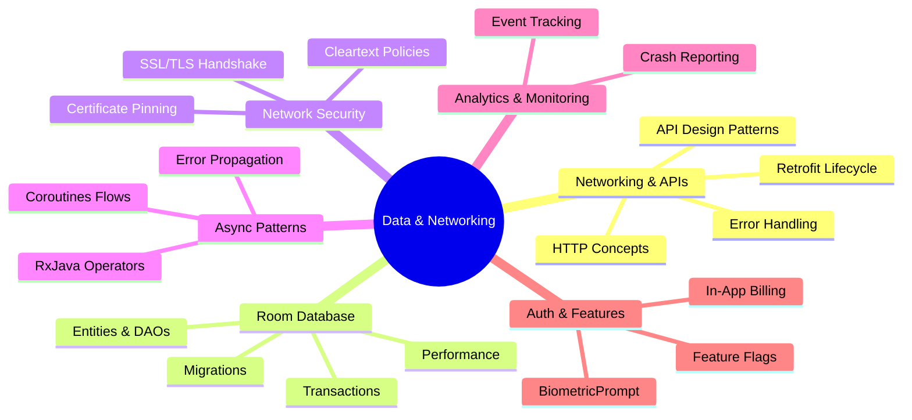

# 🌐 Data & Networking

[← Back to main index](../README.md)

> [!WARNING]
> **Data layer design is where most bugs hide.** Security (SSL/TLS, authentication), database transactions, and
> async patterns separate careful engineers from careless ones. Interview frequency: **CRITICAL**.

---

## 🔄 Data Flow Architecture

<strong>Data Integration Stack</strong>

---

## 📂 Files in This Folder

| File | Topic | Description | Key Interview Topics |
|:-----|:------|:-----------|:---------------------|
| **[networking-api.md](networking-api.md)** | Networking & API Design | Retrofit, HTTP, API patterns | Interceptors, request lifecycle, error handling |
| **[room-database.md](room-database.md)** | Room Database Advanced Patterns | Entities, DAOs, transactions | Transactions, foreign keys, query optimization |
| **[ssl-network-security.md](ssl-network-security.md)** | SSL/TLS & Network Security | Certificate pinning, cleartext policies | Certificate pinning implementation, Man-in-the-Middle attacks |
| **[rxjava-vs-coroutines.md](rxjava-vs-coroutines.md)** | RxJava vs. Coroutines Comparison | Reactive vs async patterns | Operator chaining, flow operators, backpressure |
| **[analytics-crash.md](analytics-crash.md)** | Analytics & Crash Reporting | Firebase Analytics, Crashlytics | Event property limits, PII redaction |
| **[biometric-billing.md](biometric-billing.md)** | Biometric Authentication & In-App Billing | BiometricPrompt, Play Billing | Biometric flow, Play Billing state machine |
| **[feature-flags-ab.md](feature-flags-ab.md)** | Feature Flags & A/B Testing | Experiments, rollouts | Rollout strategy, statistical significance |

---

## 🔗 Jump to other folders

| 🚀 Kotlin | 🔧 Core | 🏗️ Design |
|:---------|:--------|:---------|
| [Kotlin](../kotlin/README.md) | [Android Core](../android-core/README.md) | [Architecture](../architecture/README.md) |

| 🎨 UI | 💡 Strategy | ⚡ Performance |
|:-----|:-----------|:--------------|
| [UI & Graphics](../ui/README.md) | [Interview Strategy](../interview-strategy/README.md) | [Performance](../performance/README.md) |

| 🔨 Build |
|:---------|
| [Build & Testing](../build-testing/README.md) |
