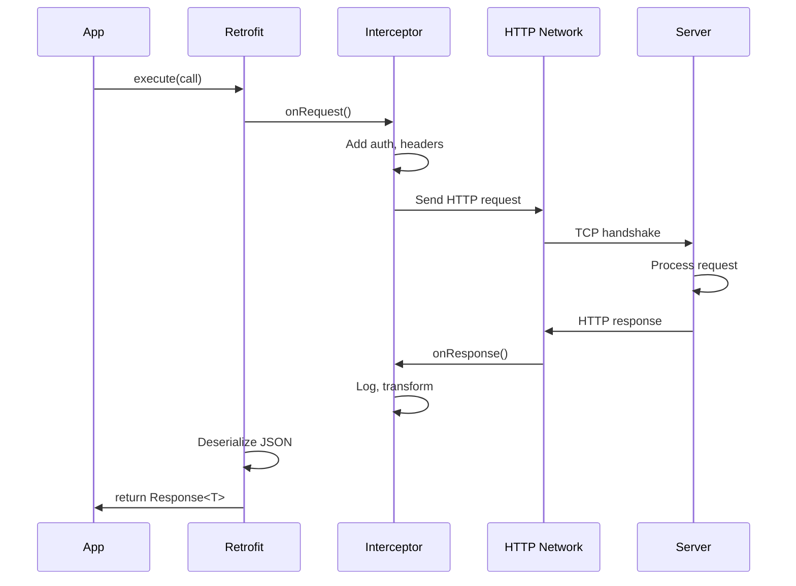

[← Back to main index](../../README.md) | [← Back to folder](../README.md)

---

## 13. Networking & API Design

<details open>
<summary><strong>📡 Retrofit Request Lifecycle</strong></summary>



</details>

---

### RESTful API Best Practices for Android

> [!IMPORTANT]
> **Design APIs resource-oriented (`/users/123`), not RPC-style (`/getUser?id=123`).** Use DTOs to map API
> responses, separate from domain models. Stateless + idempotent design enables safe retries.

REST principles · DTO ↔ Domain mapping · Stateless · Idempotent · Safe retries

**HTTP Method Contract:**

| Method | Safe to Retry | Idempotent | Use Case |
|---|---|---|---|
| **GET** | ✅ Yes | ✅ Yes | Fetch data (no side effects) |
| **PUT** | ✅ Yes | ✅ Yes | Update entire resource (replace) |
| **DELETE** | ✅ Yes | ✅ Yes | Remove resource (same result) |
| **POST** | ❌ No | ❌ No | Create (may duplicate) |
| **PATCH** | ❌ No | ❌ No | Partial update (depends on order) |

**Response shape for Android:**
<details>
<summary>💻 Code Example</summary>

```kotlin
// API response (server)
data class ApiResponse<T>(
    val success: Boolean,
    val data: T?,
    val error: String?
)

// DTO (maps API shape)
data class UserDto(val id: Int, val name: String)

// Domain model (app logic)
data class User(val id: Int, val name: String)

// Mapper (DTO → Domain)
fun UserDto.toDomain() = User(id, name)
```

</details>

<details>
<summary>🔩 Under the Hood</summary>

### Stateless Design (Why It Matters)

**Stateful design (problematic):**
```
Client A: POST /users/{id}/follow → Server stores "A is following id"
Client A loses connection
Client A: Are you following? → Server: "checking my memory..." → ERROR
// Server state lost
```

**Stateless design (safe):**
```
Client A: POST /users/{id}/follow
  Request includes: user_id, token, timestamp
  Server: "User A wants to follow id. Token valid? Timestamp recent? → Update DB"
Client A reconnects: Same POST → Idempotent (already followed, no duplicate)
```

### DTO ↔ Domain Separation

**Why separate layers:**
```
API evolves: adds "createdAt" field
// Old code (tightly coupled):
data class User(val id: Int, val name: String, val createdAt: String)
// Must update EVERYWHERE

// Decoupled code:
data class UserDto(val id: Int, val name: String, val createdAt: String)  // Evolves
data class User(val id: Int, val name: String)  // Stable
// Domain logic unchanged
```

### Idempotency & Safe Retries

**Problem without idempotency:**
```
POST /transfer (transfer $100)
  ↓ (network timeout)
  ↓ Retry POST (same request)
  ↓ Server: "Transfer $100 again" → $200 transferred (ERROR!)
```

**Solution with idempotency:**
```
PUT /users/123 (replace user data)
  ↓ (network timeout)
  ↓ Retry PUT (same request)
  ↓ Server: "Replace user data" → Same result (SAFE!)

// Or: Idempotency key
POST /transfer with header: Idempotency-Key: abc123
  ↓ Server stores: "abc123 → transferred $100"
  ↓ Retry with same key: Server: "Already processed" → No duplicate
```

### What it reuses & relies on

- **HTTP standards** (RFC 7231) — method semantics
- **JSON serialization** (Gson, kotlinx.serialization)
- **Database transactions** — ensure idempotent updates are atomic

### Why this design was chosen

**Problem:** APIs change. Servers go down. Clients retry. Need safe, predictable behavior.

**Solution: REST principles**
- Stateless: clients carry all context (easier scaling)
- Idempotent: safe to retry (no duplicates)
- DTO/Domain split: decouples API from logic

### User vs Understander

| A user knows | An understander also knows |
|---|---|
| "Use /users/123 not /getUser?id=123" | REST = resource-oriented (nouns), not RPC (verbs). /users/{id} = resource path. |
| "PUT is idempotent, POST isn't" | PUT: same request = same result (replace). POST: same request = multiple results (create duplicate). |
| "Separate DTOs from domain" | DTO maps API schema. Domain model independent. API evolves; domain logic stable. |
| "Stateless design" | Server doesn't store client context. Client sends all data per request. Enables horizontal scaling. |

### Gotchas at depth

- **DELETE idempotency:** DELETE /users/123 twice. First: resource deleted. Second: resource already gone → 404. Still idempotent (same intended result). Handle 404 gracefully.
- **PATCH not idempotent:** PATCH /users/123 {"age": "+1"} → Increments age. Retry: age incremented again. Use PUT instead (replace whole resource).
- **DTO field order:** JSON deserialization order shouldn't matter (Gson handles it). But Parcelable/Serializable order-dependent. Use Gson, not Parcelable for network.
- **API versioning:** URL versioning (/v1/users vs /v2/users) or header versioning. Both have tradeoffs. Header cleaner (single endpoint), URL explicit (separate endpoints).

</details>

### Error Handling in Networking

> [!TIP]
> Use sealed interface (`ApiResult`) to represent Success/Failure/NetworkError. Distinguish network errors
> (retry) from HTTP errors (don't retry 4xx). Repository handles mapping; ViewModel observes result type.

Sealed interface · Network vs HTTP error · Retry strategy · Repository responsibility · Type-safe

<details>
<summary>💻 Code Example</summary>

```kotlin
sealed interface ApiResult<out T> {
    data class Success<T>(val data: T) : ApiResult<T>
    data class Failure(val code: Int, val message: String) : ApiResult<Nothing>
    data class NetworkError(val cause: Throwable) : ApiResult<Nothing>
}

class UserRepository(private val api: UserApi) {
    suspend fun getUser(id: Int): ApiResult<User> = try {
        val response = api.getUser(id)
        if (response.success) {
            ApiResult.Success(response.data.toDomain())
        } else {
            ApiResult.Failure(400, response.error ?: "Unknown")
        }
    } catch (e: IOException) {
        ApiResult.NetworkError(e)  // Network error (retry candidate)
    } catch (e: HttpException) {
        val code = e.code()
        val retryable = code >= 500  // 5xx (server error)
        ApiResult.Failure(code, e.message())
    } catch (e: Exception) {
        ApiResult.Failure(500, "Unexpected error")
    }
}
```

</details>

<details>
<summary>🔩 Under the Hood</summary>

### Exception Types in Retrofit + OkHttp

**Network-level errors (IOException - RETRYABLE):**
```kotlin
// What causes it:
// - No internet connectivity
// - DNS lookup fails
// - Socket timeout
// - Connection refused

try {
    api.getUser(123)
} catch (e: IOException) {  // Network layer error
    // Safe to retry
    // Repository should implement exponential backoff
}
```

**HTTP-level errors (HttpException - CONTEXT DEPENDENT):**
```kotlin
// What causes it:
// - Server responded with error status (4xx, 5xx)
// - Response parsing failed

try {
    api.getUser(123)
} catch (e: HttpException) {
    when (e.code()) {
        400, 401, 403, 404 -> return Failure(e.code(), "Don't retry - client error")
        500, 502, 503, 504 -> return Failure(e.code(), "Retry - server error")
    }
}
```

### ApiResult Pattern vs Exceptions

**Exception-based (old style):**
```kotlin
suspend fun getUser(id: Int): User {  // Throws on error
    return api.getUser(id)
}

// Caller must handle:
try {
    val user = repo.getUser(123)
    updateUI(user)
} catch (e: IOException) {
    showRetry()
} catch (e: HttpException) {
    showError(e.message())
}
```

**ApiResult-based (safe, recommended):**
```kotlin
suspend fun getUser(id: Int): ApiResult<User> {
    return try {
        ApiResult.Success(api.getUser(id))
    } catch (e: IOException) {
        ApiResult.NetworkError(e)
    } catch (e: HttpException) {
        ApiResult.Failure(e.code(), e.message())
    }
}

// Caller pattern-matches:
when (val result = repo.getUser(123)) {
    is ApiResult.Success -> updateUI(result.data)
    is ApiResult.Failure -> showError(result.message)
    is ApiResult.NetworkError -> showRetry()
}
```

**Why ApiResult better:**
- Exhaustive when (compiler enforces all cases)
- No unchecked exceptions
- Clear success/error paths

### Repository Responsibility for Error Handling

**Repository decides:**
1. Which errors are retryable (network errors → yes, 4xx → no)
2. How many retries (exponential backoff)
3. When to delegate to cache (on network error, serve stale)
4. How to map errors (API error codes → user messages)

**ViewModel doesn't:**
- Retry logic (Repository handles)
- Network vs HTTP distinction (Repository handles)
- Specific error messages (Repository handles)

### What it reuses & relies on

- **sealed interface** — exhaustive pattern matching
- **Retrofit interceptors** — can transform exceptions
- **OkHttp client** — throws IOException on network errors
- **Kotlin coroutines** — exception propagation in suspend functions

### Why this design was chosen

**Problem:** Exceptions hide error type (network vs HTTP). Caller can't decide retry strategy.

**Solution: ApiResult ADT**
- Distinguish error types explicitly
- Repository owns retry logic
- ViewModel observes result (exhaustive when)

### User vs Understander

| A user knows | An understander also knows |
|---|---|
| "IOException = network error" | IOException from socket layer (DNS, timeout, disconnect). Thrown by OkHttp before HTTP response. |
| "HttpException = server responded" | HttpException only thrown if response status not 2xx. HTTP layer, after socket. |
| "Retry on network error, not 4xx" | Network = likely transient (retry helps). 4xx = client error (fix request first, retrying won't help). |
| "ApiResult exhaustive" | sealed interface forces all cases in when. Compiler error if missing. |

### Gotchas at depth

- **Retrofit success status range:** By default, 2xx-3xx = success. 4xx, 5xx throw HttpException. Can configure with custom success predicate.
- **Exception chain:** Retrofit wraps exceptions. e.cause may contain underlying IOException. Always check the chain.
- **Timeout exceptions:** SocketTimeoutException extends IOException. Treat as network error (retry). But increase timeout if consistently hitting it.
- **Error body parsing:** response.errorBody() is a stream (consume once). Don't parse multiple times or errors become null.

</details>

### Retry Strategy (Exponential Backoff)

> [!TIP]
> Exponential backoff = wait 100ms, 200ms, 400ms between retries (doubles each time). Prevents thundering herd
> when server recovers. Retry only network errors & 5xx; never 4xx. Max 3 retries (diminishing returns).

Exponential backoff · Jitter · Retry budget · Circuit breaker · Idempotent operations only

<details>
<summary>💻 Code Example</summary>

```kotlin
suspend inline fun <T> retryWithBackoff(
    maxRetries: Int = 3,
    initialDelayMs: Long = 100,
    block: suspend () -> T
): T {
    var lastException: Exception? = null
    repeat(maxRetries) { attempt ->
        try {
            return block()
        } catch (e: IOException) {
            lastException = e
            if (attempt < maxRetries - 1) {
                val delay = initialDelayMs * (2.0.pow(attempt)).toLong()
                delay(delay)  // 100ms, 200ms, 400ms
            }
        }
    }
    throw lastException!!
}

// Usage: immediate, 100ms, 200ms
val user = retryWithBackoff { api.getUser(123) }
```

</details>

| Scenario | Retry? | Reason |
|---|---|---|
| **IOException (no internet)** | ✅ Yes | Network transient; may recover |
| **HttpException 500, 503** | ✅ Yes | Server error; likely transient |
| **HttpException 401, 403, 404** | ❌ No | Client error; retrying won't help |

<details>
<summary>🔩 Under the Hood</summary>

### Exponential Backoff Mechanics

**Why exponential (not linear):**
```
Scenario: Server overloaded, recovers in 1 second

Linear backoff (50ms, 100ms, 150ms):
  ↓ All 1000 clients retry at similar times
  ↓ Server recovers but gets hammered again
  ↓ Cascading failure (thunder herd)

Exponential backoff (100ms, 200ms, 400ms):
  ↓ Clients spread out retries (early ones wait less, late ones wait more)
  ↓ Server recovers gradually
  ↓ Load distributes naturally
```

**Formula:**
```kotlin
delay = initialDelayMs * (2^attempt)  // 100ms * 2^0, 2^1, 2^2
// Attempt 0: 100 * 1 = 100ms
// Attempt 1: 100 * 2 = 200ms
// Attempt 2: 100 * 4 = 400ms
// Attempt 3: 100 * 8 = 800ms (but limited by maxRetries = 3)
```

### Jitter (Optional Enhancement)

**Problem with pure exponential:**
```
Clients A, B, C all start at T=0
All hit server error
All retry at T=100ms (synchronized thundering herd again)
```

**Solution: Add random jitter**
```kotlin
val delay = initialDelayMs * (2.0.pow(attempt)).toLong()
val jitter = Random.nextLong(delay)  // Random 0..delay
delay(delay + jitter)  // Spread out retries
```

### HTTP Status Code Retry Decision

**2xx-3xx (Success):** Don't retry (succeeded!)

**4xx (Client Error - DON'T RETRY):**
- 400: Bad request (invalid JSON)
- 401: Unauthorized (invalid token)
- 403: Forbidden (permission denied)
- 404: Not found (resource doesn't exist)

**5xx (Server Error - RETRY):**
- 500: Internal server error (may be transient)
- 502: Bad gateway (load balancer issue)
- 503: Service unavailable (temporarily down)
- 504: Gateway timeout (server slow)

### What it reuses & relies on

- **Kotlin delay()** — suspends coroutine (non-blocking sleep)
- **Math.pow()** — exponential calculation
- **Coroutine scope** — cancellation propagates through retries

### Why this design was chosen

**Problem:** Naive retries overload recovering servers (thundering herd). Retrying 4xx wastes time.

**Solution: Exponential backoff + smart decisions**
- Exponential: spreads out retries
- Smart: only retry transient errors

### User vs Understander

| A user knows | An understander also knows |
|---|---|
| "Exponential backoff spreads retries" | 2^attempt grows delays. Prevents synchronized retries from multiple clients. |
| "Don't retry 4xx" | 4xx = client error (invalid input, auth). Retrying same request won't fix it. |
| "Max 3 retries" | More retries have diminishing returns. After 3 failures (~700ms), likely unrecoverable. |
| "delay() doesn't block" | Coroutine suspension. Thread remains free for other work (not Thread.sleep blocking). |

### Gotchas at depth

- **Retry storms:** Many clients retrying simultaneously. Use jitter to randomize timing. Server should send 429 (rate limit) to back off clients.
- **Timeout during retry:** If socket timeout + retry backoff both happen, cumulative delays multiply. Set socket timeout < total retry window.
- **Only retry idempotent ops:** GET, PUT, DELETE safe to retry. POST may duplicate. Use Idempotency-Key header if retrying POST.
- **Jitter overhead:** Adding jitter helps, but small delays (100ms) may not need it. Larger retry delays (1s+) benefit from jitter more.

</details>

### Connection Pooling & Keep-Alive

> [!TIP]
> Reuse TCP connections (keep-alive) instead of opening new ones. OkHttp pools connections automatically. Keep 5
> idle connections, TTL 5 min. Timeout: 30s for connect/read/write. Reduces latency by 100-500ms per request.

Connection pooling · Keep-alive · TCP reuse · Timeout tuning · Idle connection cleanup

<details>
<summary>💻 Code Example</summary>

```kotlin
val httpClient = OkHttpClient.Builder()
    .connectTimeout(30, TimeUnit.SECONDS)   // TCP handshake timeout
    .readTimeout(30, TimeUnit.SECONDS)      // Waiting for response data
    .writeTimeout(30, TimeUnit.SECONDS)     // Sending request timeout
    .connectionPool(
        ConnectionPool(
            maxIdleConnections = 5,         // Keep 5 idle connections
            keepAliveDuration = 5,          // 5 minute TTL
            TimeUnit.MINUTES
        )
    )
    .build()

val retrofit = Retrofit.Builder()
    .client(httpClient)
    .baseUrl("https://api.example.com/")
    .addConverterFactory(GsonConverterFactory.create())
    .build()
```

</details>

| Config | Default | Tuning | When |
|---|---|---|---|
| **connectTimeout** | 10s | 30s | Slow network, distant servers |
| **readTimeout** | 10s | 30s | Slow response, large payload |
| **keepAlive** | 5 min | Increase | High-frequency requests |
| **maxIdle** | 5 | Increase | High concurrency |

<details>
<summary>🔩 Under the Hood</summary>

### TCP Connection Lifecycle (Keep-Alive vs New)

**Without keep-alive (new connection per request):**
```
Request 1:
  T=0ms: SYN (client → server)
  T=10ms: SYN-ACK (server → client)
  T=20ms: ACK (client → server) — connection established
  T=25ms: HTTP GET (send request)
  T=100ms: HTTP 200 (receive response)
  T=110ms: FIN (close connection)
  Total: ~110ms (includes TCP overhead)

Request 2 (to same host):
  T=110ms: SYN (new connection)
  T=120ms: SYN-ACK
  T=130ms: ACK
  ... repeat overhead
  Total: ~110ms again
```

**With keep-alive (reuse connection):**
```
Request 1:
  T=0ms-20ms: TCP handshake (3-way)
  T=25ms: HTTP GET
  T=100ms: HTTP 200
  Connection stays open

Request 2 (reuses same connection):
  T=110ms: HTTP GET (no handshake!)
  T=150ms: HTTP 200
  Total: ~40ms (no TCP overhead)
  Savings: ~70ms (64% faster!)
```

### Connection Pool Management

**How OkHttp manages:**
```kotlin
// Pool stores:
// - Idle connections: ready to reuse
// - Active connections: currently in use
// - Max idle: 5 connections (default)
// - Keep-alive: 5 minutes (default)

// When request comes in:
if (pool.hasIdleConnection) {
    connection = pool.getIdle()  // Reuse (instant)
} else if (pool.size < maxIdleConnections) {
    connection = new Connection()  // Create new (TCP handshake)
} else {
    // Wait or create new (depends on config)
}

// After response:
if (response.canReuseConnection()) {
    pool.put(connection)  // Return to pool
} else {
    connection.close()  // Close
}

// Background: pool.evict() removes idle > TTL
```

### Timeout Configuration

**connectTimeout (socket handshake):**
```kotlin
.connectTimeout(30, TimeUnit.SECONDS)
// If server doesn't respond to SYN-ACK in 30s, fail
// Typical: 10-30s (default 10s)
```

**readTimeout (waiting for response):**
```kotlin
.readTimeout(30, TimeUnit.SECONDS)
// If no data received for 30s, fail
// For large payloads (download), increase
// Typical: 10-30s (default 10s)
```

**writeTimeout (sending request):**
```kotlin
.writeTimeout(30, TimeUnit.SECONDS)
// If request not fully sent in 30s, fail
// Rarely needed (requests small)
// Typical: 10-30s (default 10s)
```

### Connection Pool Contention

**Problem: Too few idle connections**
```
5 concurrent requests, only 3 idle connections
→ 2 requests wait for idle connection
→ Latency spikes
```

**Solution: Increase pool size**
```kotlin
connectionPool(ConnectionPool(maxIdleConnections = 10, ...))
// Trade-off: more memory, better concurrency
```

### What it reuses & relies on

- **TCP keep-alive** (SO_KEEPALIVE socket option) — OS level keep-alive
- **HTTP persistent connections** (Connection: keep-alive header)
- **OkHttp interceptors** — can inspect pool stats

### Why this design was chosen

**Problem:** TCP handshake (3-way) adds 20-100ms latency per request. Wasteful if requests frequent.

**Solution: Connection pooling**
- Reuse TCP connections (amortize handshake)
- Keep-alive: idle connections stay open (short TTL)
- Reduces latency by 50-90% for high-frequency APIs

### User vs Understander

| A user knows | An understander also knows |
|---|---|
| "Keep-alive reuses connections" | TCP connection stays open after response. Next request reuses same socket (no handshake). |
| "Connection pool holds idle connections" | OkHttp maintains pool of idle sockets. New request reuses from pool (if available) or creates new. |
| "Timeout prevents hanging" | connectTimeout catches hung handshakes. readTimeout catches slow servers. Both use SO_TIMEOUT socket option. |
| "Max idle = pool size" | More idle connections = faster reuse, but more memory. Trade-off based on concurrency (5 for most apps). |

### Gotchas at depth

- **Stale connection reuse:** Connection idle for 5 min might be closed by proxy/firewall. OkHttp retries automatically on stale connection error.
- **Proxy/firewall interference:** Some proxies reset idle connections sooner than 5 min. Reduce TTL if seeing connection resets.
- **Thread safety:** OkHttp pool is thread-safe (internal locks). Safe to share single client across threads.
- **Connection limits:** Server may limit connections per IP. If hitting server's limit, reduce maxIdleConnections to prevent exhausting server's file descriptors.

</details>

