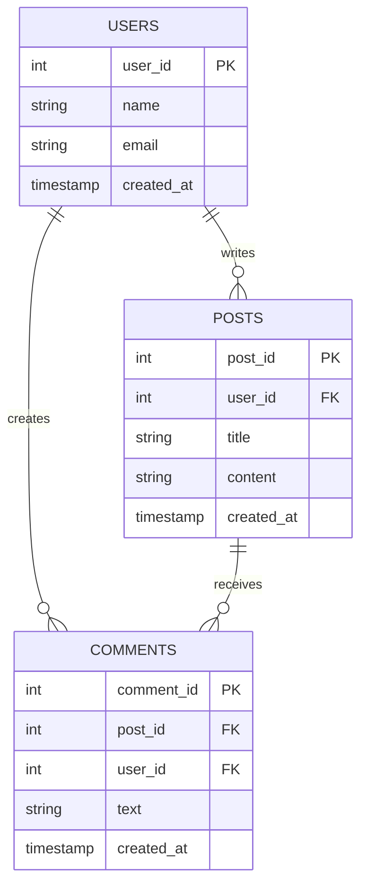
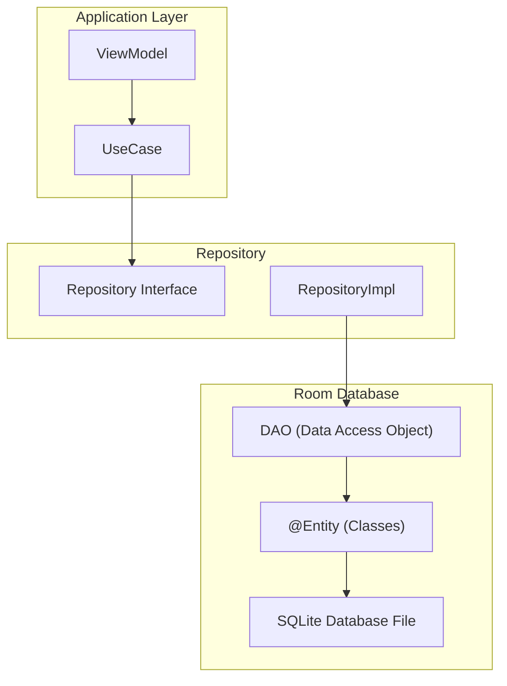

[← Back to main index](../../README.md) | [← Back to folder](../README.md)

---

## 17. Room Database Advanced Patterns

<details open>
<summary><strong>🗂️ Room Architecture & ER Relationships</strong></summary>



</details>

<details>
<summary><strong>🏗️ Room Architecture Layers</strong></summary>



</details>

---

### Migrations & Schema Evolution

> [!WARNING]
> **Room migrations handle schema version bumps.**
> - Define `Migration(oldVersion, newVersion)` with SQL
> - Always test migrations (data loss + crashes common if untested)
> - Use `@Query @PrimaryKey` to catch schema mismatches at compile-time

Migration path · `ALTER TABLE` · Schema versioning · Test migrations · Data loss risks

<details>
<summary>💻 Code Example</summary>

```kotlin
val database = Room.databaseBuilder(context, AppDatabase::class.java, "app.db")
    .addMigrations(MIGRATION_1_2, MIGRATION_2_3)
    .build()

val MIGRATION_1_2 = object : Migration(1, 2) {
    override fun migrate(db: SupportSQLiteDatabase) {
        // Add new column
        db.execSQL("ALTER TABLE users ADD COLUMN created_at INTEGER NOT NULL DEFAULT ${System.currentTimeMillis()}")
    }
}

val MIGRATION_2_3 = object : Migration(2, 3) {
    override fun migrate(db: SupportSQLiteDatabase) {
        // Rename table
        db.execSQL("ALTER TABLE users RENAME TO user_profiles")
        // Create index for performance
        db.execSQL("CREATE INDEX idx_user_email ON user_profiles(email)")
    }
}
```

</details>

**Best practice:** Test migrations!
<details>
<summary>💻 Code Example</summary>

```kotlin
@RunWith(AndroidTestRunner::class)
class MigrationTest {
    @Rule val helper = MigrationTestHelper(InstrumentationRegistry.getContext(), AppDatabase::class.java)

    @Test
    fun migrate1To2() {
        var db = helper.createDatabase("app.db", 1)
        db.execSQL("INSERT INTO users VALUES (1, 'Alice')")
        db.close()

        db = helper.runMigrationsAndValidate("app.db", 2, true, MIGRATION_1_2)
        val cursor = db.query("SELECT * FROM users")
        assertTrue(cursor.moveToFirst())
    }
}
```

</details>

<details>
<summary>🔩 Under the Hood</summary>

### SQLite ALTER TABLE Limitations

**What you CAN'T do in SQLite:**
```sql
ALTER TABLE users DROP COLUMN email;        // ❌ Not supported
ALTER TABLE users MODIFY COLUMN name TEXT;  // ❌ Not supported
ALTER TABLE users CHANGE COLUMN ...         // ❌ Not supported (MySQL only)
```

**SQLite workaround (copy pattern):**
```sql
-- Step 1: Create new table with new schema
CREATE TABLE users_new (
    id INTEGER PRIMARY KEY,
    name TEXT NOT NULL,
    -- email column removed
);

-- Step 2: Copy data (no email)
INSERT INTO users_new (id, name) SELECT id, name FROM users;

-- Step 3: Drop old table
DROP TABLE users;

-- Step 4: Rename new table
ALTER TABLE users_new RENAME TO users;
```

**Room example:**
```kotlin
val MIGRATION_drop_email = object : Migration(3, 4) {
    override fun migrate(db: SupportSQLiteDatabase) {
        // Step 1-4 above
        db.execSQL("CREATE TABLE users_new (id INTEGER PRIMARY KEY, name TEXT NOT NULL)")
        db.execSQL("INSERT INTO users_new SELECT id, name FROM users")
        db.execSQL("DROP TABLE users")
        db.execSQL("ALTER TABLE users_new RENAME TO users")
        db.execSQL("CREATE INDEX idx_user_name ON users(name)")
    }
}
```

### Schema Version Tracking

**In Room:**
```kotlin
@Database(
    entities = [User::class],
    version = 3  // Current schema version
)
abstract class AppDatabase : RoomDatabase() { ... }
```

**On device (first run with version 3):**
```
SQLite PRAGMA user_version = 3
  ↓
User opens app with version 3 code
  ↓
Room checks: version on device vs code version
  ↓
If match: no migration needed
  ↓
If device version < code version: apply migrations
  ↓
If device version > code version: error (new app, old DB)
```

### Migration Strategies

**Strategy 1: Linear chain**
```
Version 1 → 2 → 3 → 4 (each migration supplied)
```
Most reliable; requires all intermediate migrations.

**Strategy 2: Destructive** (nuke old data)
```kotlin
.fallbackToDestructiveMigration()  // Delete all data
```
Fast, but users lose data. Only for dev/testing.

**Strategy 3: Destructive on downgrade**
```kotlin
.fallbackToDestructiveMigrationOnDowngrade()
```
User downgraded app → nuke DB. Risky (data loss).

### What it reuses & relies on

- **SQLite PRAGMA user_version** — stores schema version on device
- **SQLite transaction system** — migrations atomic (all-or-nothing)
- **Room schema inspection** — `.schema` file tracks entity definitions
- **Cursor/ResultSet** — iterates rows for copy-paste logic

### Why this design was chosen

**Problem:** App updates add/change schema. Users' old DBs must upgrade without losing data.

**Solution: Migrations.**
- Version number tracks schema state
- Migrations explicitly define transformation
- Atomic transactions ensure consistency

### User vs Understander

| A user knows | An understander also knows |
|---|---|
| "Add Migration for schema changes" | Room reads PRAGMA user_version; runs migrations in order until current version reached. |
| "Test migrations" | MigrationTestHelper creates old DB, applies migration, verifies schema. Catches data loss bugs. |
| "Can't drop columns in SQLite" | SQLite lacks DROP COLUMN. Workaround: copy table (with new schema), drop old, rename new. |
| "Fallback to destructive" | Nukes DB if migration not provided. Users lose data. Only use for dev. |

### Gotchas at depth

- **Missing migration:** If user on version 1, app is version 3, but migration 2→3 missing. Room crashes. Always supply all intermediate migrations.
- **Data type changes:** Changing column type (TEXT → INTEGER) requires copy (no direct ALTER). Conversion bugs (invalid cast) crash migration.
- **Foreign key constraints:** ALTER TABLE with FK references risky. Disable FK temporarily: `PRAGMA foreign_keys = OFF`, then re-enable.
- **Performance:** Large tables (millions of rows) = slow migrations (copy entire table). Migration can take minutes; user sees "app updating..." UI.

</details>

### Query Optimization: N+1 Prevention

> [!TIP]
> N+1 = fetch 1 user, then N queries for posts (1 + N queries total). Fix: use JOIN in SQL or Room @Relation
> (auto-joins). Massive performance difference at scale.

`N+1 problem` · `JOIN optimization` · `@Relation` auto-join · `Scale matters` · `Single query vs N queries`

<details>
<summary>💻 Code Example</summary>

```kotlin
// ❌ N+1 Performance Disaster
val users = db.getUsers()           // Query 1
for (user in users) {
    user.posts = db.getPostsByUserId(user.id)  // Queries 2...N+1 (one per user)
}
// Total: 1 + N queries. With 100 users = 101 queries!

// ✅ Solution 1: SQL JOIN (single query)
@Query("""
    SELECT u.*, p.* FROM users u
    LEFT JOIN posts p ON u.id = p.user_id
""")
suspend fun getUsersWithPosts(): List<UserWithPosts>

// ✅ Solution 2: Room @Relation (Room handles join)
@Query("SELECT * FROM users")
suspend fun getUsersWithPosts(): List<UserWithPosts>
```

</details>

| Problem | Queries | Time (100 users) |
|---|---|---|
| **N+1** | 101 (1 + 100) | ~500ms (100 DB round-trips) |
| **JOIN** | 1 | ~5ms (single query) |
| **Speedup** | ~100x | ~100x improvement |

<details>
<summary>🔩 Under the Hood</summary>

### SQLite JOIN execution

**Query plan (N+1):**
```sql
SELECT * FROM users                    -- 1 scan: full table scan → 100 rows
                                       -- Application loops:
SELECT * FROM posts WHERE user_id = 1 -- Round-trip to DB
SELECT * FROM posts WHERE user_id = 2 -- Round-trip to DB
...
SELECT * FROM posts WHERE user_id = 100 -- Round-trip to DB

Total: 101 queries, 101 round-trips
```

**Query plan (JOIN):**
```sql
SELECT u.id, u.name, p.id, p.title, p.user_id
FROM users u
LEFT JOIN posts p ON u.id = p.user_id
-- Single query execution:
-- 1. Scan users table (100 rows)
-- 2. For each row, find matching posts (B-tree index lookup on user_id)
-- 3. Return all rows (1 query result, multiple rows per user)

Total: 1 query, 1 round-trip
```

### Room @Relation implementation

**What you write:**
```kotlin
data class UserWithPosts(
    @Embedded val user: User,
    @Relation(
        parentColumn = "id",
        entityColumn = "user_id"
    )
    val posts: List<Post>
)

@Query("SELECT * FROM users WHERE id = :userId")
suspend fun getUserWithPosts(userId: Int): UserWithPosts
```

**What Room generates:**
```kotlin
// Room creates wrapper query:
suspend fun getUserWithPosts(userId: Int): UserWithPosts {
    val user = db.query("SELECT * FROM users WHERE id = ?", userId)
    val posts = db.query("SELECT * FROM posts WHERE user_id = ?", user.id)
    return UserWithPosts(user, posts)
}
```

**Note:** @Relation still does 2 queries (one per entity type), but Room batches them efficiently (not loop-based N+1).

### Batch loading optimization

**Better than @Relation (for lists):**
```kotlin
@Query("""
    SELECT u.*, p.* FROM users u
    LEFT JOIN posts p ON u.id = p.user_id
    ORDER BY u.id, p.id
""")
suspend fun getUsersWithPostsBatch(): List<UserWithPosts>

// Room cursor parsing:
// Cursor rows: (user1, post1), (user1, post2), (user2, post3)...
// Room groups by user, builds UserWithPosts objects
// Single query, cursor handles grouping
```

### What it reuses & relies on

- **SQLite query optimizer** — chooses index-based join strategy
- **B-tree indices** — fast lookups on foreign key columns
- **Cursor/ResultSet** — iterates query results
- **Room cursor parsing** — groups results by parent entity

### Why N+1 is so bad

**Scaling:**
- 10 users: 11 queries (not noticeable)
- 100 users: 101 queries (visible lag)
- 1000 users: 1001 queries (crash/timeout)

**Network overhead:** Each query = HTTP round-trip (if remote). 100 queries = 100 round-trips (seconds of latency).

**SQLite overhead:** Each query = parsing + planning + execution. 100 simple queries slower than 1 complex query (plan reuse).

### User vs Understander

| A user knows | An understander also knows |
|---|---|
| "N+1 is bad" | N+1 = 1 query (parent) + N queries (children). Total = N+1 queries. Cursor/network round-trips = O(N). |
| "Use JOIN to fix" | JOIN combines tables in single query. SQLite index-joins parent+children efficiently (B-tree lookups). Single query = single round-trip. |
| "@Relation does auto-join" | Room still issues 2 queries (one per entity), but batches them (not loop-based). Still faster than N+1 loop. |
| "Performance matters" | 100x difference at scale. 100 queries = seconds. 1 query = milliseconds. |

### Gotchas at depth

- **JOIN result explosion:** If user has 100 posts, JOIN returns 100 rows (one per post). Room cursor parsing groups back into 1 UserWithPosts. Large result sets can be slow.
- **LEFT vs INNER:** LEFT JOIN keeps users without posts. INNER JOIN drops them. Choose based on use case (usually LEFT for "get all users").
- **Complex grouping:** Room handles simple 1-to-N. Complex N-to-N relationships need manual cursor handling (rare but possible).
- **Pagination with JOIN:** LIMIT 10 on JOIN counts result rows (100 posts per user = only 1 user returned). Use DISTINCT or window functions.

</details>

### Transactions & Atomicity

> [!TIP]
> `@Transaction` wraps multiple queries in SQLite transaction.
> - All succeed or all fail
> - Use for multi-step operations (insert user → insert posts)
> - Atomicity prevents partial updates (user created, posts failed = data corruption)

ACID properties · All-or-nothing · Rollback on error · SQLite transaction · `@Transaction` annotation

<details>
<summary>💻 Code Example</summary>

```kotlin
@Transaction  // All-or-nothing
suspend fun updateUserAndPosts(user: User, posts: List<Post>) {
    insertUser(user)       // Succeeds
    insertPosts(posts)     // Fails → rollback both
    // If any fails, entire operation reverts
}

// Manual transaction
db.withTransaction {
    insertUser(user)
    insertPosts(posts)
}
```

</details>

<details>
<summary>🔩 Under the Hood</summary>

### SQLite ACID Properties

**Atomicity (all-or-nothing):**
```kotlin
db.withTransaction {
    insertUser(User(1, "Alice"))        // Step 1
    insertPost(Post(1, 1, "Hello"))     // Step 2
    throw Exception("Oops!")             // Step 3: ERROR
    // Rollback: both insert operations undone
}
// User AND Post NOT in DB (atomic)
```

**Consistency (valid state before & after):**
```sql
-- Before transaction:
-- users: [User(1, "Alice")]
-- posts: []
-- Constraint: every post.user_id must exist in users

-- During transaction (ERROR):
-- Cannot create post with non-existent user_id
-- Constraint violation prevented

-- After transaction (rolled back):
-- Same state as before (consistent)
```

**Isolation (concurrent transactions):**
```
User A transaction: START → read user balance (100)
  ↓
User B transaction: START → deduct 50 (balance now 50)
  ↓
User A transaction: deduct 30 → ?
  // A sees 100 or 50? Depends on isolation level
```

**Durability (written to disk):**
```
INSERT user → SQLite writes to disk
  ↓
Power loss / crash
  ↓
On recovery: INSERT persisted (durable)
```

### @Transaction Mechanics

**What Room generates:**
```kotlin
@Transaction
suspend fun updateUserAndPosts(user: User, posts: List<Post>) {
    // Room generates:
    // BEGIN TRANSACTION
    insertUser(user)
    insertPosts(posts)
    // COMMIT (if no errors)
    // or ROLLBACK (if exception)
}
```

**Manual equivalent:**
```sql
BEGIN TRANSACTION;
INSERT INTO users VALUES (...);
INSERT INTO posts VALUES (...);
-- If error anywhere:
ROLLBACK;
-- If success:
COMMIT;
```

### Isolation Levels (Concurrent Transactions)

**Read Uncommitted (dirty reads possible):**
```
Transaction A: INSERT user(balance=100)
Transaction B: SELECT balance → 100 (before commit)
Transaction A: ROLLBACK
// B saw "dirty" data (never committed)
```

**Read Committed (default in SQLite via WAL):**
```
Transaction A: INSERT user(balance=100), COMMIT
Transaction B: SELECT balance → 100 (only committed data)
// B only sees committed data (safe)
```

**SQLite isolation (WAL mode):**
- Write-Ahead Logging (WAL)
- Readers see consistent snapshot
- Writers don't block readers (separate WAL file)
- Room uses WAL by default

### Rollback Strategy

**Exception triggers rollback:**
```kotlin
db.withTransaction {
    insertUser(user)         // Success: in transaction buffer
    throw IOException()       // Exception: ROLLBACK triggered
    insertPost(post)         // Never reached
}
// Both insertions undone (atomic)
```

**Resource cleanup (try-finally):**
```kotlin
db.withTransaction {
    try {
        insertUser(user)
        insertPost(post)
    } finally {
        // Cleanup code (transaction still active)
        // Rollback happens AFTER finally
    }
}
```

### What it reuses & relies on

- **SQLite transaction system** — BEGIN/COMMIT/ROLLBACK
- **Write-Ahead Logging (WAL)** — isolation + concurrency
- **SQLite savepoints** — nested transactions (savepoint/release)
- **Room suspend functions** — async I/O with coroutine scope

### Why this design was chosen

**Problem:** Multiple operations must be all-or-nothing. One failure = data corruption.

**Example:** Transferring money
```
Account A: -$100
Account B: +$100
// Both must succeed, or both must fail
// If B fails after A debited: money vanishes
```

**Solution: Transactions.**
- Wrap all operations
- If any fails: rollback all
- Database stays consistent

### User vs Understander

| A user knows | An understander also knows |
|---|---|
| "@Transaction makes all-or-nothing" | Room wraps function in BEGIN/COMMIT (or ROLLBACK). SQLite atomically applies all or none. |
| "Rollback undoes changes" | SQLite reverts all changes to transaction snapshot if error occurs. |
| "Concurrent transactions" | WAL mode allows readers/writers simultaneously (readers see old snapshot, writers create new). |
| "Savepoints for nesting" | SQLite SAVEPOINT allows nested transactions (outer commits, inner can rollback). |

### Gotchas at depth

- **Transaction timeout:** Very long transactions (millions of inserts) may timeout. Batch into smaller transactions if needed.
- **Deadlock on nested transactions:** Two transactions wait for each other's locks. SQLite raises SQLITE_IOERR. Careful with `@Transaction` calling another `@Transaction`.
- **Corrupted DB after crash:** If crash during COMMIT, DB may be corrupt. WAL journal files must be cleaned. Room handles via `databaseBuilder().fallbackToDestructiveMigration()` on corruption.
- **Size growth:** WAL files (.wal, .shm) grow alongside main DB. Not automatically cleaned. Use `pragma wal_checkpoint(RESTART)` to consolidate.

</details>

---

