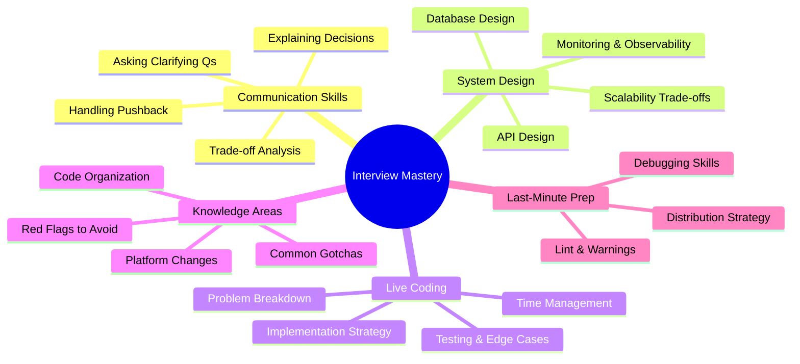

# 💡 Interview Strategy

[← Back to main index](../README.md)

> [!IMPORTANT] **Your technical knowledge means nothing if you can't communicate it.** System design, live coding, and communication skills are what hiring managers evaluate. Use this folder as your interview battle plan.

---

## 🎯 Interview Preparation Checklist

<strong>Interview Success Formula</strong>

---

## 📂 Files in This Folder

| File | Topic | Description | Usage |
|:-----|:------|:-----------|:-----|
| **[interview-communication.md](interview-communication.md)** | Interview Strategy & Communication Tips | Asking questions, trade-off analysis | Read FIRST - meta-skills |
| **[system-design.md](system-design.md)** | System & Feature Design | Database design, API design | Practice before each interview |
| **[live-coding.md](live-coding.md)** | Live Coding Survival | 25-minute coding challenge strategy | Bookmark & review before coding round |
| **[platform-changes.md](platform-changes.md)** | Platform Changes & Security | API 34+, 35+, 36+ changes | Update quarterly as new APIs ship |
| **[debugging.md](debugging.md)** | Debugging & Common Bugs | Crash analysis, debugging tools | Reference during system design |
| **[common-gotchas.md](common-gotchas.md)** | Common Interview Gotchas | Configuration changes, state preservation | Internalize these before interview |
| **[code-organization.md](code-organization.md)** | Code Organization & Architecture | Project structure, ADR, KDoc | Use as live coding reference |
| **[app-bundle-apk.md](app-bundle-apk.md)** | App Bundle vs. APK Distribution | Dynamic features, Play Store distribution | Study 1-2 days before if you're interviewing at Google/Goog companies |
| **[lint-warnings.md](lint-warnings.md)** | Lint Warnings to Watch | Lint, Android Studio inspections | Run lint before code reviews in interviews |
| **[red-flags.md](red-flags.md)** | Common Interview Red Flags | Code smells, anti-patterns | Review to know what NOT to do |
| **[last-minute-prep.md](last-minute-prep.md)** | Last-Minute Interview Prep | Night before checklist | Night before - use as routine |

---

## 🔗 Jump to other folders

| 🚀 Kotlin | 🔧 Core | 🏗️ Design |
|:---------|:--------|:---------|
| [Kotlin](../kotlin/README.md) | [Android Core](../android-core/README.md) | [Architecture](../architecture/README.md) |

| 🌐 Data | 🎨 UI | ⚡ Performance |
|:--------|:-----|:-------------|
| [Data & Networking](../data-networking/README.md) | [UI & Graphics](../ui/README.md) | [Performance](../performance/README.md) |

| 🔨 Build |
|:---------|
| [Build & Testing](../build-testing/README.md) |
