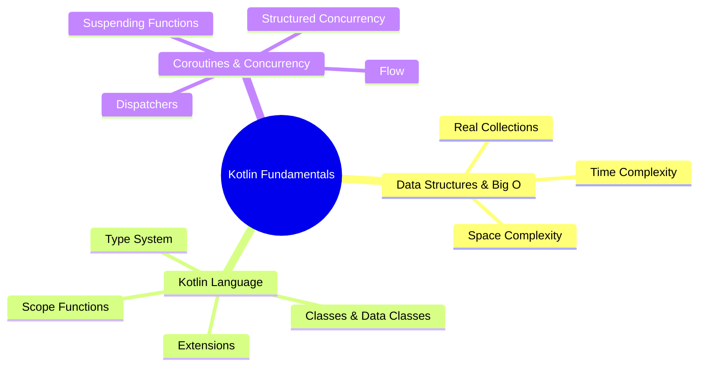

# 🚀 Kotlin Essentials

[← Back to main index](../README.md)

> [!IMPORTANT] **Foundation for all Android development.** Master these fundamentals before diving into Architecture or Android Core. Interview frequency: **CRITICAL**.

---

## 📚 Study Progression

<strong>Kotlin Learning Path</strong>

---

## 📂 Files in This Folder

| File | Topic | Description | Key Interview Topics |
|:-----|:------|:-----------|:---------------------|
| **[data-structures.md](data-structures.md)** | Data Structures & Big O | Time/space complexity analysis | HashMap vs TreeMap, HashSet collision handling |
| **[kotlin-language.md](kotlin-language.md)** | Kotlin Language Deep Dive | Syntax, data classes, scoping | Kotlin vs Java, inlining, reified types |
| **[coroutines.md](coroutines.md)** | Concurrency & Coroutines | Structured concurrency and Flow | Dispatchers, structured concurrency, cancellation |

---

## 🔗 Jump to other folders

| 🔧 Core | 🏗️ Design | 🔨 Build |
|:------|:---------|:--------|
| [Android Core](../android-core/README.md) | [Architecture](../architecture/README.md) | [Build & Testing](../build-testing/README.md) |

| 🌐 Data | 💡 Strategy | ⚡ Performance |
|:--------|:-----------|:--------------|
| [Data & Networking](../data-networking/README.md) | [Interview Strategy](../interview-strategy/README.md) | [Performance](../performance/README.md) |

| 🎨 UI |
|:------|
| [UI & Graphics](../ui/README.md) |
