[← Back to coroutines.md](coroutines.md) | [← Back to folder](README.md)

---

# Coroutines — Visual Reference

> Visual companion to `coroutines.md`. Every concept rendered as a diagram.

---

## Coroutine Lifecycle State Machine

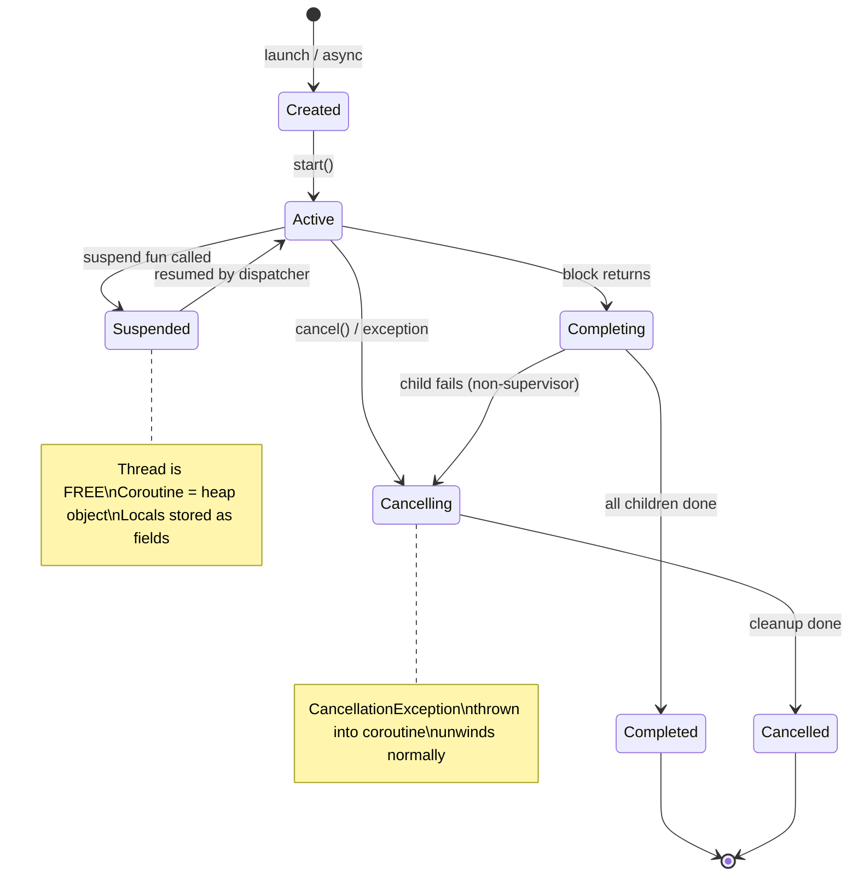
```mermaid
stateDiagram-v2
    [*] --> Created : launch / async
    Created --> Active : start()
    Active --> Suspended : suspend fun called
    Suspended --> Active : resumed by dispatcher
    Active --> Completing : block returns
    Completing --> Completed : all children done
    Active --> Cancelling : cancel() / exception
    Completing --> Cancelling : child fails (non-supervisor)
    Cancelling --> Cancelled : cleanup done
    Completed --> [*]
    Cancelled --> [*]

    note right of Suspended : Thread is FREE\nCoroutine = heap object\nLocals stored as fields
    note right of Cancelling : CancellationException\nthrown into coroutine\nunwinds normally
```

---

## Threads vs Coroutines — The Waiter Analogy

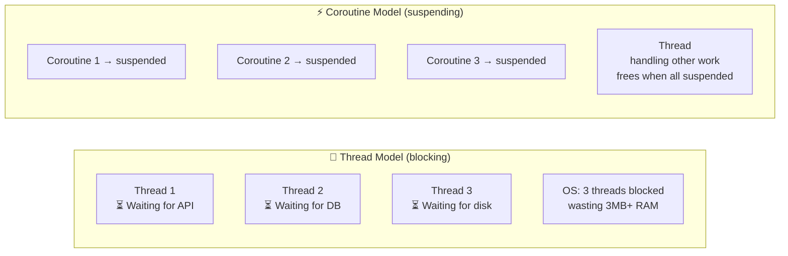
```mermaid
flowchart LR
    subgraph THREAD_MODEL["🧵 Thread Model (blocking)"]
        T1["Thread 1\n⏳ Waiting for API"]
        T2["Thread 2\n⏳ Waiting for DB"]
        T3["Thread 3\n⏳ Waiting for disk"]
        T4["OS: 3 threads blocked\nwasting 3MB+ RAM"]
    end
    subgraph COROUTINE_MODEL["⚡ Coroutine Model (suspending)"]
        C1["Coroutine 1 → suspended"]
        C2["Coroutine 2 → suspended"]
        C3["Coroutine 3 → suspended"]
        TH["Thread\nhandling other work\nfrees when all suspended"]
    end
```

### Memory Comparison

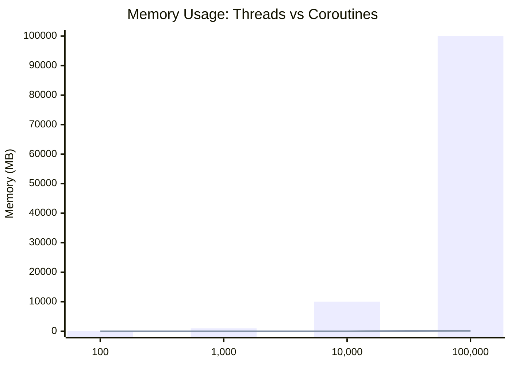
```mermaid
xychart-beta
    title "Memory Usage: Threads vs Coroutines"
    x-axis ["100", "1,000", "10,000", "100,000"]
    y-axis "Memory (MB)" 0 --> 100000
    bar [100, 1000, 10000, 100000]
    line [0.1, 1, 10, 100]
```

> **Blue bars** = Threads (~1MB each) | **Line** = Coroutines (~1KB each)

---

## CPS Transformation — What the Compiler Does

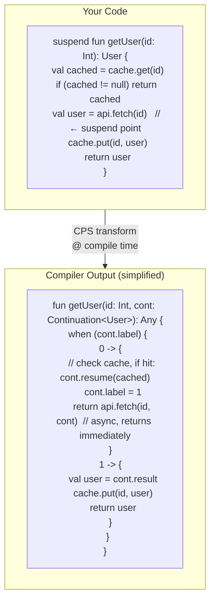
```mermaid
flowchart TD
    subgraph BEFORE["Your Code"]
        B["suspend fun getUser(id: Int): User {\n  val cached = cache.get(id)\n  if (cached != null) return cached\n  val user = api.fetch(id)   // ← suspend point\n  cache.put(id, user)\n  return user\n}"]
    end
    subgraph AFTER["Compiler Output (simplified)"]
        A["fun getUser(id: Int, cont: Continuation&lt;User&gt;): Any {\n  when (cont.label) {\n    0 -> {\n      // check cache, if hit: cont.resume(cached)\n      cont.label = 1\n      return api.fetch(id, cont)  // async, returns immediately\n    }\n    1 -> {\n      val user = cont.result\n      cache.put(id, user)\n      return user\n    }\n  }\n}"]
    end
    BEFORE -->|"CPS transform\n@ compile time"| AFTER
```

### State Machine Execution Flow

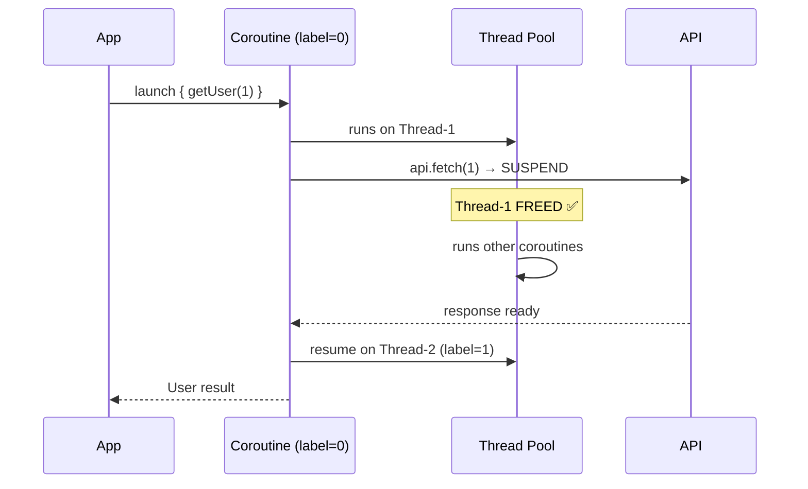
```mermaid
sequenceDiagram
    participant App
    participant Coroutine as Coroutine (label=0)
    participant Thread as Thread Pool
    participant API

    App->>Coroutine: launch { getUser(1) }
    Coroutine->>Thread: runs on Thread-1
    Coroutine->>API: api.fetch(1) → SUSPEND
    Note over Thread: Thread-1 FREED ✅
    Thread->>Thread: runs other coroutines
    API-->>Coroutine: response ready
    Coroutine->>Thread: resume on Thread-2 (label=1)
    Coroutine-->>App: User result
```

---

## Dispatchers — Thread Pool Architecture

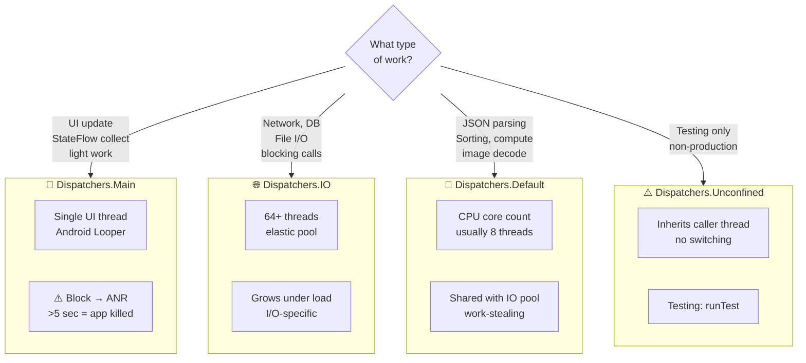
```mermaid
flowchart TD
    WORK{What type\nof work?}

    WORK -->|"UI update\nStateFlow collect\nlight work"| MAIN
    WORK -->|"Network, DB\nFile I/O\nblocking calls"| IO
    WORK -->|"JSON parsing\nSorting, compute\nimage decode"| DEF
    WORK -->|"Testing only\nnon-production"| UNC

    subgraph MAIN["🎨 Dispatchers.Main"]
        M1["Single UI thread\nAndroid Looper"]
        M2["⚠️ Block → ANR\n>5 sec = app killed"]
    end
    subgraph IO["🌐 Dispatchers.IO"]
        I1["64+ threads\nelastic pool"]
        I2["Grows under load\nI/O-specific"]
    end
    subgraph DEF["🔧 Dispatchers.Default"]
        D1["CPU core count\nusually 8 threads"]
        D2["Shared with IO pool\nwork-stealing"]
    end
    subgraph UNC["⚠️ Dispatchers.Unconfined"]
        U1["Inherits caller thread\nno switching"]
        U2["Testing: runTest"]
    end
```

### withContext — Dispatcher Switching

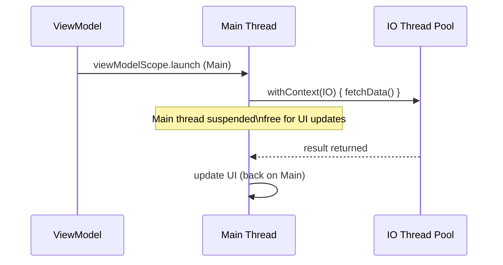
```mermaid
sequenceDiagram
    participant VM as ViewModel
    participant Main as Main Thread
    participant IO as IO Thread Pool

    VM->>Main: viewModelScope.launch (Main)
    Main->>IO: withContext(IO) { fetchData() }
    Note over Main: Main thread suspended\nfree for UI updates
    IO-->>Main: result returned
    Main->>Main: update UI (back on Main)
```

### Dispatcher Selection Guide

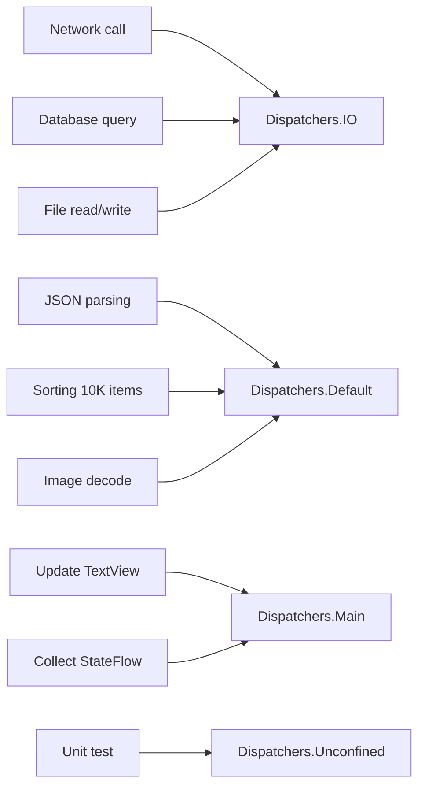
```mermaid
flowchart LR
    N["Network call"] --> IO_D["Dispatchers.IO"]
    DB["Database query"] --> IO_D
    FILE["File read/write"] --> IO_D
    JSON["JSON parsing"] --> DEF_D["Dispatchers.Default"]
    SORT["Sorting 10K items"] --> DEF_D
    IMG["Image decode"] --> DEF_D
    UI["Update TextView"] --> MAIN_D["Dispatchers.Main"]
    FLOW["Collect StateFlow"] --> MAIN_D
    TEST["Unit test"] --> UNC_D["Dispatchers.Unconfined"]
```

---

## Exception Handling — Job Hierarchy

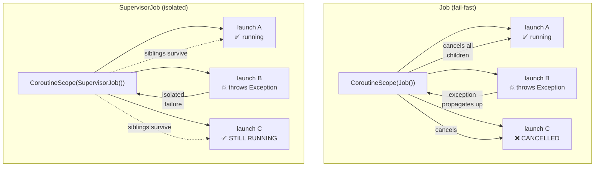
```mermaid
flowchart TD
    subgraph JOB_MODEL["Job (fail-fast)"]
        JS["CoroutineScope(Job())"]
        JA["launch A\n✅ running"]
        JB["launch B\n💥 throws Exception"]
        JC["launch C\n❌ CANCELLED"]
        JS --> JA
        JS --> JB
        JS --> JC
        JB -->|"exception\npropagates up"| JS
        JS -->|"cancels all\nchildren"| JA
        JS -->|"cancels"| JC
    end
    subgraph SUP_MODEL["SupervisorJob (isolated)"]
        SS["CoroutineScope(SupervisorJob())"]
        SA["launch A\n✅ running"]
        SB["launch B\n💥 throws Exception"]
        SC["launch C\n✅ STILL RUNNING"]
        SS --> SA
        SS --> SB
        SS --> SC
        SB -->|"isolated\nfailure"| SS
        SS -.->|"siblings survive"| SA
        SS -.->|"siblings survive"| SC
    end
```

### Exception Propagation Paths

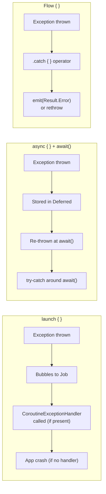
```mermaid
flowchart LR
    subgraph LAUNCH["launch { }"]
        L1["Exception thrown"]
        L2["Bubbles to Job"]
        L3["CoroutineExceptionHandler\ncalled (if present)"]
        L4["App crash (if no handler)"]
        L1 --> L2 --> L3 --> L4
    end
    subgraph ASYNC["async { } + await()"]
        A1["Exception thrown"]
        A2["Stored in Deferred"]
        A3["Re-thrown at await()"]
        A4["try-catch around await()"]
        A1 --> A2 --> A3 --> A4
    end
    subgraph FLOW["Flow { }"]
        F1["Exception thrown"]
        F2[".catch { } operator"]
        F3["emit(Result.Error)\nor rethrow"]
        F1 --> F2 --> F3
    end
```

### Context Inheritance

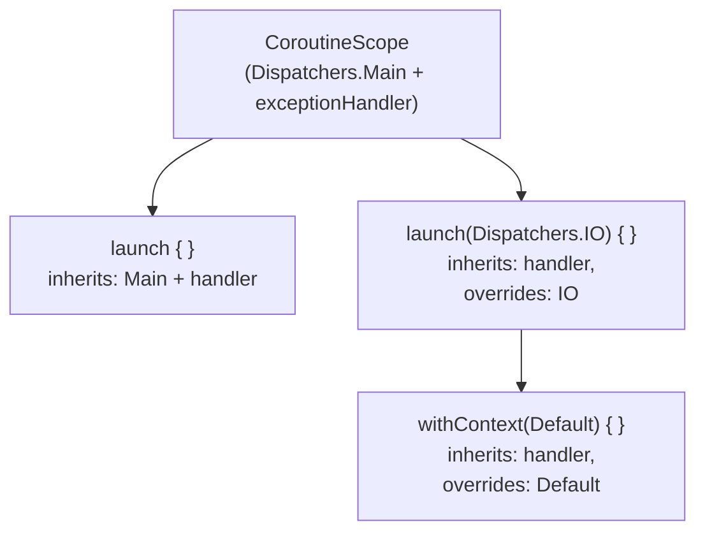
```mermaid
flowchart TD
    PARENT["CoroutineScope\n(Dispatchers.Main + exceptionHandler)"]
    CHILD1["launch { }\n inherits: Main + handler"]
    CHILD2["launch(Dispatchers.IO) { }\n inherits: handler, overrides: IO"]
    CHILD3["withContext(Default) { }\n inherits: handler, overrides: Default"]

    PARENT --> CHILD1
    PARENT --> CHILD2
    CHILD2 --> CHILD3
```

---

## StateFlow vs SharedFlow

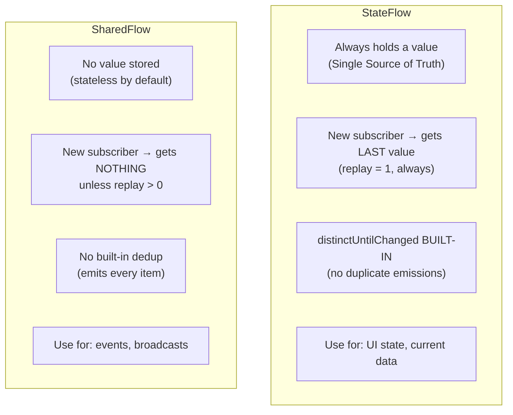
```mermaid
flowchart TD
    subgraph SF["StateFlow"]
        SF1["Always holds a value\n(Single Source of Truth)"]
        SF2["New subscriber → gets LAST value\n(replay = 1, always)"]
        SF3["distinctUntilChanged BUILT-IN\n(no duplicate emissions)"]
        SF4["Use for: UI state, current data"]
    end
    subgraph SHF["SharedFlow"]
        SHF1["No value stored\n(stateless by default)"]
        SHF2["New subscriber → gets NOTHING\nunless replay > 0"]
        SHF3["No built-in dedup\n(emits every item)"]
        SHF4["Use for: events, broadcasts"]
    end
```

### Subscriber Behavior

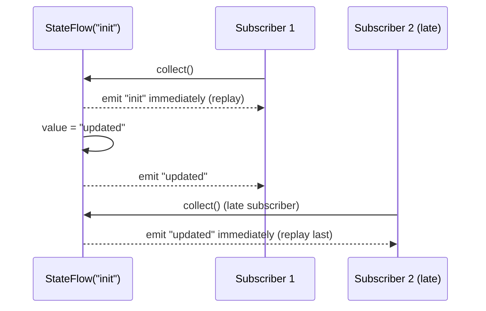
```mermaid
sequenceDiagram
    participant SF as StateFlow("init")
    participant S1 as Subscriber 1
    participant S2 as Subscriber 2 (late)

    S1->>SF: collect()
    SF-->>S1: emit "init" immediately (replay)
    SF->>SF: value = "updated"
    SF-->>S1: emit "updated"
    S2->>SF: collect() (late subscriber)
    SF-->>S2: emit "updated" immediately (replay last)
```

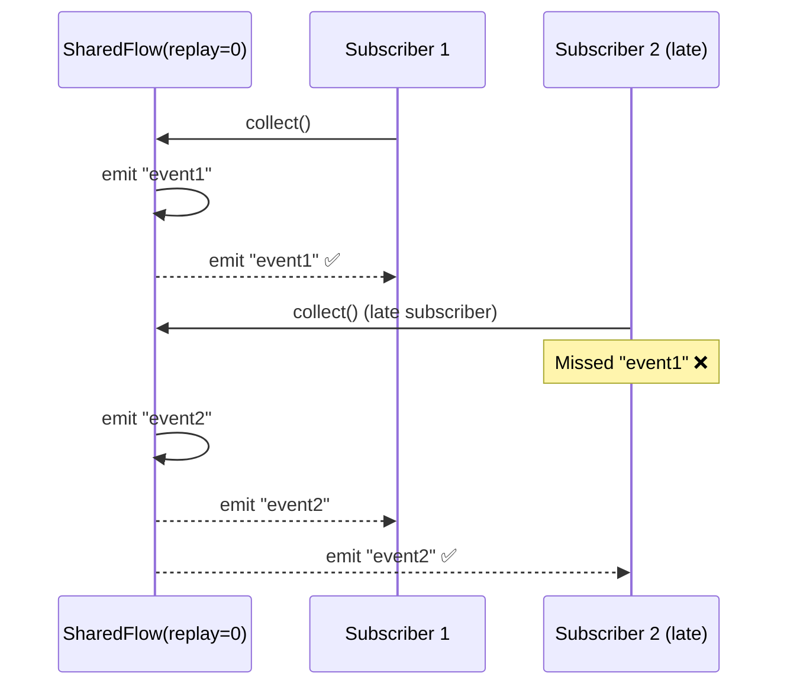
```mermaid
sequenceDiagram
    participant SHF as SharedFlow(replay=0)
    participant S1 as Subscriber 1
    participant S2 as Subscriber 2 (late)

    S1->>SHF: collect()
    SHF->>SHF: emit "event1"
    SHF-->>S1: emit "event1" ✅
    S2->>SHF: collect() (late subscriber)
    Note over S2: Missed "event1" ❌
    SHF->>SHF: emit "event2"
    SHF-->>S1: emit "event2"
    SHF-->>S2: emit "event2" ✅
```

### StateFlow Internal Memory Layout

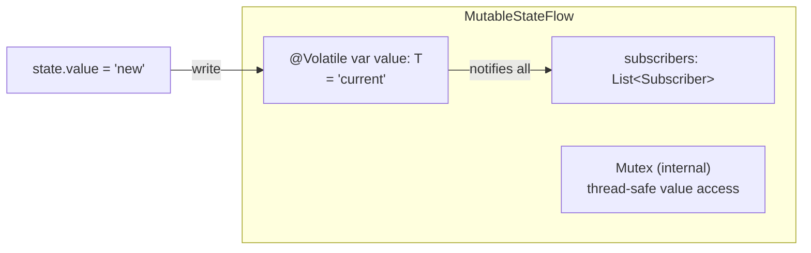
```mermaid
flowchart LR
    subgraph STATEFLOW["MutableStateFlow"]
        VAL["@Volatile var value: T\n= 'current'"]
        SUBS["subscribers: List&lt;Subscriber&gt;"]
        MUTEX["Mutex (internal)\nthread-safe value access"]
    end
    UPDATE["state.value = 'new'"] -->|"write"| VAL
    VAL -->|"notifies all"| SUBS
```

---

## collectAsStateWithLifecycle — Lifecycle-Aware Collection

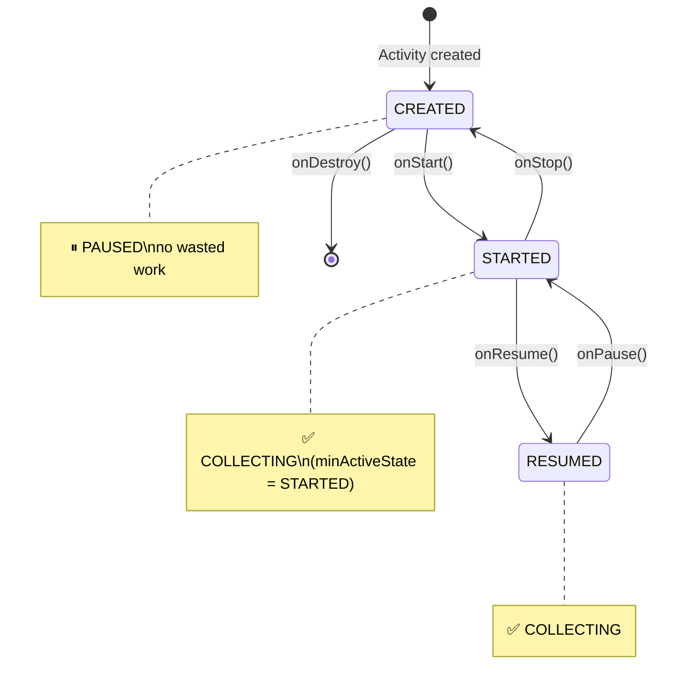
```mermaid
stateDiagram-v2
    [*] --> CREATED : Activity created
    CREATED --> STARTED : onStart()
    STARTED --> RESUMED : onResume()
    RESUMED --> STARTED : onPause()
    STARTED --> CREATED : onStop()
    CREATED --> [*] : onDestroy()

    note right of STARTED : ✅ COLLECTING\n(minActiveState = STARTED)
    note right of RESUMED : ✅ COLLECTING
    note right of CREATED : ⏸ PAUSED\nno wasted work
```

### collectAsState vs collectAsStateWithLifecycle

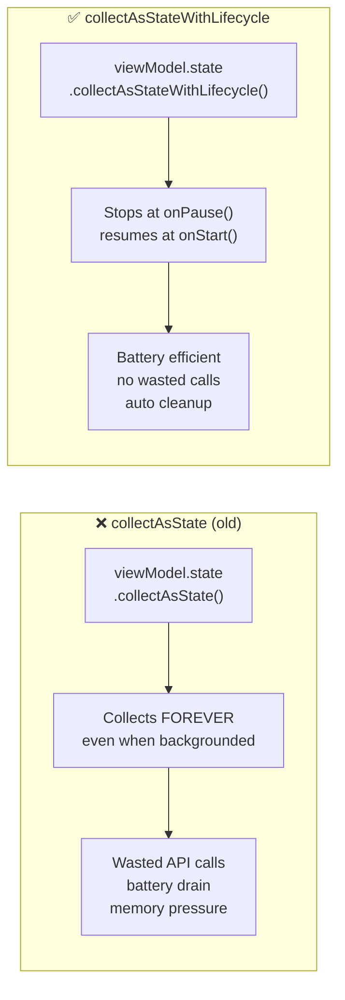
```mermaid
flowchart LR
    subgraph OLD["❌ collectAsState (old)"]
        OC["viewModel.state\n.collectAsState()"]
        OF["Collects FOREVER\neven when backgrounded"]
        OW["Wasted API calls\nbattery drain\nmemory pressure"]
        OC --> OF --> OW
    end
    subgraph NEW["✅ collectAsStateWithLifecycle"]
        NC["viewModel.state\n.collectAsStateWithLifecycle()"]
        NF["Stops at onPause()\nresumes at onStart()"]
        NB["Battery efficient\nno wasted calls\nauto cleanup"]
        NC --> NF --> NB
    end
```

### How It Works Internally

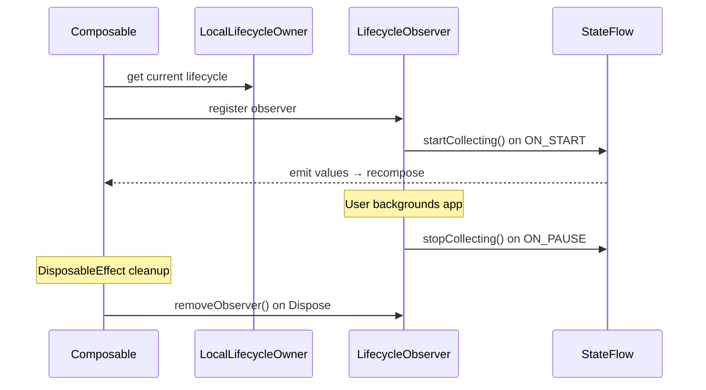
```mermaid
sequenceDiagram
    participant C as Composable
    participant LO as LocalLifecycleOwner
    participant OBS as LifecycleObserver
    participant FLOW as StateFlow

    C->>LO: get current lifecycle
    C->>OBS: register observer
    OBS->>FLOW: startCollecting() on ON_START
    FLOW-->>C: emit values → recompose
    Note over OBS: User backgrounds app
    OBS->>FLOW: stopCollecting() on ON_PAUSE
    Note over C: DisposableEffect cleanup
    C->>OBS: removeObserver() on Dispose
```

---

## Full Coroutines Mental Map

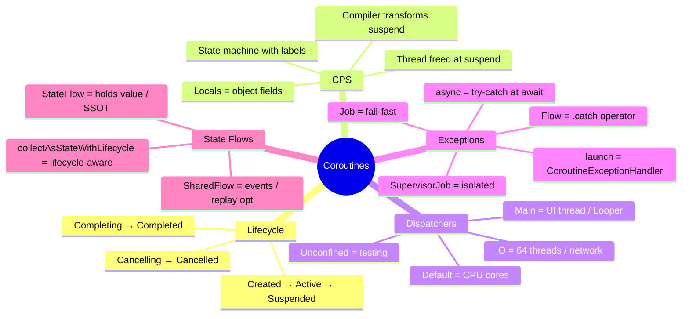
```mermaid
mindmap
    root((Coroutines))
        Lifecycle
            Created → Active → Suspended
            Completing → Completed
            Cancelling → Cancelled
        CPS
            Compiler transforms suspend
            State machine with labels
            Locals = object fields
            Thread freed at suspend
        Dispatchers
            Main = UI thread / Looper
            IO = 64 threads / network
            Default = CPU cores
            Unconfined = testing
        Exceptions
            launch = CoroutineExceptionHandler
            async = try-catch at await
            Flow = .catch operator
            Job = fail-fast
            SupervisorJob = isolated
        State Flows
            StateFlow = holds value / SSOT
            SharedFlow = events / replay opt
            collectAsStateWithLifecycle = lifecycle-aware
```
