[← Back to coroutines.md](coroutines.md) | [← Back to folder](README.md)

---

# Coroutines — Visual Reference

> Visual companion to `coroutines.md`. Every concept rendered as a diagram.

---

## Coroutine Lifecycle State Machine

---

## Threads vs Coroutines — The Waiter Analogy

```mermaid
flowchart LR
    subgraph THREAD_MODEL["🧵 Thread Model (blocking)"]
        T1["Thread 1\n⏳ Waiting for API"]
        T2["Thread 2\n⏳ Waiting for DB"]
        T3["Thread 3\n⏳ Waiting for disk"]
        T4["OS: 3 threads blocked\nwasting 3MB+ RAM"]
    end
    subgraph COROUTINE_MODEL["⚡ Coroutine Model (suspending)"]
        C1["Coroutine 1 → suspended"]
        C2["Coroutine 2 → suspended"]
        C3["Coroutine 3 → suspended"]
        TH["Thread\nhandling other work\nfrees when all suspended"]
    end
```

### Memory Comparison

> **Blue bars** = Threads (~1MB each) | **Line** = Coroutines (~1KB each)

---

## CPS Transformation — What the Compiler Does

### State Machine Execution Flow

```mermaid
sequenceDiagram
    participant App
    participant Coroutine as Coroutine (label=0)
    participant Thread as Thread Pool
    participant API

    App->>Coroutine: launch { getUser(1) }
    Coroutine->>Thread: runs on Thread-1
    Coroutine->>API: api.fetch(1) → SUSPEND
    Note over Thread: Thread-1 FREED ✅
    Thread->>Thread: runs other coroutines
    API-->>Coroutine: response ready
    Coroutine->>Thread: resume on Thread-2 (label=1)
    Coroutine-->>App: User result
```

---

## Dispatchers — Thread Pool Architecture

```mermaid
flowchart TD
    WORK{What type\nof work?}

    WORK -->|"UI update\nStateFlow collect\nlight work"| MAIN
    WORK -->|"Network, DB\nFile I/O\nblocking calls"| IO
    WORK -->|"JSON parsing\nSorting, compute\nimage decode"| DEF
    WORK -->|"Testing only\nnon-production"| UNC

    subgraph MAIN["🎨 Dispatchers.Main"]
        M1["Single UI thread\nAndroid Looper"]
        M2["⚠️ Block → ANR\n>5 sec = app killed"]
    end
    subgraph IO["🌐 Dispatchers.IO"]
        I1["64+ threads\nelastic pool"]
        I2["Grows under load\nI/O-specific"]
    end
    subgraph DEF["🔧 Dispatchers.Default"]
        D1["CPU core count\nusually 8 threads"]
        D2["Shared with IO pool\nwork-stealing"]
    end
    subgraph UNC["⚠️ Dispatchers.Unconfined"]
        U1["Inherits caller thread\nno switching"]
        U2["Testing: runTest"]
    end
```

### withContext — Dispatcher Switching

### Dispatcher Selection Guide

---

## Exception Handling — Job Hierarchy

```mermaid
flowchart TD
    subgraph JOB_MODEL["Job (fail-fast)"]
        JS["CoroutineScope(Job())"]
        JA["launch A\n✅ running"]
        JB["launch B\n💥 throws Exception"]
        JC["launch C\n❌ CANCELLED"]
        JS --> JA
        JS --> JB
        JS --> JC
        JB -->|"exception\npropagates up"| JS
        JS -->|"cancels all\nchildren"| JA
        JS -->|"cancels"| JC
    end
    subgraph SUP_MODEL["SupervisorJob (isolated)"]
        SS["CoroutineScope(SupervisorJob())"]
        SA["launch A\n✅ running"]
        SB["launch B\n💥 throws Exception"]
        SC["launch C\n✅ STILL RUNNING"]
        SS --> SA
        SS --> SB
        SS --> SC
        SB -->|"isolated\nfailure"| SS
        SS -.->|"siblings survive"| SA
        SS -.->|"siblings survive"| SC
    end
```

### Exception Propagation Paths

### Context Inheritance

---

## StateFlow vs SharedFlow

### Subscriber Behavior

```mermaid
sequenceDiagram
    participant SHF as SharedFlow(replay=0)
    participant S1 as Subscriber 1
    participant S2 as Subscriber 2 (late)

    S1->>SHF: collect()
    SHF->>SHF: emit "event1"
    SHF-->>S1: emit "event1" ✅
    S2->>SHF: collect() (late subscriber)
    Note over S2: Missed "event1" ❌
    SHF->>SHF: emit "event2"
    SHF-->>S1: emit "event2"
    SHF-->>S2: emit "event2" ✅
```

### StateFlow Internal Memory Layout

---

## collectAsStateWithLifecycle — Lifecycle-Aware Collection

```mermaid
stateDiagram-v2
    [*] --> CREATED : Activity created
    CREATED --> STARTED : onStart()
    STARTED --> RESUMED : onResume()
    RESUMED --> STARTED : onPause()
    STARTED --> CREATED : onStop()
    CREATED --> [*] : onDestroy()

    note right of STARTED : ✅ COLLECTING\n(minActiveState = STARTED)
    note right of RESUMED : ✅ COLLECTING
    note right of CREATED : ⏸ PAUSED\nno wasted work
```

### collectAsState vs collectAsStateWithLifecycle

```mermaid
flowchart LR
    subgraph OLD["❌ collectAsState (old)"]
        OC["viewModel.state\n.collectAsState()"]
        OF["Collects FOREVER\neven when backgrounded"]
        OW["Wasted API calls\nbattery drain\nmemory pressure"]
        OC --> OF --> OW
    end
    subgraph NEW["✅ collectAsStateWithLifecycle"]
        NC["viewModel.state\n.collectAsStateWithLifecycle()"]
        NF["Stops at onPause()\nresumes at onStart()"]
        NB["Battery efficient\nno wasted calls\nauto cleanup"]
        NC --> NF --> NB
    end
```

### How It Works Internally

---

## Full Coroutines Mental Map

```mermaid
mindmap
    root((Coroutines))
        Lifecycle
            Created → Active → Suspended
            Completing → Completed
            Cancelling → Cancelled
        CPS
            Compiler transforms suspend
            State machine with labels
            Locals = object fields
            Thread freed at suspend
        Dispatchers
            Main = UI thread / Looper
            IO = 64 threads / network
            Default = CPU cores
            Unconfined = testing
        Exceptions
            launch = CoroutineExceptionHandler
            async = try-catch at await
            Flow = .catch operator
            Job = fail-fast
            SupervisorJob = isolated
        State Flows
            StateFlow = holds value / SSOT
            SharedFlow = events / replay opt
            collectAsStateWithLifecycle = lifecycle-aware
```

