[← Back to data-structures.md](data-structures.md) | [← Back to folder](README.md)

---

# Data Structures — Visual Reference

> Visual companion to `data-structures.md`. Every concept rendered as a diagram.

---

## Performance Matrix

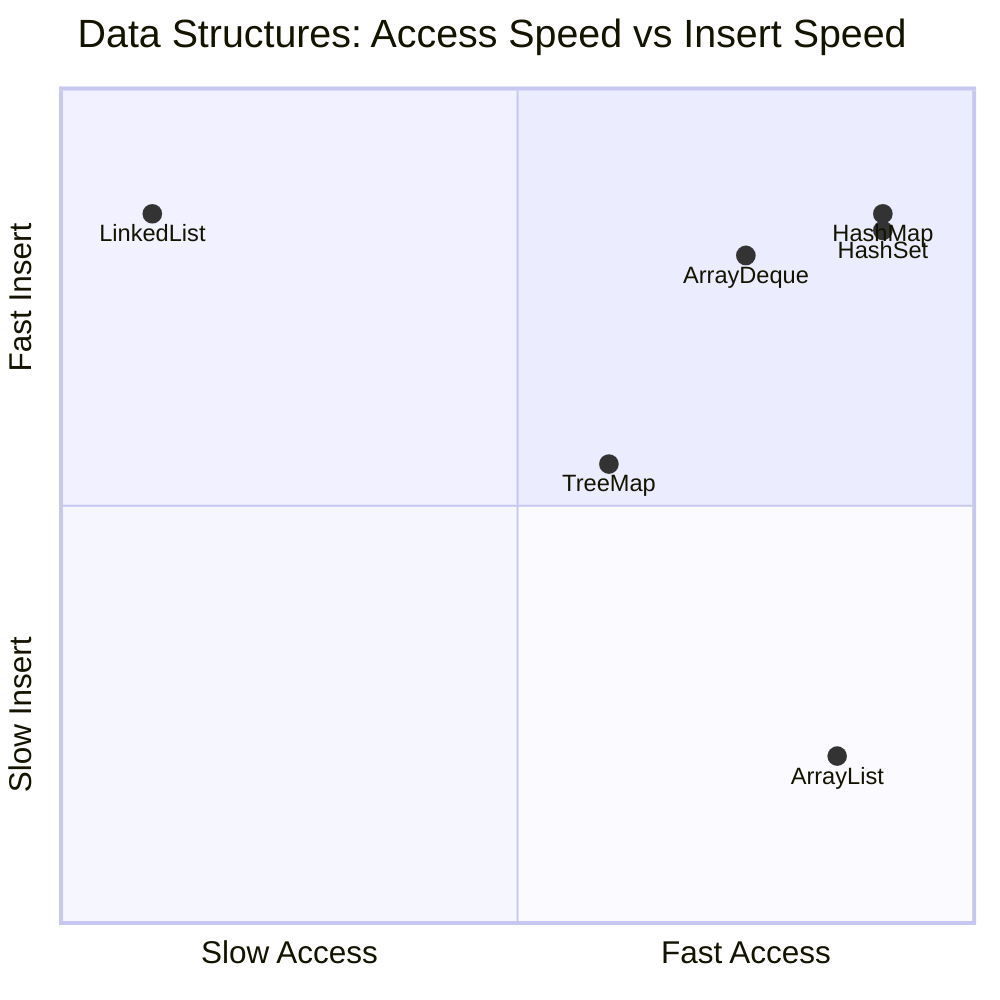

---

## ArrayList vs LinkedList — Memory Layout

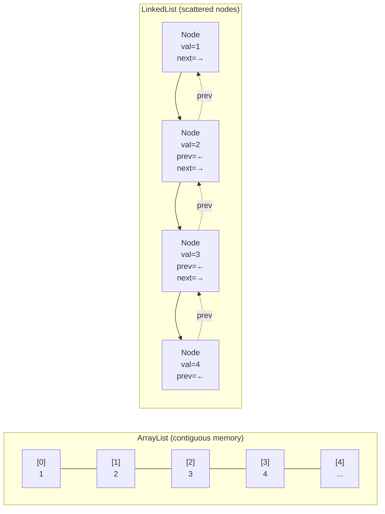

### Memory Per Element

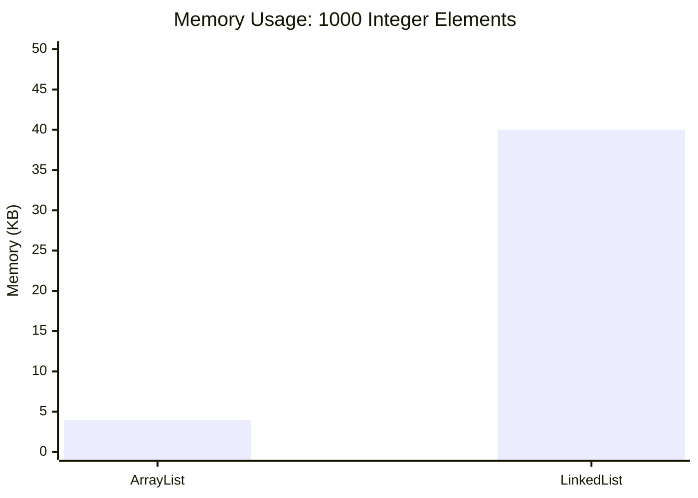

> **ArrayList**: ~4KB (contiguous int array, cache-friendly L1 hits)
> **LinkedList**: ~40KB (24–40 bytes per node: header + value + next + prev refs, L3 cache misses)

---

## ArrayList — Resize Behavior

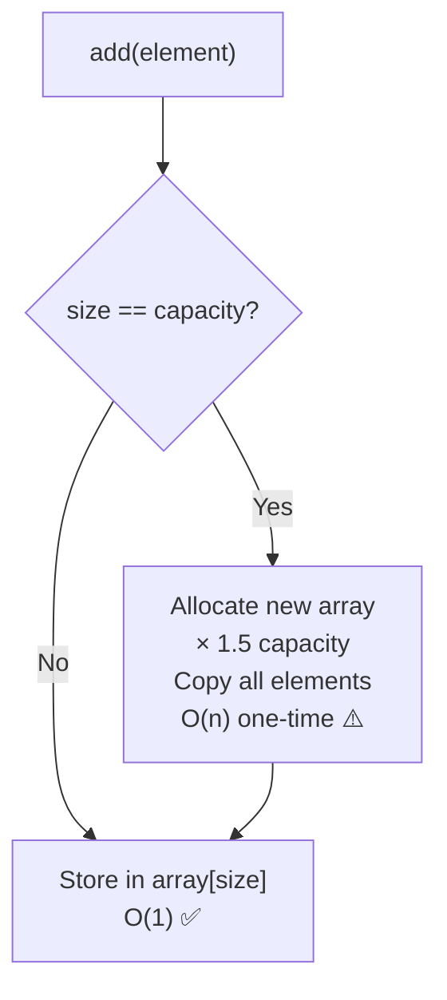

### Amortized O(1) — Why It Works

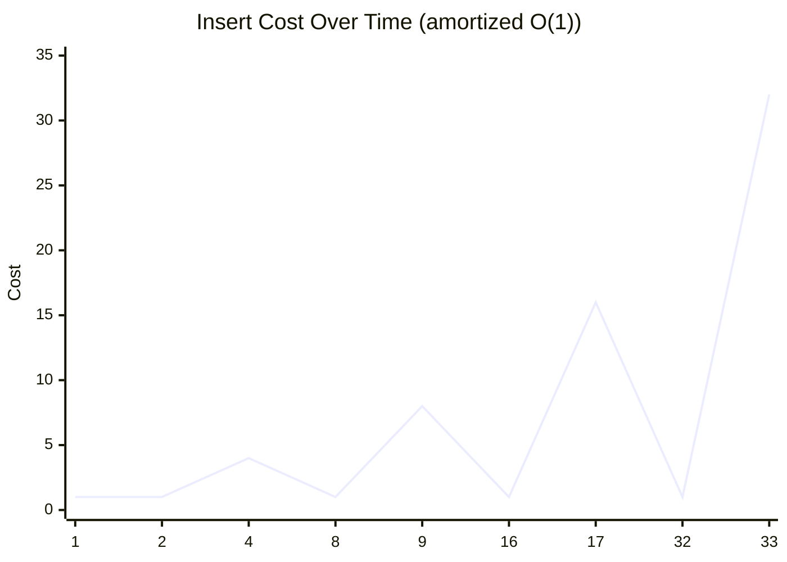

> Spikes = resize events (copy old array). Between spikes: constant cost. Average across all inserts = O(1).

---

## HashMap Internals

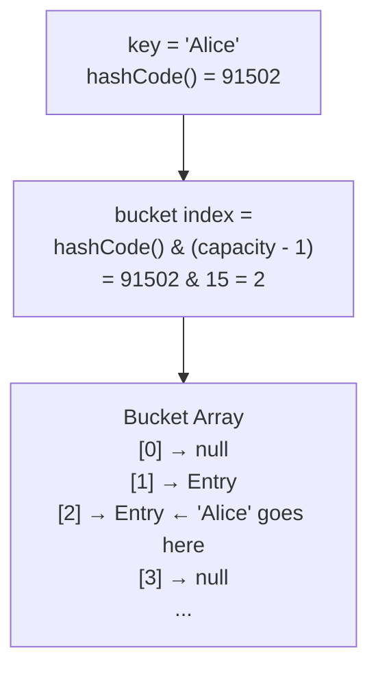

### Collision Resolution

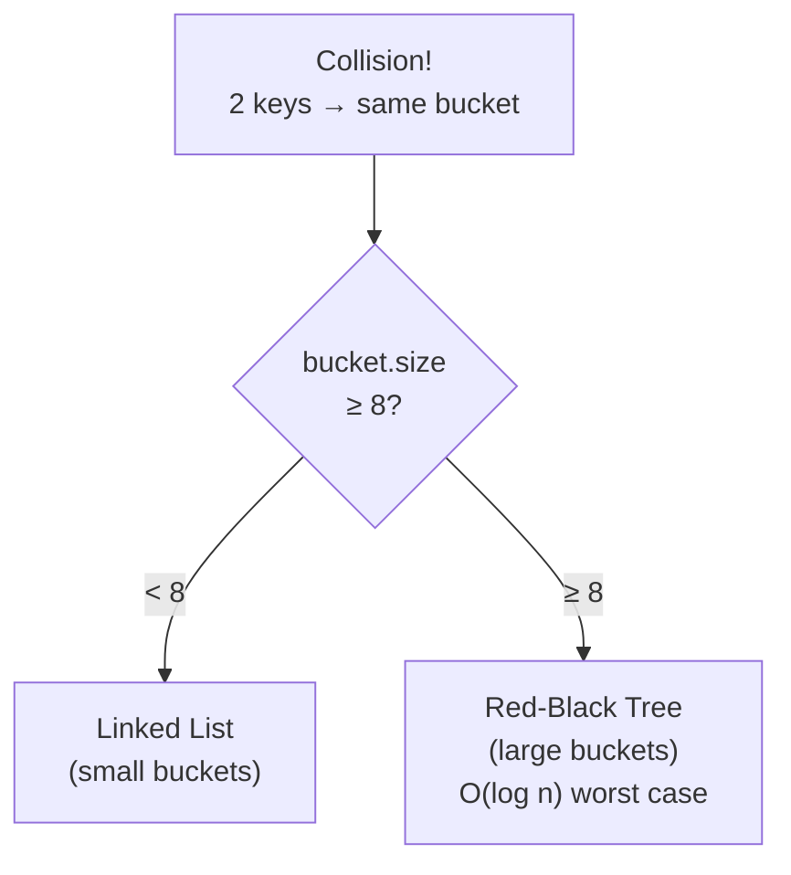

### Load Factor & Resize

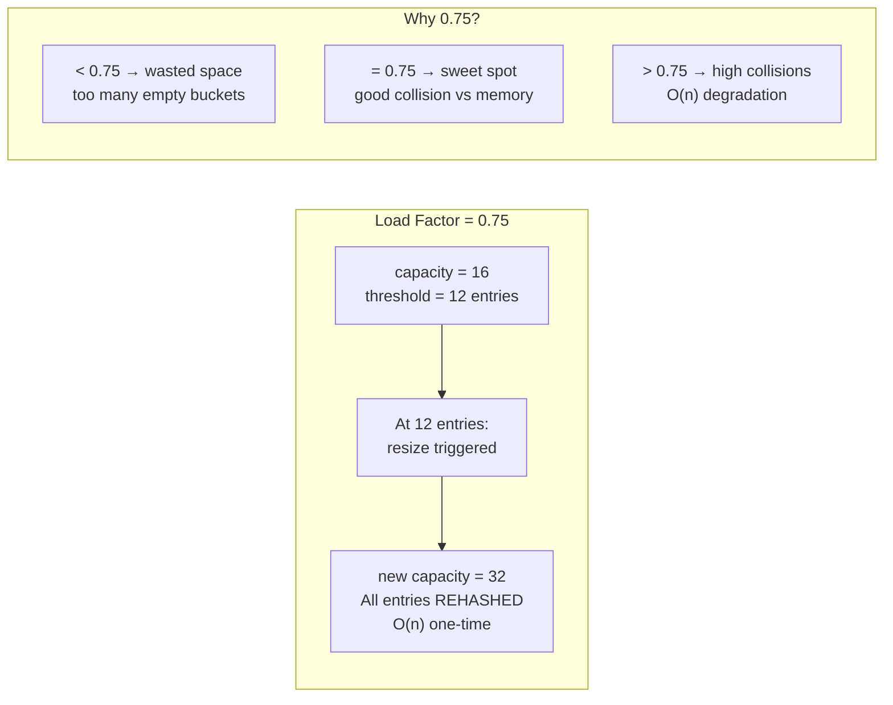

### HashMap Get — Full Path

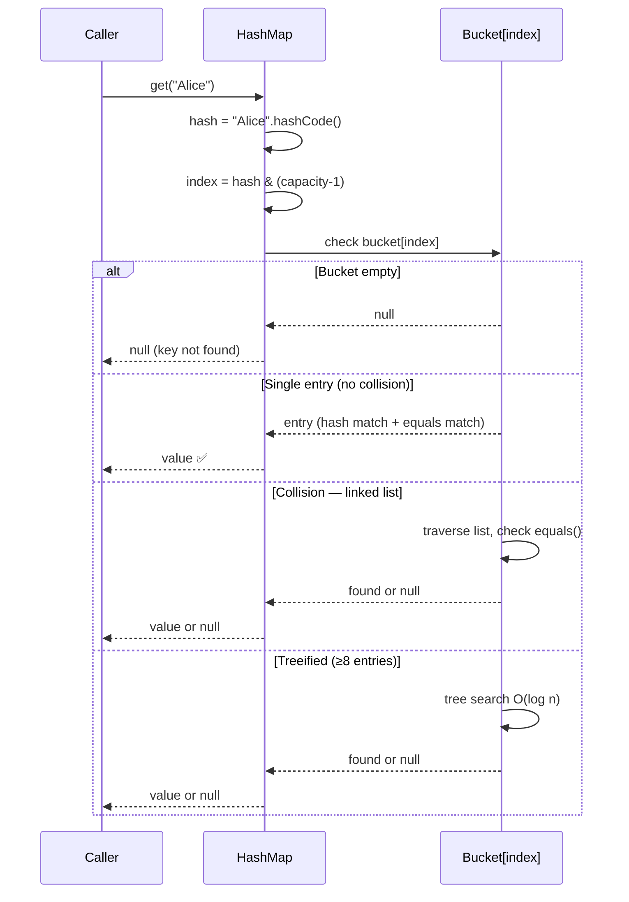

---

## Big O Quick Reference

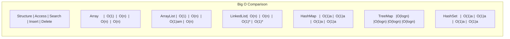

> `a` = amortized, `am` = amortized, `*` = O(1) only if you have a node reference

---

## When to Use Which

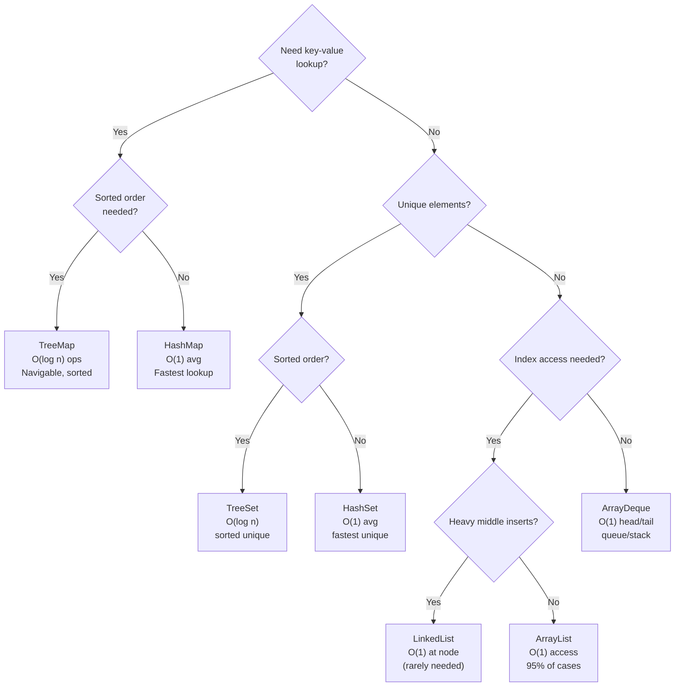

---

## Cache Efficiency — Why ArrayList Beats LinkedList in Practice

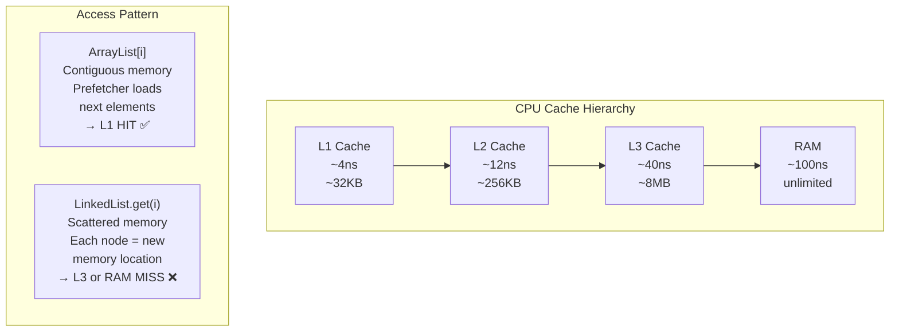

---

## Mental Map — Data Structures

```mermaid
mindmap
    root((Data Structures))
        ArrayList
            O(1) access by index
            O(1) amortized insert at end
            1.5x resize on overflow
            contiguous memory, cache-friendly
            95% of use cases
        LinkedList
            O(1) insert at head with reference
            O(n) access by index
            24-40 bytes per node overhead
            scattered memory, cache-unfriendly
            rare: queue/deque needs
        HashMap
            hashCode + & (capacity-1) for bucket
            0.75 load factor default
            linked list → red-black tree at 8
            O(1) avg, O(n) worst (bad hash)
        TreeMap
            Red-black tree internally
            O(log n) all operations
            sorted keys, navigable
            use when order matters
        HashSet
            HashMap with dummy values
            O(1) contains/add
```
