[← Back to kotlin-language.md](kotlin-language.md) | [← Back to folder](README.md)

---

# Kotlin Language — Visual Reference

> Visual companion to `kotlin-language.md`. Every concept rendered as a diagram.

---

## Class Type Hierarchy


---

## PART A — Data Classes: What the Compiler Generates


### Destructuring — How It Works


### copy() Memory Model

```mermaid
flowchart LR
    original["User(id=1, name='Alice')\n@address 0x1000"]
    copy_call["user.copy(name='Bob')"]
    new_obj["User(id=1, name='Bob')\n@address 0x2000\n⬅ NEW ALLOCATION"]

    original -->|"copy()"| copy_call
    copy_call -->|"always allocates"| new_obj
```



---

## PART B — Extension Functions: Static Dispatch

```mermaid
flowchart TD
    subgraph KOTLIN["Kotlin Source"]
        KT["fun String.isValidEmail(): Boolean\n  = this.contains('@')"]
    end
    subgraph JAVA_BYTECODE["Compiled Java Bytecode"]
        JV["public static boolean isValidEmail(String \$this) {\n  return \$this.contains('@');\n}"]
    end
    subgraph DISPATCH["Dispatch Type"]
        STATIC["⚠️ STATIC DISPATCH\nNot virtual — no polymorphism\nCalled by type at compile time"]
    end
    KOTLIN -->|"compiler transforms"| JAVA_BYTECODE
    JAVA_BYTECODE --> DISPATCH
```



### Extension vs Override — Polymorphism Trap

```mermaid
flowchart TD
    subgraph WRONG["❌ Extension (no polymorphism)"]
        A1["Animal ref = Dog()"]
        EXT["fun Animal.sound() = 'generic'\nfun Dog.sound() = 'woof'"]
        R1["animal.sound() → 'generic'\n(static dispatch, type = Animal)"]
        A1 --> EXT --> R1
    end
    subgraph RIGHT["✅ Virtual method (polymorphism)"]
        A2["Animal ref = Dog()"]
        OVR["open fun Animal.sound()\noverride fun Dog.sound()"]
        R2["animal.sound() → 'woof'\n(virtual dispatch, runtime type = Dog)"]
        A2 --> OVR --> R2
    end
```



### Receiver Chain in Scope Functions


---

## PART C — Inline & Reified: Compilation Flow


### Lambda Allocation: Regular vs Inline

```mermaid
flowchart LR
    subgraph REGULAR["Regular Function"]
        RL["fun process(items, action: (Int)->Unit)"]
        OBJ["🗑️ Lambda Object\nallocated on heap\n~16 bytes + GC pressure"]
        RL --> OBJ
    end
    subgraph INLINE["Inline Function"]
        IL["inline fun process(items, action: (Int)->Unit)"]
        INLINED["✅ Code inlined\nNo lambda object\nDirect method call"]
        IL --> INLINED
    end
```



### Inline Trade-off


---

## PART D — suspend / CPS State Machine


### Coroutine vs Thread Memory


> Threads: ~1MB each → 100K threads = 100 GB RAM ❌
> Coroutines: ~1KB each → 100K coroutines = 100 MB RAM ✅

---

## PART E — Sealed Class vs Sealed Interface


### When to Use Which


### Compiler Exhaustiveness Check

```mermaid
flowchart LR
    subgraph PERMITTED["Permitted Subclasses (compiler tracked)"]
        LIST["Loading\nSuccess\nError"]
    end
    subgraph WHEN_EXPR["when(state) expression"]
        W1["Loading -> showSpinner()"]
        W2["Success -> showData()"]
        MISSING["❌ Error missing\n→ COMPILE ERROR"]
    end
    PERMITTED -->|"enforces"| WHEN_EXPR
```



---

## PART F — Value Class Boxing Scenarios


### Value Class: JVM Bytecode Transform


---

## PART G — Flow Operators Decision Tree

```mermaid
flowchart TD
    START([Transforming a Flow?])
    START --> Q1{New inner flow\nper upstream item?}
    Q1 -->|Yes| Q2{Cancel old when\nnew arrives?}
    Q1 -->|No| Q3{Rate limiting needed?}

    Q2 -->|Yes| FML["flatMapLatest\n✅ Search autocomplete\nCancels previous inner flow"]
    Q2 -->|No| Q4{Order matters?}
    Q4 -->|Yes| FMC["flatMapConcat\n✅ Sequential dependencies\nWaits for each inner flow"]
    Q4 -->|No| FMM["flatMapMerge(N)\n✅ Parallel independent\nN concurrent inner flows"]

    Q3 -->|Yes| Q5{Wait for silence\nor emit periodically?}
    Q5 -->|"Wait for silence\n(search input)"| DEB["debounce(300ms)\nEmits only after 300ms gap"]
    Q5 -->|"Periodic\n(click/scroll)"| THR["throttle(500ms)\nMax 1 emit per 500ms"]
    Q3 -->|No| Q6{Drop intermediate\nvalues?}
    Q6 -->|"Only latest matters\n(UI render)"| CON["conflate()\nDrops backlog, keeps latest"]
    Q6 -->|"Decouple speed\n(fast producer)"| BUF["buffer(N)\nProducer ahead by N items"]
```



### Flow Operator Timing Diagrams

```mermaid
sequenceDiagram
    participant U as Upstream
    participant FL as flatMapLatest
    participant C as Collector

    U->>FL: emit("cat")
    FL->>C: start inner flow for "cat"
    U->>FL: emit("cats")
    FL->>C: ❌ CANCEL inner flow for "cat"
    FL->>C: start inner flow for "cats"
    C-->>C: only "cats" result delivered
```




### Search Autocomplete Pattern

```mermaid
flowchart LR
    INPUT["searchQuery\nMutableStateFlow"]
    DB["debounce(300)\nwait for pause"]
    DUP["distinctUntilChanged\nskip if same"]
    FML["flatMapLatest\ncancel old search"]
    API["api.search(query)\nnetwork call"]
    CATCH["catch { emit(emptyList()) }\nerror → empty"]
    UI["UI renders results"]

    INPUT --> DB --> DUP --> FML --> API --> CATCH --> UI
```

---

## Summary — Kotlin Language Mental Model

```mermaid
mindmap
    root((Kotlin))
        DataClass
            Auto equals/hashCode/copy
            component1/2 for destructuring
            copy allocates new object
        Extensions
            Static dispatch only
            No private field access
            DSL via receivers
        Inline
            Reified generics
            No lambda allocation
            Code copied to call site
        Sealed
            Exhaustive when
            sealed class = shared state
            sealed interface = type union
        ValueClass
            Zero allocation direct
            Boxing in 4 contexts
            Erased at JVM level
        Flow
            flatMapLatest = cancel
            flatMapConcat = serial
            flatMapMerge = parallel
            debounce = silence
```
