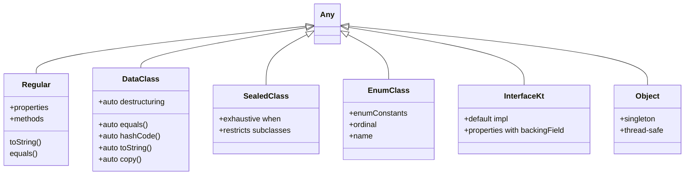

[← Back to main index](../../README.md) | [← Back to folder](../README.md)

---

## 2. Kotlin Language Deep Dive (Start Simple, Go Deeper)

<details open>
<summary><strong>📦 Kotlin Class Type Hierarchy</strong></summary>



</details>

---

### PART A: Data Classes & Destructuring

#### **The Basics (What it does)**

<details>
<summary>💻 Code Example</summary>

```kotlin
data class User(val id: Int, val name: String, val email: String)

val user = User(1, "Alice", "alice@ex.com")
println(user)  // User(id=1, name=Alice, email=alice@ex.com)
println(user.copy(name = "Bob"))  // Creates new copy with changed field

// Destructuring
val (id, name, email) = user
println("$id: $name")
```

</details>

#### **How to use it (Patterns)**

<details>
<summary>💻 Code Example</summary>

```kotlin
// Auto-generated functions
val user1 = User(1, "Alice", "a@ex.com")
val user2 = User(1, "Alice", "a@ex.com")
println(user1 == user2)  // true (uses equals())

// Copying & updates
val updatedUser = user1.copy(name = "Bob", email = "b@ex.com")

// Collections benefit
val users = listOf(user1, user2)
users.distinct()  // Uses equals() & hashCode()

// Map to entities
val userMap = users.associateBy { it.id }  // Map<Int, User>
```

</details>

<details>
<summary><b>DEEP DIVE: How Data Classes Work Under the Hood</b></summary>

**Compiler magic:** Kotlin compiler **generates** these functions for data classes:

```kotlin
// What you write:
data class User(val id: Int, val name: String)

// Compiler generates:
class User(val id: Int, val name: String) {
    override fun equals(other: Any?): Boolean {
        if (this === other) return true  // Same object?
        if (other !is User) return false  // Type check
        if (id != other.id) return false
        if (name != other.name) return false
        return true
    }

    override fun hashCode(): Int {
        var result = id.hashCode()  // Start with first field
        result = 31 * result + name.hashCode()  // Combine with others
        return result
    }

    override fun toString(): String =
        "User(id=$id, name=$name)"

    fun copy(id: Int = this.id, name: String = this.name): User =
        User(id, name)  // New instance with defaults

    operator fun component1(): Int = id  // For destructuring
    operator fun component2(): String = name
}
```

**Destructuring works via `componentN()` functions:**
```kotlin
val (id, name) = user
// Decompiles to:
val id = user.component1()
val name = user.component2()
```

**Key insight:** Data classes reuse standard object patterns. They're **syntactic sugar**, not new runtime concepts.

**Bytecode check:**
```bash
# Compile & decompile
kotlinc User.kt -d User.class
javap -c User.class  # Shows equals() is ordinary method
```

**Performance reality:**
- `equals()` is O(n) field comparisons (not reference comparison)
- `hashCode()` combines hashes (collision-safe)
- `copy()` always allocates new object (no structural sharing)

**Trade-off:** Convenience vs. allocation. Every `copy()` = new object. For 1000 users in list, `.distinct()` calls `equals()` O(n²) times worst-case.

</details>

---

### PART B: Extension Functions & Receiver

#### **The Basics (What it does)**

<details>
<summary>💻 Code Example</summary>

```kotlin
// Add function to String without subclassing
fun String.isValidEmail(): Boolean = this.contains("@")

val email = "alice@ex.com"
println(email.isValidEmail())  // true (looks like String method!)

// Generic extension
fun <T> List<T>.second(): T = this[1]
listOf(1, 2, 3).second()  // 2
```

</details>

#### **How to use it (Patterns)**

<details>
<summary>💻 Code Example</summary>

```kotlin
// Builder pattern via extensions
fun <T> buildList(block: MutableList<T>.() -> Unit): List<T> {
    val list = mutableListOf<T>()
    list.block()  // this = list
    return list
}

val numbers = buildList<Int> {
    add(1)
    add(2)
    add(3)
}

// Scope functions using receivers
user.apply { name = "Bob"; email = "b@ex.com" }  // Modify in-place
    .also { println(it) }  // Side effect
    .run { calculateScore() }  // Transform

// DSL building
html {
    body {
        div(id = "main") {
            h1 { +"Hello" }
            p { +"World" }
        }
    }
}
```

</details>

<details>
<summary><b>DEEP DIVE: Receivers & How Extension Functions Compile</b></summary>

**What you write:**
```kotlin
fun String.isValidEmail(): Boolean = this.contains("@")
```

**What compiler generates:**
```java
public static final boolean isValidEmail(String $this$isValidEmail) {
    return $this$isValidEmail.contains("@");
}
```

**The receiver (`this`) becomes first parameter!** Extension functions are **NOT actual methods**—they're **static functions with implicit first arg**.

**Receiver in scopes:**
```kotlin
// receiver = this = User object
user.apply {
    name = "Bob"  // this.name = "Bob"
    email = "b@ex.com"  // this.email = ...
}

// Decompiles to:
User $receiver = user;
$receiver.setName("Bob");  // Actual method call
$receiver.setEmail("b@ex.com");
return $receiver;
```

**DSL through receivers:**
```kotlin
// You write:
html {
    body { p { +"Hello" } }
}

// Receiver chain:
// html block: receiver = HTML object
// body block: receiver = BODY object (nested inside HTML)
// p block: receiver = P object (nested inside BODY)

// Decompiles to:
HTML html = new HTML();
BODY body = new BODY();
html.body(body);

P p = new P();
p.text("Hello");  // +"Hello" calls invoke on String receiver
body.p(p);
```

**Key insight:** Extensions are syntactic sugar over static methods. Allows **fluent chaining** and **DSL building** without inheritance.

**Performance:** No overhead—compiled to regular static calls. JIT inline them.

**Limitations:**
- No `private` access to receiver's private fields (compiled as outside class)
- Dispatch is **static** (not virtual)—no polymorphism

```kotlin
// ❌ Won't override
open class Animal
fun Animal.sound() = "generic"
class Dog : Animal()
fun Dog.sound() = "woof"

val dog: Animal = Dog()
dog.sound()  // Prints "generic" (static dispatch, not "woof")

// ✅ Virtual dispatch with open functions
open class Animal { open fun sound() = "generic" }
class Dog : Animal() { override fun sound() = "woof" }
dog.sound()  // "woof" (virtual dispatch)
```

</details>

---

### PART C: Inline Functions & Reified Generics

#### **The Basics (What it does)**

<details>
<summary>💻 Code Example</summary>

```kotlin
// Regular function
fun <T> filter(list: List<T>, predicate: (T) -> Boolean): List<T> {
    return list.filter(predicate)
}

val numbers = listOf(1, 2, 3, 4)
val evens = filter(numbers) { it % 2 == 0 }

// ❌ Can't check generic type at runtime
// ❌ Lambda creates object allocation

// Inline function with reified
inline fun <reified T> parseJson(json: String): T {
    return when (T::class) {  // Can check T!
        User::class -> parseUserJson(json) as T
        Product::class -> parseProductJson(json) as T
        else -> throw IllegalArgumentException()
    }
}

val user: User = parseJson("""{"id":1,"name":"Alice"}""")  // Works!
```

</details>

#### **How to use it (Patterns)**

<details>
<summary>💻 Code Example</summary>

```kotlin
// Type-safe casts with reified
inline fun <reified T> Any.asOrNull(): T? = this as? T

val obj: Any = "Hello"
val str: String? = obj.asOrNull()  // Works: "Hello"
val int: Int? = obj.asOrNull()     // Works: null (not Int)

// No lambda allocation overhead
inline fun repeat(times: Int, block: () -> Unit) {
    for (i in 0 until times) {
        block()
    }
}
// block() calls are **inlined** (no lambda object created)

// With noinline (don't inline this lambda)
inline fun foo(crossinline callback: () -> Unit, noinline other: () -> Unit) {
    callback()  // Inlined
    other()     // Not inlined (stored in object)
}
```

</details>

<details>
<summary><b>DEEP DIVE: Inline & Reified Compilation Magic</b></summary>

**What you write:**
```kotlin
inline fun <reified T> parseJson(json: String): T {
    return when (T::class) {
        User::class -> parseUserJson(json) as T
        else -> throw IllegalArgumentException()
    }
}

val user: User = parseJson("""...""")
```

**What compiler generates (simplified):**
```java
// Function body COPIED into call site
User user;
String json = "...";
Class<?> $klass = User.class;  // Type argument materialized!
if ($klass.equals(User.class)) {
    user = (User) parseUserJson(json);
} else {
    throw new IllegalArgumentException();
}
```

**Key: Type argument reified at call site!** Compiler inserts `User.class` directly.

**Why only inline can be reified:**
- Generic type erasure: `List<String>` becomes `List` at runtime (JVM limitation)
- **Inline** = code copied → can use actual type
- **Non-inline** = separate function → can't access caller's type info

```kotlin
// ❌ Error: Can't be reified
fun <reified T> notInline(json: String): T {  // ERROR: reified needs inline
    // ...
}

// ✅ Works
inline fun <reified T> isInline(json: String): T {
    // Compiler copies body here; T is known
}
```

**Lambda allocation vs inline:**
```kotlin
// Regular function
fun processItems(items: List<Int>, action: (Int) -> Unit) {
    for (item in items) action(item)
}

val lambda = object : Function1<Int, Unit> {  // Object allocated on heap
    override fun invoke(x: Int) {
        println(x)
    }
}
processItems(numbers, lambda)

// Inline function
inline fun processItems(items: List<Int>, action: (Int) -> Unit) {
    for (item in items) {
        println(item)  // Code inlined here, NO object created!
    }
}
processItems(numbers) { println(it) }
```

**Bytecode comparison:**
```bash
# Regular: processItems calls invoke() on Function1 object
# Inline: processItems loop contains println directly (no lambda object)
```

**`crossinline` keyword (for nested coroutines):**
```kotlin
// ❌ Error: Can't use suspend in inlined lambda
inline fun launchAsync(block: suspend () -> Unit) {
    GlobalScope.launch { block() }  // Error: block not inlined (in lambda context)
}

// ✅ Fixed: Mark crossinline
inline fun launchAsync(crossinline block: suspend () -> Unit) {
    GlobalScope.launch { block() }  // block is inlined but prevents direct return
}
```

**Trade-off table:**

| Inline | Benefit | Cost |
|--------|---------|------|
| ✅ | Reified generics | Code bloat (inlined everywhere) |
| ✅ | No lambda allocation | Not suitable for recursive functions |
| ✅ | Return from lambda | Larger bytecode |
| ❌ | Can't be `private` | Can't use in Java |

**When to use:**
- Small functions (1-3 lines)
- Reified needed
- High-call-frequency (allocation matters)

**Avoid:**
- Large functions (code bloat)
- Library APIs (consumers pay cost)
- Recursive functions (infinite expansion)

</details>

---

### PART D: Coroutine Internals — How `suspend` Works (CPS Deep Dive)

> [!TIP]
> `suspend` functions compile to state machines via Continuation-Passing Style (CPS). The compiler transforms
> suspension points into labeled states, allowing one thread to manage 100K+ coroutines.

`suspend keyword` · `Continuation<T>` callback · `State machine` · `No OS threads` · `Yields, not blocks`

<details>
<summary>💻 Code Example</summary>

```kotlin
suspend fun getUser(id: Int): User {
    val cached = cache.get(id)
    if (cached != null) return cached
    val user = api.fetch(id)  // Suspension point
    return user
}
```

</details>

<details>
<summary>🔩 Under the Hood</summary>

### Compiler transformation (CPS)

**What you write:**
```kotlin
suspend fun getUser(id: Int): User {
    val cached = cache.get(id)         // State 0
    if (cached != null) return cached
    val user = api.fetch(id)           // Suspension point → State 1
    cache.put(id, user)
    return user
}
```

**What compiler generates:**
```kotlin
fun getUser(id: Int, cont: Continuation<User>): Any {
    when (cont.label) {
        0 -> {  // State 0: check cache
            if (cached != null) { cont.resume(cached); return COROUTINE_SUSPENDED }
            else { cont.label = 1; return api.fetch(id, cont) }
        }
        1 -> {  // State 1: resume after fetch
            val user = (cont as MyContinuation).result()
            cache.put(id, user)
            return user
        }
    }
}
```

### What it reuses & relies on

- **Continuation<T>** callback interface (JVM standard, coroutines runtime)
- **CoroutineDispatcher** (Dispatcher.Main, Default, IO) — schedules resumed coroutines on thread pool
- **Suspending function protocol** — returns `COROUTINE_SUSPENDED` sentinel to indicate yielding
- **No stack frames stored** — locals become object fields (ContinuationImpl subclass)

### Why this design was chosen

**Alternative 1:** Thread per coroutine (like platform threads)
- Simpler model but 1 thread ≈ 1 MB stack → max 100K impossible (OOM at 1K)
- OS context switches expensive (microseconds each)

**CPS state machine approach:**
- Coroutine state lives in heap object (few KB) → 100K+ fit in RAM
- No OS thread context switch needed → switch is function call (~nanoseconds)
- JVM JIT can inline state transitions → minimal overhead

### User vs Understander

| A user knows | An understander also knows |
|---|---|
| `suspend` pauses execution | Compiler inserts `label` field; each state is a branch in `when` |
| "Coroutines are lightweight" | Suspended coroutine = object holding locals + label; no OS resource held |
| `Dispatchers.Main` runs on UI thread | Dispatcher is thread pool; coroutine resumes on available thread (not bound to original) |
| `launch { }` starts a coroutine | Compiler creates `SafeContinuation` wrapper; runtime enqueues on dispatcher's queue |

### Gotchas at depth

- **No automatic stack trace in debugger:** Stack is broken across states (state 0 stack, state 1 stack separate). Debugger shows only current state. (Mitigated in IDE but confusing in logs.)
- **Locals are fields:** If coroutine suspends at same point twice with different locals, race condition possible if not careful. (Coroutine scope prevents this in practice.)
- **Cross-platform differences:** Native/Wasm have different CPS strategies. Kotlin/JS uses callbacks directly.

</details>

### PART E: sealed class vs sealed interface

> [!TIP]
> `sealed class` = shared state + single parent; `sealed interface` = type union + multi-inheritance. Start with interface (more flexible).

`sealed class` for shared state · `sealed interface` for type unions · Mutually exclusive subtypes · Exhaustive when

<details>
<summary>💻 Code Example</summary>

```kotlin
// Interface: type union (no shared state)
sealed interface UiState {
    data object Loading : UiState
    data class Success(val data: String) : UiState
    data class Error(val msg: String) : UiState
}

// Class: shared state + parent
sealed class ApiResponse<T>(val statusCode: Int) {
    class Success<T>(val data: T, statusCode: Int) : ApiResponse<T>(statusCode)
}
```

</details>

| Feature | `sealed class` | `sealed interface` |
|---|---|---|
| **Inheritance** | Single parent only | Multiple interfaces + one class |
| **State** | Constructor params, shared fields | No state, only methods |
| **Equals/hashCode** | Auto-generated in data subclasses | Manual or data class subtypes |
| **When to use** | Subtypes share common data | Type unions, multi-inheritance needed |

<details>
<summary>🔩 Under the Hood</summary>

### Compiler handling

**Sealed class:**
```kotlin
sealed class Result<T>(val ts: Long) {
    class Success<T>(val value: T, ts: Long = System.currentTimeMillis()) : Result<T>(ts)
}

// Compiler generates:
// - Result constructor calls stored in Result.kt bytecode (linkage metadata)
// - Subclass check: Result.class.getPermittedSubclasses() (Java 15+)
// - Only subclasses in same file/sealed hierarchy allowed
```

**Sealed interface:**
```kotlin
sealed interface Loadable
data class Item(val id: Int) : Loadable
class CustomItem(val id: Int) : Loadable

// Compiler generates:
// - Same permitted subclasses metadata
// - No state sharing (interface has no fields)
// - Subtypes can extend other classes simultaneously
```

### What it reuses & relies on

- **Java sealed types (Java 15+)** — compiled as `PermittedSubclasses` attribute
- **Data classes** — used for subclass implementations (auto-generate equals/hashCode/copy)
- **Single Inheritance Hierarchy** — sealed interface doesn't change single parent rule for classes, only adds interface implementation

### Why this design was chosen

**Sealed class:**
- Enforce exhaustive matching without error-prone inheritance
- Share common constructor/fields across variants (Result<T> with timestamp)
- Clear ownership: one family tree

**Sealed interface (Kotlin 1.4+):**
- More flexible: allow type A to be both `Loadable` AND `Parcelable`
- Decouple type union from class hierarchy
- Better for multi-concern types (UI state that's also serializable)

### User vs Understander

| A user knows | An understander also knows |
|---|---|
| `sealed` prevents external subclasses | Only subclasses in same file/module allowed (compiler enforces via PermittedSubclasses) |
| `when(state)` is exhaustive | Compiler tracks permitted subclasses; missing branch = compilation error |
| Sealed classes hold data | Sealed interface subtypes can implement other interfaces (e.g., `Parcelable`); more composable |
| Sealed interface is like abstract interface | No difference at runtime (both erased); difference is in what compiler enforces statically |

### Gotchas at depth

- **Inheritance + interface mix:** `sealed interface X` + `data class Y : X, Parcelable` works, but if `Parcelable` has conflicting methods, must implement both
- **toString/equals:** With sealed class, use data class subtypes for auto-generation. If mixing data + regular classes, equals() becomes manual
- **Multi-module sealed:** If sealed type is in module A, subclass in module B, compiler in B may not know it's sealed (depends on configuration)

</details>

### PART F: inline class (Value Class)

> [!TIP]
> `@JvmInline value class` = compile-time type-safe wrapper, erased at runtime. Zero allocation when passed
> directly; boxed only when stored in containers or interface returns.

`Type-safe IDs` · `No object allocation` · `Erased at runtime` · `Boxing in some contexts`

<details>
<summary>💻 Code Example</summary>

```kotlin
@JvmInline value class UserId(val value: Int)
@JvmInline value class Email(val value: String)

fun sendEmail(userId: UserId, email: Email) { /*...*/ }
sendEmail(UserId(123), Email("test@ex.com"))  // Type-safe, zero allocation
```

</details>

**When to use:** Wrapper types for primitives/strings passed frequently (IDs, emails, URLs). Skip if rarely used (negligible savings).

<details>
<summary>🔩 Under the Hood</summary>

### Compilation & erasure

**What you write:**
```kotlin
@JvmInline value class UserId(val value: Int)

fun sendEmail(userId: UserId, email: String) { }
val id: UserId = UserId(123)
sendEmail(id, "test@ex.com")
```

**What compiler generates:**
```java
// Erased: UserId doesn't exist at runtime
public static void sendEmail(int userId, String email) { }

// Call site:
int id = 123;  // No object created
sendEmail(id, "test@ex.com");
```

### Boxing behavior — When allocation occurs

```kotlin
@JvmInline value class UserId(val value: Int)

val id: UserId = UserId(123)              // ✅ No allocation
val boxed: Any = id as Any                // ❌ BOX! Wrapper created
val nullable: UserId? = id                // ❌ BOX! Nullable requires object
val inList: List<UserId> = listOf(id)     // ❌ BOX! Container = wrapper
interface Identifiable { fun id(): UserId }  // ❌ BOX! Interface boundary
```

**Compiler generates (for nullable/container):**
```java
// When UserId is nullable or in container:
public static final class UserId {  // Object wrapper created
    private final int value;
    public UserId(int v) { this.value = v; }
}
```

### What it reuses & relies on

- **JVM type erasure** — generics erased at runtime, inline classes leverage this
- **Value-based classes** (Java, JEP 169) — compiler recognizes immutable patterns
- **Escape analysis** (JIT) — optimizer can prove object escapes and eliminate allocation
- **Kotlin metadata** — `@JvmInline` annotation tells compiler to inline in JVM code

### Why this design was chosen

**Alternative: Regular wrapper class**
```kotlin
data class UserId(val value: Int)  // Every use allocates object
```
- Prevents parameter mix-ups (same benefit)
- But allocation cost: every call allocates wrapper → garbage pressure

**Inline class approach:**
- Type-safe at compile time (catches mistakes)
- Runtime cost = zero (erased to primitive)
- Tradeoff: Boxing in 4 specific contexts (documented above)

### User vs Understander

| A user knows | An understander also knows |
|---|---|
| Inline class is type-safe ID wrapper | Erased to underlying type at runtime; no object exists at JVM level |
| "Zero allocation" | Allocation free ONLY in direct parameter passing; boxed in containers/nullability |
| `UserId?` creates a wrapper | Nullable forces boxing (primitive can't be null at JVM level) |
| Works like an `Int` but type-safe | Compiler emits `Int` at bytecode level; IDE + type checker prevent mixing |

### Gotchas at depth

- **Boxing unpredictable in IDE:** IDE may show "no allocation" but conditional code paths might box unexpectedly (escape analysis visibility)
- **Equality comparisons:** `UserId(1) == UserId(1)` works, but comparing boxed instances uses identity not value (gotcha if persisting in collections)
- **Reflection:** Can't instantiate via reflection (class doesn't exist at runtime); use factory functions
- **Multi-platform:** Inline classes work on JVM; on Native/JS behavior differs (not always erased)

</details>

### PART G: Flow Operators — When to Use

> [!TIP]
> Flow operators transform/combine streams. Each choice reflects a design decision: serial vs parallel, buffer
> vs backpressure, cancellation vs completion.

`flatMapConcat` serial · `flatMapMerge` parallel · `flatMapLatest` cancels · `debounce` + `throttle` rate-limit

| Operator | Decision | When | Example |
|---|---|---|---|
| **`flatMapConcat`** | Sequential, waits for each | Depends on order | User ID → profile → posts |
| **`flatMapMerge(N)`** | N parallel, emits as ready | Independent, limited concurrency | Download 4 images in parallel |
| **`flatMapLatest`** | Cancel old on new input | Search/autocomplete | New query cancels prev search |
| **`buffer(N)`** | Producer ahead, doesn't suspend | Fast producer, slow consumer | Network (fast) → UI (slow) |
| **`conflate()`** | Drop intermediate, keep latest | Only final state matters | Position flow → render |
| **`debounce(ms)`** | Wait after silence, emit latest | Search input (wait for user stop) | Wait 300ms → emit query |
| **`throttle(ms)`** | Emit max once per interval | Prevent spam | Click flow (1 per 500ms) |
| **`distinctUntilChanged()`** | Skip if same as previous | Avoid redundant work | User ID unchanged → skip fetch |

<details>
<summary>🔩 Under the Hood</summary>

### How each operator manipulates the stream

**`flatMapConcat` (sequential):**
```kotlin
// Pseudocode: waits for inner Flow to complete
outer.flatMapConcat { x -> inner(x) }

// Emission order: guaranteed ordered
// Backpressure: if inner is slow, outer suspends (waits)
```

**`flatMapMerge(concurrency=4)` (parallel with limit):**
```kotlin
// Pseudocode: runs up to 4 inner Flows simultaneously
outer.flatMapMerge(4) { x -> inner(x) }

// Emission order: as they complete (not guaranteed order)
// Backpressure: collects results, can buffer if consumer slow
```

**`flatMapLatest` (cancellation):**
```kotlin
// Pseudocode: cancels previous inner Flow on new outer value
outer.flatMapLatest { x -> inner(x) }

// When outer emits again:
// - Previous inner() coroutine is cancelled (Job.cancel())
// - New inner() starts
// Use case: search query changes → old search API call cancelled
```

**`debounce(ms)` + `throttle(ms)` (rate limiting):**
```kotlin
// debounce: waits for gap, emits latest
searchQuery.debounce(300).collect { query ->
    // Called only 300ms after user stops typing
}

// throttle: samples at fixed interval
clickFlow.throttle(500).collect { click ->
    // Called at most once per 500ms
}

// Compiler generates: Timer-based coroutine + delay() calls
```

### What it reuses & relies on

- **Coroutine scope** — each operator runs in collector's scope (lifetime tied to collect())
- **CoroutineContext** — dispatcher inherited from collector (Main/Default/IO)
- **Job hierarchy** — cancellation propagates down (child coroutines cancelled when parent cancelled)
- **Channel/buffer** — internal buffering for backpressure (FlowCollector implements buffered channel protocol)

### Why these designs were chosen

**Serial (`flatMapConcat`) vs Parallel (`flatMapMerge`):**
- Serial guarantees order; parallel maximizes throughput
- Parallel has concurrency limit (default depends on CPU count) to prevent resource exhaustion

**Cancellation (`flatMapLatest`) vs completion (`flatMapConcat`):**
- Cancellation is expensive (cancellation token, exception unwinding) but necessary for UI (search queries)
- Completion is cheap (just wait) but blocks producer

**Rate limiting (`debounce` vs `throttle`):**
- `debounce`: reactive (wait for silence) → ideal for input events (search, typing)
- `throttle`: periodic (fixed interval) → ideal for high-frequency events (scroll, mouse move)

### User vs Understander

| A user knows | An understander also knows |
|---|---|
| `flatMapLatest` cancels old search | Compiler inserts `currentJob?.cancel()` before launching new one; cancellation token propagates down |
| `debounce(300)` waits for silence | Uses Timer coroutine + delay(300); each new item resets timer |
| `conflate()` keeps latest | Internal buffer with size=1; new items overwrite pending item |
| `buffer(N)` decouples producer/consumer | Channel(capacity=N); producer emits into channel, collector drains independently |

### Gotchas at depth

- **`flatMapLatest` doesn't re-emit on cancel:** If search is cancelled mid-emission, no error emitted (unless explicitly handled in `catch { }`)
- **`debounce` with 0ms:** Still suspends once (delay(0) = yield to scheduler); not "no delay"
- **`buffer` overflow:** If capacity exceeded, behavior depends on BufferOverflow (SUSPEND, DROP_OLDEST, DROP_LATEST)
- **Dispatcher matters:** `debounce` uses default scheduler (can cause delays if Dispatcher.Main blocked); consider explicit dispatcher

</details>

**Practical decision tree:**
1. **Multiple independent values?** → `flatMapMerge(4)` (N parallel)
2. **Each depends on previous?** → `flatMapConcat` (sequential)
3. **Cancel on new input?** → `flatMapLatest` (search, autocomplete)
4. **Only latest matters?** → `conflate()` (UI rendering)
5. **Prevent rapid-fire?** → `debounce(300)` or `throttle(500)`

**Example: Search autocomplete (interview pattern):**
<details>
<summary>💻 Code Example</summary>

```kotlin
val searchQuery = MutableStateFlow("")
val results: Flow<List<Item>> = searchQuery
    .debounce(300)  // Wait for user to stop typing
    .distinctUntilChanged()  // Skip if unchanged
    .flatMapLatest { query ->
        if (query.isEmpty()) flowOf(emptyList())
        else api.search(query)
            .onStart { emit(emptyList()) }  // Loading state
    }
    .catch { emit(emptyList()) }  // Error → empty
```

</details>

---

