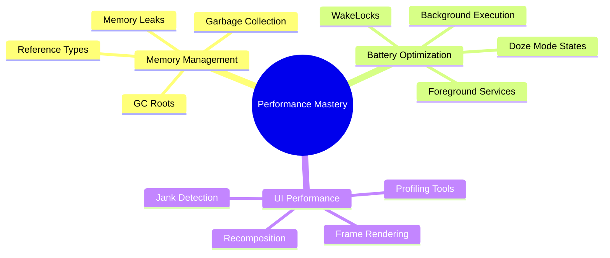

# ⚡ Performance & Memory

[← Back to main index](../README.md)

> [!IMPORTANT] **Performance expertise separates production engineers from hobbyists.** Memory leaks, battery drain, and frame stuttering are interview red flags. Interview frequency: **HIGH**.

---

## 📊 Performance Optimization Roadmap

<strong>Performance Layers</strong>

---

## 📂 Files in This Folder

| File | Topic | Description | Key Interview Topics |
|:-----|:------|:-----------|:---------------------|
| **[memory-performance.md](memory-performance.md)** | Memory & Performance | Recomposition, profiling, optimization | Recomposition scope, frame scheduling, Android Profiler |
| **[battery-optimization.md](battery-optimization.md)** | Battery Optimization & Doze | Power usage, background execution | Doze mode, adaptive battery, background limitations |
| **[weak-references.md](weak-references.md)** | Weak References & Memory Management | GC, memory leaks, reference types | WeakReference vs SoftReference, memory leak patterns, LeakCanary |

---

## 🔗 Jump to other folders

| 🚀 Kotlin | 🔧 Core | 🏗️ Design |
|:---------|:--------|:---------|
| [Kotlin](../kotlin/README.md) | [Android Core](../android-core/README.md) | [Architecture](../architecture/README.md) |

| 🌐 Data | 🎨 UI | 💡 Strategy |
|:--------|:-----|:-----------|
| [Data & Networking](../data-networking/README.md) | [UI & Graphics](../ui/README.md) | [Interview Strategy](../interview-strategy/README.md) |

| 🔨 Build |
|:---------|
| [Build & Testing](../build-testing/README.md) |
