[← Back to battery-optimization.md](battery-optimization.md) | [← Back to folder](README.md)

---

# Battery Optimization — Visual Reference

> Visual companion to `battery-optimization.md`. Every concept rendered as a diagram.

---

## Doze Mode State Machine

---

## Doze Mode — Impact on APIs

```mermaid
flowchart TD
    DOZE["📱 Device in Doze Mode\n(screen off, no motion, 30+ min)"]

    DOZE --> ALARM["⏰ AlarmManager\nsetExact() / setRepeating()\n❌ DEFERRED to maintenance window"]
    DOZE --> NET["🌐 Network\nAll requests\n❌ SUSPENDED"]
    DOZE --> GPS["📍 Location Updates\n❌ STOPPED"]
    DOZE --> WAKE["⚡ Partial Wakelocks\nPowerManager.PARTIAL_WAKE_LOCK\n❌ IGNORED"]
    DOZE --> WORK["⚙️ WorkManager / JobScheduler\n✅ DEFERRED (not cancelled)\nruns in next maintenance window"]

    style ALARM fill:#5c1a1a,color:#fff
    style NET fill:#5c1a1a,color:#fff
    style GPS fill:#5c1a1a,color:#fff
    style WAKE fill:#5c1a1a,color:#fff
    style WORK fill:#1a3a1a,color:#cfc
```

---

## WorkManager vs AlarmManager vs JobScheduler

### Maintenance Window Timeline

---

## Battery Drain Sources

### Battery Drain by API Usage

---

## Battery Stats Inspection

---

## Background Work Decision Tree

```mermaid
flowchart TD
    Q1{"When must work run?"}

    Q1 -->|"Exact time\n(calendar alarm)"| Q_EXACT{"User-visible?"}
    Q1 -->|"Deferrable\n(sync, upload)"| WORK_MAN["✅ WorkManager\nrespects Doze\nbatches efficiently"]
    Q1 -->|"Long-running\n(download, music)"| SERVICE["✅ Foreground Service\n+ Notification\nOS won't kill"]

    Q_EXACT -->|"Yes (reminder)"| ALARM_EXACT["AlarmManager.setExactAndAllowWhileIdle()\n⚠️ Use sparingly"]
    Q_EXACT -->|"No"| WORK_MAN

    WORK_MAN --> W_CON["Add Constraints:\nNetworkType.CONNECTED\nrequiresCharging\nrequiresBatteryNotLow"]
```

### WorkManager Constraint Examples

---

## App Standby Buckets (Android 9+)

```mermaid
flowchart TD
    subgraph BUCKETS["App Standby Buckets"]
        ACTIVE["🟢 ACTIVE\nUser currently using app\nNo restrictions"]
        WORKING["🟡 WORKING SET\nUsed regularly\nFew restrictions"]
        FREQUENT["🟠 FREQUENT\nUsed occasionally\nModerate restrictions"]
        RARE["🔴 RARE\nSeldom used\nHeavy restrictions"]
        RESTRICTED["⛔ RESTRICTED\n(Android 12+)\nNot used in months\nExtreme restrictions"]
    end

    ACTIVE -->|"less usage over time"| WORKING
    WORKING -->|"less usage"| FREQUENT
    FREQUENT -->|"less usage"| RARE
    RARE -->|"very long time"| RESTRICTED
    RESTRICTED -->|"user opens app"| ACTIVE
```

---

## Battery Optimization Mental Map

```mermaid
mindmap
    root((Battery))
        DozeMode
            30 min idle → Doze
            Defers alarms, network, GPS
            Maintenance windows every 9h
            WorkManager = Doze-friendly
        APIs
            WorkManager = deferrable work
            ForegroundService = ongoing
            AlarmManager = exact timing only
            setAndAllowWhileIdle = use sparingly
        DrainSources
            GPS = most expensive
            Cellular TX = high cost
            Partial wakelocks = drain
            Background CPU = significant
        Tools
            dumpsys batterystats
            Android Studio Energy Profiler
            Google Play Android Vitals
        AppStandby
            Active → Working → Frequent → Rare
            Bucket = OS-controlled
            Less usage = more restrictions
```

