[← Back to memory-performance.md](memory-performance.md) | [← Back to folder](README.md)

---

# Memory & Performance — Visual Reference

> Visual companion to `memory-performance.md`. Every concept rendered as a diagram.

---

## Memory Leak Detection Flowchart

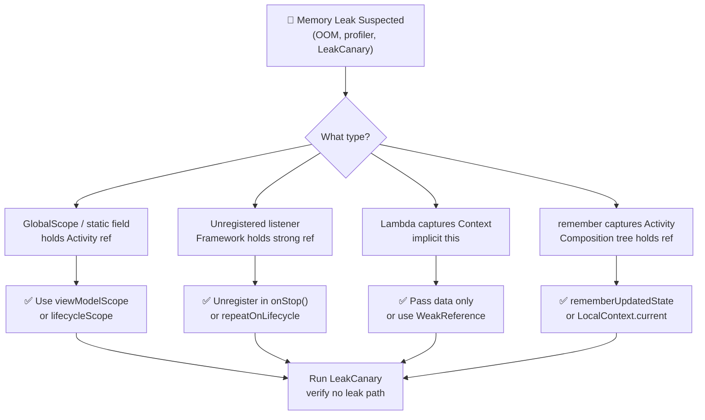

---

## GC Root Chain — Why Objects Stay Alive

```mermaid
flowchart TD
    subgraph GC_ROOTS["GC Roots (always alive)"]
        STACK["Thread Stacks\n(local variables)"]
        STATIC["Static Fields\n(class-level vars)"]
        JNI["JNI References\n(C++ holding Java objects)"]
        MONITOR["Monitor Objects\n(synchronized locks)"]
    end

    subgraph LEAK_CHAIN["Leak Chain Example"]
        GLOBAL_SCOPE["GlobalScope\n(static, lives forever)"]
        JOB["Coroutine Job\n(held by GlobalScope)"]
        CLOSURE["Lambda closure\n(captured Activity)"]
        ACTIVITY["Activity\n(trapped in heap!)"]
        FRAGMENT["Fragment"]
        VIEW["View"]
        VIEW_MODEL["ViewModel"]

        GLOBAL_SCOPE --> JOB --> CLOSURE --> ACTIVITY
        ACTIVITY --> FRAGMENT & VIEW & VIEW_MODEL
    end

    STATIC --> GLOBAL_SCOPE

    style ACTIVITY fill:#5c1a1a,color:#fff
    style LEAK_CHAIN fill:#2a1a1a
```

### Fix — Scope Lifetime Alignment

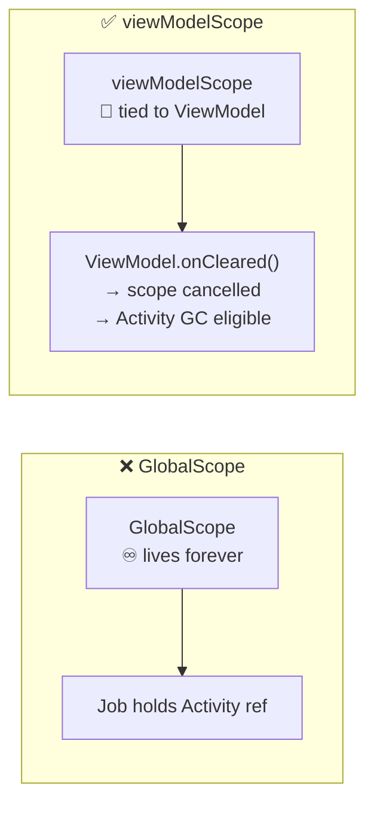

---

## JVM/ART Generational GC — Heap Structure

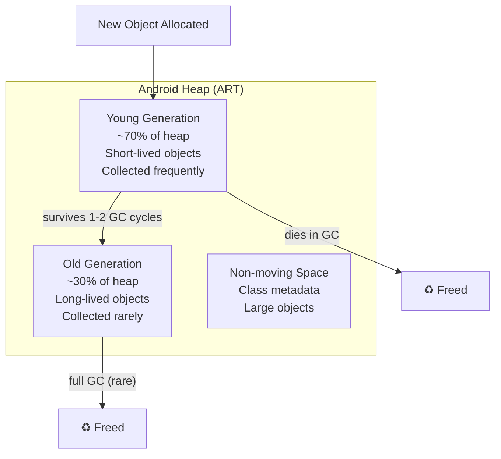

### Strong vs Weak vs Soft References

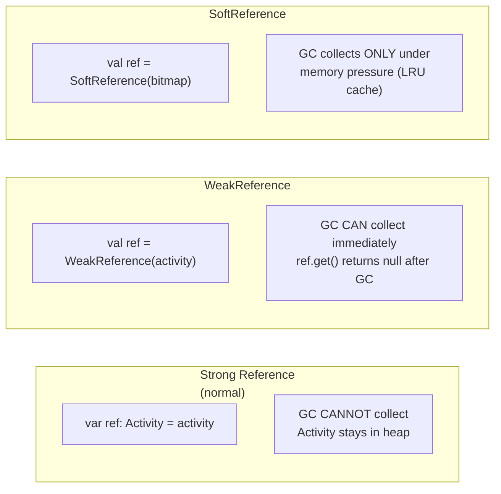

---

## LeakCanary — How It Works

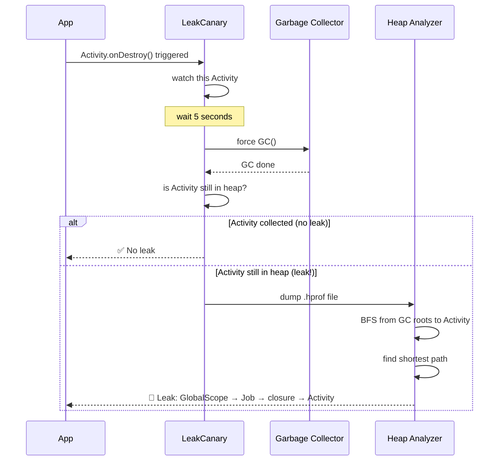

### LeakCanary Heap Path Analysis

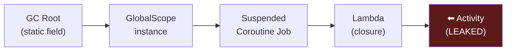

---

## Compose Recomposition — Slot Table

```mermaid
flowchart TD
    subgraph COMPOSITION["Composition Tree (in-memory)"]
        COUNTER["Counter @Composable\nSlot 0: MutableIntState(count=5)"]
        BUTTON["Button\nonClick = { count++ }"]
        TEXT["Text\nSlot 0: '5'"]
        COUNTER --> BUTTON --> TEXT
    end
    subgraph RECOMP["When count changes to 6..."]
        STEP1["1. MutableIntState notified"]
        STEP2["2. Counter marked for recomposition"]
        STEP3["3. Counter re-executes"]
        STEP4["4. remember looks up Slot 0 → same object"]
        STEP5["5. count.value = 6 (already updated)"]
        STEP6["6. Button/Text recompose if params changed"]
        STEP1 --> STEP2 --> STEP3 --> STEP4 --> STEP5 --> STEP6
    end
```

### Strong Skipping — Compiler Decision

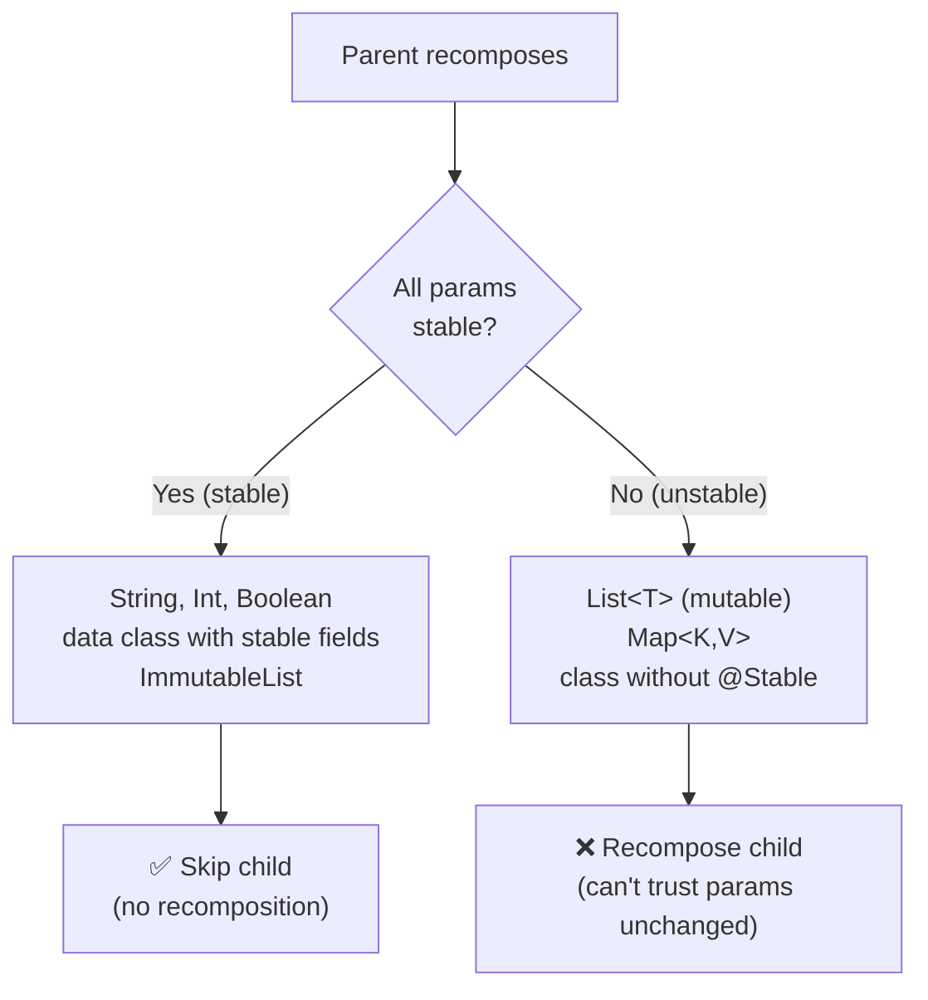

### derivedStateOf — Breaking Dependency Chains

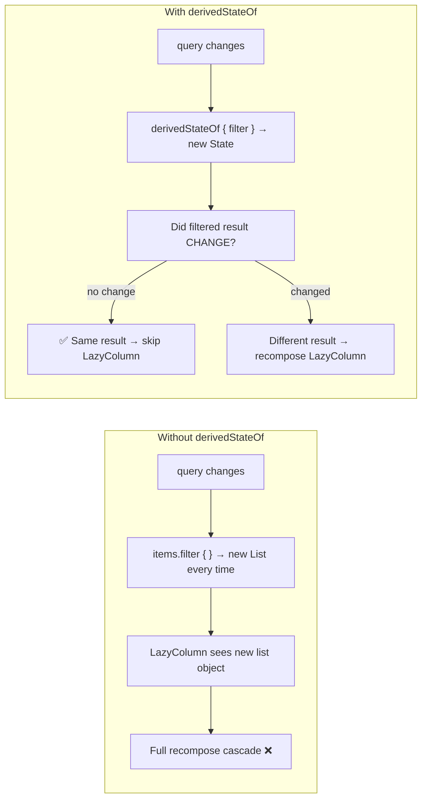

---

## State Hoisting

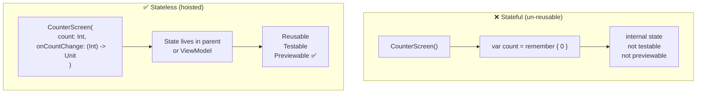

### Hoist to Lowest Common Ancestor

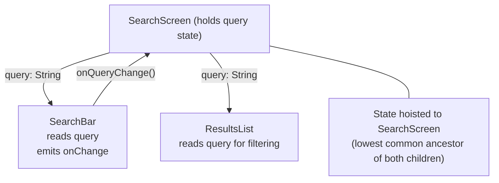

---

## Performance Mental Map

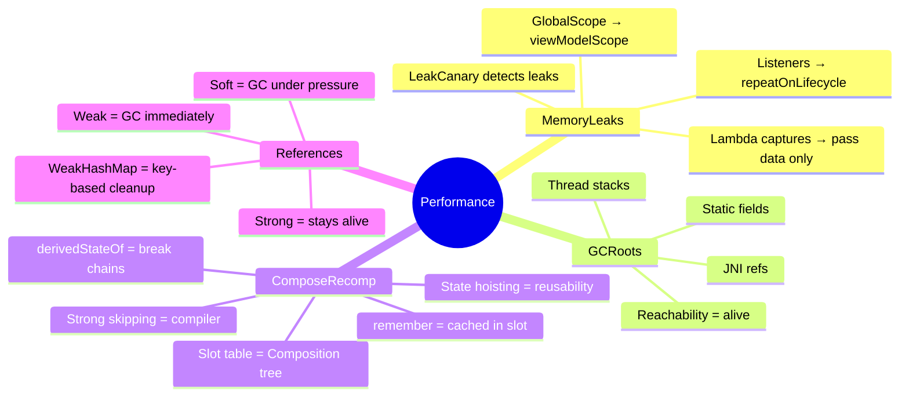
