[← Back to main index](../../README.md) | [← Back to folder](../README.md)

---

## 6. Memory & Performance

```mermaid
flowchart TD
    Leak["🚨 Memory Leak Detected"] --> Source{Leak Source?}
    Source -->|GlobalScope/Static| GS["GlobalScope or\nStatic field"]
    Source -->|Listeners| LIS["Unregistered\nListeners"]
    Source -->|Context| CTX["Context captured\nin lambda"]
    GS --> Fix1["Use viewModelScope\nor lifecycleScope"]
    LIS --> Fix2["Unregister in\nonStop()"]
    CTX --> Fix3["Use weak refs or\npass data only"]
    Fix1 --> LeakCanary["Run LeakCanary\nto verify fix"]
    Fix2 --> LeakCanary
    Fix3 --> LeakCanary
```

<details open>
<summary><strong>🔍 Memory Leak Detection Flowchart</strong></summary>



</details>

---

### 3 Common Memory Leaks (With Detection)

> [!WARNING]
> **Memory leak = object retained when should be garbage collected.** Usually: Activity retained after back
> navigation. Top causes: wrong coroutine scope, lambda capturing context, unregistered listeners.

`GlobalScope` × Activity · `Callback captures context` · `Unregistered listeners` · `LeakCanary detection` · `GC root chain`

| Leak | Cause | Fix |
|---|---|---|
| **GlobalScope + Activity** | GlobalScope outlives Activity | Use viewModelScope, lifecycleScope |
| **Compose remember captures context** | Lambda captures `this@Activity` | Use rememberUpdatedState, pass data only |
| **Unregistered listeners** | Framework holds strong ref | Unregister in onStop(), use repeatOnLifecycle |

<details>
<summary>💻 Code Example</summary>

```kotlin
// ❌ Leak: GlobalScope outlives Activity
GlobalScope.launch {
    val data = loadData(activity)  // activity ref held
    updateUI(data)  // Called after Activity destroyed!
}

// ✅ Fix: viewModelScope tied to Activity lifetime
viewModelScope.launch {
    val data = loadData()  // Activity ref not needed
    updateUI(data)  // Safe: scope cleared on ViewModel cleared
}
```

</details>

<details>
<summary>🔩 Under the Hood</summary>

### GC root graph traversal

**Leak mechanism (simplified):**
```
GC Root (static field)
  ↓ (strong reference)
GlobalScope.launch (Job)
  ↓ (closure capture)
lambda { updateUI(activity) }
  ↓ (implicit this)
Activity (trapped!)
  ↓ (references)
Fragment, View, ViewModel
    (all trapped, can't GC)

Result: Activity + all children retained indefinitely
```

**Memory Profiler inspection:**
```
Retained Objects: Activity
  └─ Fragment (still referenced by Activity)
     └─ ViewModel (still referenced by Fragment)
        └─ GlobalScope job (still scheduled)
           └─ Closure (captured Activity)
```

### LeakCanary detection

**What it does:**
1. On suspected leak (Activity destroyed but ref still held):
2. Force GC, dump heap to .hprof file
3. Parse heap: find shortest path from GC root to suspected object
4. Print chain: "App → GlobalScope job → closure → Activity"

**Root causes LeakCanary finds:**
- Static fields (never eligible for GC)
- Thread objects (threads live until thread exits)
- Thread-local storage (if thread pool reused, TLS persists)
- Service callbacks (if service not stopped)

### Compose `remember` with context capture

**Problem:**
```kotlin
@Composable
fun MyScreen(activity: Activity) {  // Shouldn't need activity here!
    val callback = remember {
        { Toast.makeText(activity, "Clicked", Toast.LENGTH_SHORT).show() }  // Captures activity
    }
    Button(onClick = callback) { Text("Click") }
}

// Recomposition lifecycle:
// 1. Composable called with activity ref
// 2. remember block creates callback (captures activity)
// 3. Callback stored in Composition (in-memory tree)
// 4. If Composition held after Activity destroyed, activity trapped
```

**Solution: rememberUpdatedState**
```kotlin
@Composable
fun MyScreen() {
    val context = LocalContext.current  // Compose context, safe
    val message = rememberUpdatedState("Clicked")  // Updated on recomposition, no capture
    val callback = remember {
        { Toast.makeText(context, message.value, Toast.LENGTH_SHORT).show() }  // No closure over mutable state
    }
}
```

### Listener registration pattern

**Old (error-prone):**
```kotlin
override fun onStart() {
    super.onStart()
    context.registerReceiver(receiver, filter)  // ❌ Easy to forget unregister
}

override fun onDestroy() {
    super.onDestroy()
    // ❌ If onPause called before onDestroy, receiver still registered (onPause → onStop → onDestroy)
    context.unregisterReceiver(receiver)
}
```

**New (safe):**
```kotlin
lifecycleScope.launch {
    repeatOnLifecycle(Lifecycle.State.STARTED) {  // Automatically managed
        context.registerReceiver(receiver, filter)  // Registered at onStart
        // Unregistered at onStop (not onDestroy — safer)
    }
}
```

### What it reuses & relies on

- **GC root** — thread stacks, static fields, JNI references (where GC traversal starts)
- **Reachability** — object can be GC'd if unreachable from any GC root
- **Strong/weak references** — weak refs don't prevent GC (used for caches)
- **Lifecycle awareness** — lifecycleScope automatically cancelled when lifecycle destroyed

### Why these leaks happen

**GlobalScope:**
- Intentionally long-lived (global app duration)
- Designed for fire-and-forget (bad for Activity-scoped work)
- No automatic cleanup (must manually cancel Job)

**Closure capture:**
- Lambdas implicitly capture `this` (convenience, but risk)
- Stored in remember cache (persists across recompositions)
- If composable cached after Activity destroyed, leak

**Listeners:**
- Framework holds strong ref (by design)
- onDestroy not guaranteed in all lifecycle paths (especially rotation)
- Must unregister in onStop (called before onDestroy reliably)

### User vs Understander

| A user knows | An understander also knows |
|---|---|
| "GlobalScope is bad for Activity" | GlobalScope.launch creates Job that outlives Activity. Closure captures Activity ref. Job stored in global registry (never cleared). |
| "Use viewModelScope instead" | viewModelScope = CoroutineScope(Job + Dispatchers.Main). Job cancelled in ViewModel.onCleared() → Activity GC-eligible. |
| "Remember captures context" | Remember stores closure in Composition tree (in-memory). If Composition retained after Activity destroyed, closure retained → activity retained. |
| "Listeners leak if not unregistered" | Framework stores listener in list. If Activity destroyed but listener still in list, Activity can't GC (strong ref from listener to Activity). |

### Gotchas at depth

- **Rotation = onDestroy/onCreate:** On config change, Activity destroyed + recreated. If GlobalScope job still holding ref to old Activity, new Activity created but old Activity trapped (two activities in memory).
- **Listener weak refs:** Some frameworks use WeakReference for listeners (safe), but not all. Always unregister manually unless docs guarantee weak ref.
- **rememberUpdatedState overhead:** rememberUpdatedState creates wrapper object. For frequently-changing state, use composition tree to pass values instead.
- **TLS in coroutines:** If coroutine launches on thread pool that's reused (Dispatchers.Default), thread-local variables might leak if not cleaned up.

</details>

### GC Root — How Objects are Kept Alive

> [!TIP]
> GC Root = starting point for reachability traversal. Thread stacks, static fields, JNI refs are always roots.
> Anything reachable from a root stays alive.

`GC Root` always alive · `Thread stacks` · `Static fields` · `JNI references` · `Reachability chains`

**Root types (never collected):**
- **Thread stacks:** Local variables in running threads
- **Static fields:** Class-level vars (single per app)
- **JNI references:** C++ refs to Java objects
- **Monitor objects:** Locks held in synchronized blocks
- **Interned strings:** String pool

**Objects trapped (reachable from root):**
<details>
<summary>💻 Code Example</summary>

```
GC Root (thread stack)
  ↓ Local var: GlobalScope job (strong ref)
  ↓ Closure captures: Activity
    ↓ Field: Fragment
      ↓ Field: View
        ↓ (all trapped — can't GC)
```

</details>

**Detection workflow:**

| Tool | What it does | Use when |
|---|---|---|
| **LeakCanary** | Auto-detects Activity leaks, dumps heap, finds GC root chain | Suspect leak in Activity back nav |
| **Memory Profiler** | Manual heap dump, object count, retained size | Investigating specific object |
| **adb shell dumpsys meminfo** | System memory stats (not object-level) | Checking overall memory pressure |

<details>
<summary>🔩 Under the Hood</summary>

### JVM Generational GC vs ART

**JVM Generational GC (Android API <28, legacy):**
```
Heap divided into:
  - Young Gen (70%): Objects aged <1s, collected frequently (fast)
  - Old Gen (30%): Long-lived objects, collected rarely (slow)

Allocation → Young Gen
  ↓ (if survives 1-2 young gen collections)
  ↓ (promoted to Old Gen)
Happens: O(1) marking, but full GC stalls

Leak impact:
  - Young gen leak (e.g., Activity in cache): cleared quickly (minor GC)
  - Old gen leak (e.g., static field): not cleared until full GC (rare)
```

**ART (Art Runtime, Android API 28+):**
```
Generational concurrent mark sweep:
  - Young collection: concurrent (doesn't stop threads)
  - Old collection: less frequent, can be concurrent

Heap stats:
  - More efficient GC (less pause time)
  - Leak detection same (object reachability = key)

Leak impact:
  - Same retention logic
  - But pause times shorter (better UX)
```

### Heap dump format (.hprof)

**Binary format parsed by LeakCanary:**
```
[Object instances]
  - Instance ID
  - Class pointer
  - Field values (field offsets, types)

[GC roots]
  - Thread stack roots
  - Static field roots
  - JNI refs

[References between objects]
  - Object A → Object B (field reference)
  - Object A → Array Object B[i] (array element)
```

**Shortest path algorithm:**
```
BFS from suspected object → find shortest chain to any GC root
  Activity (under test) → Fragment → ViewModel → Job → Activity (cycle)
  Print: "Leak found. GC root chain: Job(GlobalScope) → Activity"
```

### Strong vs Weak Reference Queues

**Strong reference:**
```kotlin
var ref: Activity = activity
// Activity trapped (reachable from local var)
// GC can't collect even if Activity.destroy() called
```

**Weak reference (doesn't prevent GC):**
```kotlin
val weakRef = WeakReference(activity)
// activity eligible for GC even if weakRef still exists
// After GC: weakRef.get() returns null
```

**Reference queue (for cleanup):**
```kotlin
val refQueue = ReferenceQueue<Activity>()
val weakRef = WeakReference(activity, refQueue)

// After GC collects activity:
val ref = refQueue.poll()  // Returns weakRef
// Notification that activity was collected
```

**Soft reference (cached objects):**
```kotlin
val softRef = SoftReference(bitmap)
// Collected only if memory pressure critical (LRU cache)
// Survives normal GC collections
```

### What it reuses & relies on

- **Concurrent mark-sweep algorithm** — walks reachability graph, marks live objects
- **Write barriers** — track object reference changes for concurrent GC
- **Card marking** — divide heap into "cards," track which old objects reference young objects
- **Thread park/resume** — STW (Stop-The-World) collections pause all threads briefly

### Why these designs were chosen

**Generational approach:**
- Observation: Most objects die young (temporary allocations)
- Collect young gen frequently (fast, small)
- Collect old gen rarely (expensive, large)
- Result: Lower average pause time

**ART over Dalvik:**
- Dalvik: JIT compilation (slow startup, unpredictable)
- ART: AOT + JIT hybrid (fast startup, predictable)
- Both use same generational GC concepts

### User vs Understander

| A user knows | An understander also knows |
|---|---|
| "GC Root determines if object stays alive" | GC traverses from roots (static/stack), marks reachable objects, sweeps unmarked. Unreachable from root = eligible for collection. |
| "WeakReference doesn't prevent GC" | WeakReference bypasses reachability check (not followed during GC traversal). Weak refs survive even after object GC'd. |
| "Heap dump shows all objects" | .hprof file is snapshot at point-in-time. Includes all object instances + field values + GC roots + reference graph. |
| "LeakCanary detects retained Activity" | After Activity.destroy(), LeakCanary polls Activity objects. If still in heap after GC, finds shortest chain to GC root (usually GlobalScope job). |

### Gotchas at depth

- **False positives in LeakCanary:** Some frameworks intentionally cache Activity (e.g., for resources). LeakCanary flags as leak, but actually safe if bounded. Can suppress via `@SuppressLint("DiscouragedPrivateApi")` or custom matchers.
- **Heap dump size:** Large app heaps (300+ MB) create huge .hprof files. Analyzing on slow machine can take minutes.
- **WeakReference timing:** After GC collects object, WeakReference.get() returns null **immediately next call**. Small window between collection and notification.
- **Static field leaks:** If static field holds Activity, leak is permanent (static never GC'd). Only way to fix: null out static field explicitly, or clear in app shutdown.

</details>

### Compose Recomposition — Smart Re-execution

> [!TIP]
> Recomposition = re-run composable when inputs change. Composition tree caches state via `remember`. Compiler
> skips unchanged branches (strong skipping). Use stable types to enable skipping.

`Recomposition` only affected nodes · `Composition tree` in memory · `Strong skipping` compiler analysis · `Stable types` enable optimization

<details>
<summary>💻 Code Example</summary>

```kotlin
@Composable
fun Counter() {
    var count by remember { mutableIntStateOf(0) }  // Persisted in Composition
    Button(onClick = { count++ }) { Text("$count") }
}
// Parent recomposes → Counter re-executes
// but remember block returns cached mutableIntStateOf(0) (same object)
// count value preserved across recompositions
```

</details>

| Optimization | What it does | Enables |
|---|---|---|
| **`remember`** | Cache object in Composition tree, keyed by position | State persistence across recompositions |
| **`derivedStateOf`** | Only trigger recomp if result value changes, not intermediate | Filter/transform without cascading |
| **Strong skipping** | Skip composable if all params stable | Child skip parent recomposition |
| **State hoisting** | Move state up, pass as params + lambdas down | Composable reusability + testing |

<details>
<summary>🔩 Under the Hood</summary>

### Composition slot table

**In-memory tree structure:**
```
Composition (in-memory tree)
├── Node: Counter @Composable
│   ├── Slot 0: mutableIntStateOf(5)  // remember value, keyed by position
│   ├── Node: Button
│   │   ├── onClick = { count++ }
│   │   └── Node: Text
│   │       └── Slot 0: "5"
```

**Recomposition process:**
```
1. State change: count = 6
2. Composition tree notified: Counter needs recomposition
3. Counter re-executes
4. remember block: looks up Slot 0 in tree
   - Key = (composable id, position, type)
   - Found in tree: returns cached MutableState<Int> (same object!)
5. count is still same MutableState object, but value changed to 6
6. Button and Text re-execute (because they're inside Counter)
7. Compiler checks: Button's params changed? Text's params changed?
   - If yes: recompose
   - If no: skip (strong skipping)
```

### Smart recomposition algorithm

**Dependency tracking:**
```kotlin
@Composable
fun SearchResults(query: String, items: List<Item>) {
    val filteredItems = derivedStateOf { items.filter { it.name.contains(query) } }
    // Depends on: query, items
    // Produces: filteredItems (state)

    LazyColumn {
        items(filteredItems.value) { item ->  // Only recompose if filteredItems changed
            ResultItem(item)  // Skip if item identity unchanged
        }
    }
}

// If items reordered but filteredItems same: LazyColumn skips
// If query changed but no matches: filteredItems same, LazyColumn skips
```

**Without derivedStateOf (inefficient):**
```kotlin
val filteredItems = items.filter { it.name.contains(query) }  // New list every recomposition!
// Every parent recomposition → new list instance → LazyColumn sees new param → full recompose (cascade)
```

### Strong skipping compiler pass

**Compiler analysis (Kotlin 2.0.20+):**
```
@Composable
fun Child(name: String, count: Int) {  // Params: all stable types
    Text(name)
    Text(count.toString())
}

// Compiler marks: skippable=true
// Why? name is String (stable), count is Int (stable)
// If parent recomposes but passes same name + count → skip Child entirely
```

**Stability inference:**
```kotlin
// Stable: data classes with all stable fields
data class Item(val id: Int, val name: String)  // Both fields stable

// Unstable: mutable interface
List<String>  // Mutable, compiler can't guarantee it's immutable

// Unstable: generic without bounds
class Container<T>  // T could be mutable type

// Solution: use immutable library
ImmutableList<String>  // From kotlinx-collections-immutable, marked stable
```

**Check compiler metrics:**
```bash
./gradlew debugComposeCompilerMetrics
# Output: app/build/compose_compiler_metrics/ComposableMetrics.txt
# Shows: composable name, skippable=true/false, stability
```

### State hoisting pattern

**Stateful (un-reusable):**
```kotlin
@Composable
fun CounterScreen() {  // State internal
    var count by remember { mutableIntStateOf(0) }
    Button(onClick = { count++ }) { Text("$count") }
}
// Can't reuse, can't test, can't preview with different count values
```

**Stateless (reusable):**
```kotlin
@Composable
fun CounterScreen(count: Int, onCountChange: (Int) -> Unit) {  // State external
    Button(onClick = { onCountChange(count + 1) }) { Text("$count") }
}
// Reusable, testable, previewable
```

### What it reuses & relies on

- **Composition tree** — in-memory Compose IR (not Kotlin AST, but runtime structure)
- **Compiler plugin** — analyzes code, generates skipping logic, infers stability
- **Kotlin reflection** — stability inference uses type information
- **State management** — MutableState<T> tracks observers, notifies on change

### Why this design was chosen

**Problem (naive recomposition):**
- Every state change → recompose entire tree
- Result: O(n) expensive recompositions

**Solution (smart recomposition):**
- Only affected subtrees recompose (O(1) if dependency tree shallow)
- Compiler analysis finds skippable branches (no manual annotation)
- State hoisting decouples state from UI (enables testing, previewing)

### User vs Understander

| A user knows | An understander also knows |
|---|---|
| "remember persists state" | remember stores MutableState<T> in Composition tree slot (keyed by position). Recomposition retrieves same slot → same object → value persisted. |
| "derivedStateOf prevents cascading" | derivedStateOf creates separate state, only notifies dependents if value changes (not intermediate values). Breaks dependency chain. |
| "Strong skipping = skip child" | Compiler generates skipping code: `if (params changed) recompose(); else skip()`. Analyzer marks skippable if all params stable. |
| "Stable types enable skipping" | Compiler trusts stable types won't change unexpectedly. List<T> unstable (mutable), ImmutableList<T> stable (immutable). |

### Gotchas at depth

- **Position-based keys:** remember uses composable position as key (not content). If remember moves (different position in tree), gets different slot → state lost. Rare but confusing.
- **Stability overrides:** Can mark class @Stable or @Immutable to override compiler inference (sometimes needed for external libraries marked unstable).
- **derivedStateOf overhead:** Creates new State object, hoists computation (slightly expensive). Don't over-use for every small computed value.
- **Composition tree size:** remember allocates slots in tree. 1000 remember calls = 1000 slots = memory overhead. Not a problem for typical screens, but huge list with remember per item is wasteful (use factory + scope).

</details>

### State Hoisting

**What:** Move state **up** to caller; state down as params, events up as lambdas. **When:** Reusable, testable, previewable composables. **Pattern:** `StatefulScreen()` → `StatelessScreen(state, onEvent)`. **Rule:** Hoist to **lowest common ancestor** needing the state.

---

