[← Back to weak-references.md](weak-references.md) | [← Back to folder](README.md)

---

# Weak References — Visual Reference

> Visual companion to `weak-references.md`. Every concept rendered as a diagram.

---

## Reference Types — GC Behavior

```mermaid
flowchart TD
    OBJ["Object in Heap"]

    subgraph STRONG_REF["Strong Reference (default)"]
        SR["var activity = myActivity"]
        SR_NOTE["GC CANNOT collect\n♾️ stays alive as long as ref exists"]
    end

    subgraph SOFT_REF["SoftReference"]
        SOF["val ref = SoftReference(bitmap)"]
        SOF_NOTE["GC collects ONLY under memory pressure\n🎯 ideal for caches\nsurvives normal GC"]
    end

    subgraph WEAK_REF["WeakReference"]
        WK["val ref = WeakReference(listener)"]
        WK_NOTE["GC collects IMMEDIATELY when unreachable\n🧹 auto-cleanup on next GC\nref.get() → null after collection"]
    end

    subgraph PHANTOM_REF["PhantomReference (rare)"]
        PH["val ref = PhantomReference(obj, refQueue)"]
        PH_NOTE["Never returns object (always null)\nused for cleanup hooks\nsignals after finalization"]
    end

    OBJ --- STRONG_REF & SOFT_REF & WEAK_REF & PHANTOM_REF
```



### Reference Strength Comparison


> Strong = never collected | Soft = collected under pressure | Weak = collected immediately | Phantom = signaled after collection

---

## WeakReference Lifecycle

```mermaid
sequenceDiagram
    participant APP as Application
    participant WR as WeakReference&lt;Activity&gt;
    participant GC as Garbage Collector
    participant HEAP as JVM Heap

    APP->>HEAP: Activity created
    APP->>WR: WeakReference(activity)
    Note over WR: holds weak ref to Activity

    APP->>APP: last strong ref removed\n(back navigation)
    Note over HEAP: Activity = only weakly reachable

    APP->>GC: next GC cycle
    GC->>GC: scan heap — Activity weakly reachable only
    GC->>HEAP: collect Activity
    GC->>WR: clear reference

    APP->>WR: weakRef.get()
    WR-->>APP: null (already collected)
```

---

## WeakReference in Listener Registry

```mermaid
flowchart TD
    subgraph STRONG_LEAK["❌ Strong Reference (memory leak)"]
        MGR_S["EventManager\nlisteners: List&lt;EventListener&gt;"]
        LISTENER_S["Activity implements EventListener"]
        ACTIVITY_S["Activity\n(destroyed but trapped!)"]
        MGR_S --> LISTENER_S --> ACTIVITY_S
        MGR_S -->|"strong ref keeps\nActivity alive"| ACTIVITY_S
    end

    subgraph WEAK_SAFE["✅ WeakReference (auto-cleanup)"]
        MGR_W["EventManager\nlisteners: List&lt;WeakReference&lt;EventListener&gt;&gt;"]
        WR["WeakReference&lt;Activity&gt;"]
        ACTIVITY_W["Activity\n(back-pressed → strong ref gone)"]
        GC_W["GC collects Activity\nWeakRef.get() = null"]
        CLEAN["publish() removes null refs\nauto-cleanup ✅"]
        MGR_W --> WR
        WR -.->|"weak (doesn't keep alive)"| ACTIVITY_W
        ACTIVITY_W -->|"GC"| GC_W --> CLEAN
    end
```



### EventBus with WeakReference Pattern

```mermaid
sequenceDiagram
    participant ACT as Activity
    participant BUS as EventBus
    participant GC as GC

    ACT->>BUS: subscribe(this)
    BUS->>BUS: add WeakReference(activity)
    BUS->>BUS: publish(event)
    BUS->>BUS: clean dead refs (get() == null)
    BUS-->>ACT: listener?.onEvent(event) ✅

    Note over ACT: Activity destroyed (back pressed)
    ACT->>GC: strong ref gone → eligible for GC
    GC->>GC: collect Activity
    GC->>BUS: WeakRef.get() now returns null

    BUS->>BUS: next publish() call
    BUS->>BUS: removeAll { it.get() == null }
    Note over BUS: Dead ref cleaned automatically ✅
```



---

## WeakHashMap — Key-Based Eviction


### WeakHashMap Lifecycle


---

## Soft Reference — Memory-Sensitive Cache


### Soft vs LRU Cache

```mermaid
flowchart LR
    subgraph SOFT_CACHE["SoftReference Cache"]
        SC1["No size limit"]
        SC2["System decides when to evict"]
        SC3["Unpredictable eviction timing"]
        SC4["Legacy approach"]
    end
    subgraph LRU["LRU Cache (preferred)"]
        LR1["Fixed size limit (e.g., 20% RAM)"]
        LR2["Evict least recently used"]
        LR3["Predictable behavior"]
        LR4["Modern approach ✅"]
    end
```



---

## Reference Type Decision Tree

```mermaid
flowchart TD
    Q1{"What's the goal?"}
    Q1 -->|"Keep object alive\nnormal usage"| STRONG_USE["✅ Strong Reference\n(default)"]
    Q1 -->|"Auto-cleanup when\nobject no longer needed"| Q2{"Cleanup triggers?"}
    Q1 -->|"Cache — keep if\nmemory allows"| SOFT_USE["✅ SoftReference\nor LRUCache"]

    Q2 -->|"Object becomes\nunreachable (listener)"| WEAK_USE["✅ WeakReference\nlistener registries\nEventBus"]
    Q2 -->|"Object lifetime tied\nto key lifetime"| WEAKHM_USE["✅ WeakHashMap\nkey-based caches"]
    Q2 -->|"Need cleanup\nhook after GC"| PHANTOM_USE["⚠️ PhantomReference\n(rare, advanced)"]
```



---

## Memory Reference Mental Map

```mermaid
mindmap
    root((References))
        Strong
            Default in Kotlin/Java
            Prevents GC
            Use for normal objects
        Weak
            ref.get() = null after GC
            Listener registries
            EventBus subscribers
            Auto-cleanup pattern
        Soft
            Collected under memory pressure
            Image caching (legacy)
            LRUCache preferred now
        WeakHashMap
            Keys held weakly
            Entry removed when key GC'd
            Object-lifetime-scoped caches
        PhantomReference
            Always returns null
            Cleanup hooks
            Very rare use case
```
