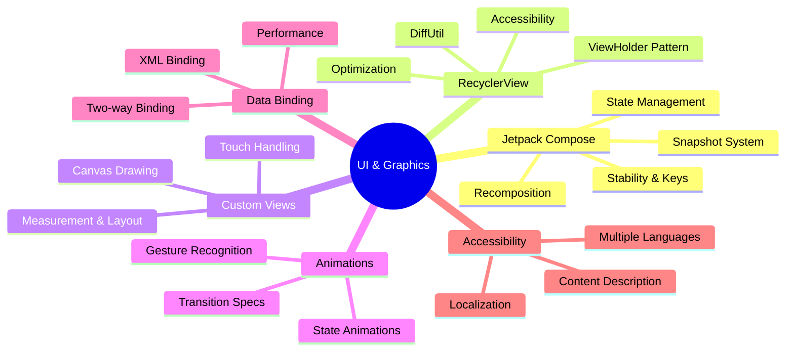

# 🎨 UI & Graphics

[← Back to main index](../README.md)

> [!TIP] **Modern Android UI requires deep understanding of Compose and performance.** Jetpack Compose is now the standard; legacy RecyclerView knowledge is table stakes. Interview frequency: **HIGH**.

---

## 🖼️ UI Technology Stack

<strong>UI Framework Evolution</strong>

---

## 📂 Files in This Folder

| File | Topic | Description | Key Interview Topics |
|:-----|:------|:-----------|:---------------------|
| **[compose-advanced.md](compose-advanced.md)** | Jetpack Compose Advanced Patterns | Snapshot system, stability | Recomposition, key strategy, state hoisting |
| **[recyclerview.md](recyclerview.md)** | RecyclerView Optimization | DiffUtil, ViewHolder patterns | ViewHolder cache, DiffUtil performance, scrap view pool |
| **[animations-transitions.md](animations-transitions.md)** | Animations & Transitions | State animations, transition specs | Animation lifecycle, interpolation, frame scheduling |
| **[custom-views-canvas.md](custom-views-canvas.md)** | Custom Views & Canvas Drawing | Measurement, layout, drawing | Canvas API, invalidation, hardware acceleration |
| **[data-binding.md](data-binding.md)** | Data Binding & View Binding | XML binding, two-way binding | Two-way binding gotchas, performance implications |
| **[accessibility-i18n.md](accessibility-i18n.md)** | Accessibility (a11y) & Localization (i18n) | ContentDescription, multiple languages | TalkBack support, RTL handling, region detection |

---

## 🔗 Jump to other folders

| 🚀 Kotlin | 🔧 Core | 🏗️ Design |
|:---------|:--------|:---------|
| [Kotlin](../kotlin/README.md) | [Android Core](../android-core/README.md) | [Architecture](../architecture/README.md) |

| 🌐 Data | 💡 Strategy | ⚡ Performance |
|:--------|:-----------|:--------------|
| [Data & Networking](../data-networking/README.md) | [Interview Strategy](../interview-strategy/README.md) | [Performance](../performance/README.md) |

| 🔨 Build |
|:---------|
| [Build & Testing](../build-testing/README.md) |
