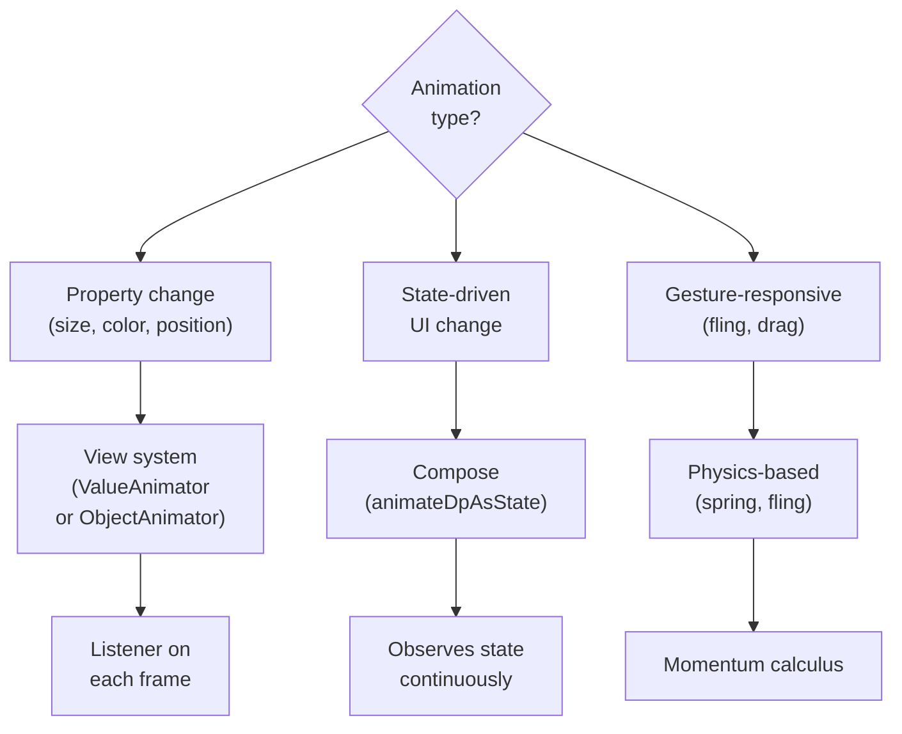

[← Back to main index](../../README.md) | [← Back to folder](../README.md)

---

## 28. Animations & Transitions

<details open>
<summary><strong>🎬 Animation Type Decision Tree</strong></summary>



</details>

---

### Property Animation (ValueAnimator)

> [!TIP]
> **`ValueAnimator.ofInt/Float()` animates from start to end over duration with interpolator.**
> `addUpdateListener()` updates view per frame. Manual `requestLayout()` for layout changes.

ValueAnimator · Interpolators · Update listeners · 60fps driven

<details>
<summary>💻 Code Example</summary>

```kotlin
val animator = ValueAnimator.ofInt(0, 100).apply {
    duration = 1000
    interpolator = LinearInterpolator()  // Or AccelerateDecelerateInterpolator, etc.
    addUpdateListener { animation ->
        val value = animation.animatedValue as Int
        myView.layoutParams.height = value
        myView.requestLayout()
    }
}
animator.start()
```

</details>

<details>
<summary>🔩 Under the Hood</summary>

### Frame-by-Frame Updates

**Choreographer-driven:** Animator registers with Choreographer (60Hz callback). On each vsync, calculates interpolated value, calls listener.

**requestLayout():** Triggers measure/layout/draw cycle. Next frame will render new layout.

### User vs Understander

| A user knows | An understander also knows |
|---|---|
| "Interpolator eases motion" | Interpolator function maps time fraction [0,1] to progress [0,1]. Linear = straight. Ease = curved (feels natural). |
| "Driven by Choreographer" | Animator not self-driving. Choreographer posts callback every 16ms (60Hz). Animator calculates progress, calls listener. |
| "requestLayout for size changes" | Manual measure/layout needed when animation changes view dimensions. Property animation doesn't know about layout. |

### Gotchas at depth

- **Listener leaks:** If Animator holds reference to view/activity, leak occurs. Lifecycle binding needed (or cancel on destroy).
- **Too many animations:** 20+ animators = callback overhead. Combine with transition() or use ObjectAnimator instead.

</details>

### Compose Animations

> [!TIP]
> **`animateDpAsState()` observes state, animates to target value.** Use `spring()`, `tween()`, or `keyframes()`
> specs. For multiple properties, use `updateTransition()` (keeps animations in sync).

animateDpAsState · Specs (spring, tween) · updateTransition · State-driven

<details>
<summary>💻 Code Example</summary>

```kotlin
@Composable
fun AnimatedCard(isExpanded: Boolean) {
    val height by animateDpAsState(
        targetValue = if (isExpanded) 300.dp else 100.dp,
        animationSpec = spring(dampingRatio = 0.8f),
        label = "card height"
    )
    Card(Modifier.height(height)) { Text("Content") }
}

@Composable
fun MultiAnimation(state: CardState) {
    val transition = updateTransition(state)
    val bgColor by transition.animateColor { if (it == CardState.Expanded) Color.Blue else Color.Gray }
    val scale by transition.animateFloat { if (it == CardState.Expanded) 1f else 0.8f }
    Box(Modifier.background(bgColor).scale(scale))
}
enum class CardState { Collapsed, Expanded }
```

</details>

<details>
<summary>🔩 Under the Hood</summary>

### Recomposition & Animation

**State change → recomposition → animateDpAsState() continues over duration → multiple recompositions → final value reached.**

**Each recomposition:** Compose measures/layouts/draws with new animated value.

**updateTransition:** Keeps multiple animations synchronized. One state change → all animations animate together (not separately).

### User vs Understander

| A user knows | An understander also knows |
|---|---|
| "animateDpAsState triggers recomposition" | State updated per frame → Compose recomposes → new value rendered → 60fps smooth. |
| "Specs control motion curve" | spring() = physics-based (overshoot). tween() = linear or custom easing. Specs are pure functions. |
| "updateTransition syncs animations" | Transition state drives all animations. Single state change → all properties animate coherently. |

### Gotchas at depth

- **Over-recomposition:** If state changes while animating, animation restarts (can feel janky). Use Transition to prevent.
- **Memory in animations:** State in lambda = recomposed per frame. Avoid allocating objects per frame.

</details>

---

