[← Back to main index](../../README.md) | [← Back to folder](../README.md)

---

## 16. Jetpack Compose Advanced Patterns

```mermaid
flowchart TD
    State["State Change"] --> Lambda["Lambda captures\ncomposable"]
    Lambda --> Recomp["Recomposition scope\nfrom slot table"]
    Recomp --> Skip{Is function\nparameters\nsame?}
    Skip -->|Yes| SkipRecomp["Skip entire subtree"]
    Skip -->|No| Exec["Execute composable\nwith new parameters"]
    Exec --> Children["Recompose children\n(recursively)"]
    SkipRecomp --> End["✅ Optimized\n(no jank)"]
    Children --> End
```

<details open>
<summary><strong>🔄 Recomposition & Recomposition Scope</strong></summary>



</details>

---

### Modifiers & Custom Layout

> [!TIP]
> **Modifier order matters — applied *right to left* (last = outermost).** Use `composed {}` for stateful
> modifiers. `CustomLayout` for manual measurements (LayoutModifier internals).

Modifier chain · Composed modifier · CustomLayout · Measurement/Placement · Layout inspection

**Modifier order matters — left to right application:**
<details>
<summary>💻 Code Example</summary>

```kotlin
Box(
    Modifier
        .size(100.dp)           // First: set size
        .background(Color.Blue) // Then: color inside box
        .border(2.dp, Black)    // Then: border outside
        .padding(8.dp)          // Then: padding between border & content
)
// Order reversed = visual order (rightmost = outermost)
```

</details>

**Custom modifier:**
<details>
<summary>💻 Code Example</summary>

```kotlin
fun Modifier.shimmer() = composed {
    val infinite = rememberInfiniteTransition()
    val alpha by infinite.animateFloat(
        initialValue = 0.3f,
        targetValue = 0.9f,
        animationSpec = infiniteRepeatingSpec(
            animation = tween(1000),
            repeatMode = RepeatMode.Reverse
        )
    )
    alpha(alpha)
}

// Usage: Modifier.shimmer().background(Gray)
```

</details>

<details>
<summary>🔩 Under the Hood</summary>

### Modifier Chain Execution (Right-to-Left)

**Visual order vs execution order:**
```kotlin
Box(
    Modifier
        .padding(8.dp)          // Applied 3rd
        .border(2.dp, Black)    // Applied 2nd
        .background(Color.Blue) // Applied 1st (outermost)
)

// Execution: padding → border → background
// Visual: background [outermost] → border → padding [innermost]
```

**Why reversed?**
- Each Modifier wraps the next
- padding(8) wraps border(2)
- border(2) wraps background()
- Result: background as outermost layer

**Real-world impact:**
```kotlin
// ❌ Wrong: padding inside background
Modifier
    .background(Color.Blue)
    .padding(8.dp)  // Padding outside box

// ✅ Right: padding outside background
Modifier
    .padding(8.dp)
    .background(Color.Blue)  // Padding wraps background
```

### Composed Modifier Pattern

**Without `composed`** (broken):
```kotlin
fun Modifier.badShimmer() = this.then(
    alpha(0.5f)  // Static value, no animation
)
```

**With `composed`** (correct):
```kotlin
fun Modifier.shimmer() = composed {  // Lambda creates new modifier per use
    val infinite = rememberInfiniteTransition()
    val alpha by infinite.animateFloat(...)
    alpha(alpha)  // Alpha animates
}
// Each use of .shimmer() gets its own animation state
```

**Why `composed` needed:**
- `remember {}` only works inside `@Composable`
- Direct modifier = non-composable (no `remember`)
- `composed {}` converts modifier DSL to composable context

### What it reuses & relies on

- **Modifier.then()** — chains modifiers
- **LayoutModifier interface** — measurement/placement
- **remember/rememberInfiniteTransition** — state management in composed modifiers
- **Recomposition system** — animating modifiers trigger recomposition

### Why this design was chosen

**Problem:** Modifiers need to layer (padding outside background).

**Solution:** Chain pattern (fluent API). Last modifier called = first applied (reverse).

### User vs Understander

| A user knows | An understander also knows |
|---|---|
| "Modifier order matters" | Chain is applied right-to-left; each modifier wraps previous (Decorator pattern) |
| "Use composed for animations" | `composed {}` creates new modifier instance per use; `remember` scoped to that instance |
| ".padding.background looks wrong" | Padding applied 2nd (after background); visually appears outside. Reverse order if want padding inside. |
| "Custom modifiers use LayoutModifier" | LayoutModifier.measure(constraints) → layout(w, h) → measure children, place them. |

### Gotchas at depth

- **Recomposition in composed:** If anything inside `composed {}` changes, entire modifier recomputed (may reset animations).
- **Multiple uses of same modifier:** Each use creates separate state (good for reusability, but watch for unintended duplication).
- **Drawing order:** Modifiers draw in applied order. Last modifier = drawn on top. Easy to hide content accidentally.

</details>

### Compose Effects: LaunchedEffect, DisposableEffect, SideEffect

> [!TIP]
> LaunchedEffect for async work (coroutines). DisposableEffect for listeners (with cleanup). SideEffect for side
> effects after recomposition. Choose based on lifecycle + cleanup needs.

`LaunchedEffect` async · `DisposableEffect` cleanup · `SideEffect` post-recompose · `Key-driven` · `Cancellation safety`

<details>
<summary>💻 Code Example</summary>

```kotlin
// LaunchedEffect: fetch on userId change
LaunchedEffect(userId) {
    val user = repo.getUser(userId)
    updateUI(user)  // Cancelled if userId changes
}

// DisposableEffect: listener with cleanup
DisposableEffect(Unit) {
    repo.subscribe(listener)
    onDispose { repo.unsubscribe(listener) }  // Always called
}
```

</details>

| Effect | Triggers | Cleanup | When to Use |
|---|---|---|---|
| **LaunchedEffect** | Key change (enters once per key) | Coroutine cancelled | Async work, API calls, Flow collection |
| **DisposableEffect** | Enters scope | onDispose block | Listeners, observers, state registration |
| **SideEffect** | After every recomposition | None | Analytics, logging, non-Compose state |
| **remember** | Composition tree slot | Never | Cache expensive computations |

<details>
<summary>🔩 Under the Hood</summary>

### LaunchedEffect lifecycle & cancellation

**What happens:**
```kotlin
LaunchedEffect(userId) {  // Key = userId
    val user = repo.getUser(userId)  // API call starts
    updateUI(user)
}

// Execution timeline:
// 1. Composable enters: LaunchedEffect block starts (launches coroutine in scope)
// 2. userId unchanged: block runs to completion, nothing happens
// 3. userId changes: CURRENT coroutine cancelled (CancellationException), NEW block launches with new userId
// 4. Composable leaves: coroutine cancelled (scope cleared)
```

**Cancellation safety:**
```kotlin
LaunchedEffect(userId) {
    try {
        val user = repo.getUser(userId)  // If cancelled here, exception thrown
        updateUI(user)  // If cancelled here, updateUI not called
    } catch (e: CancellationException) {
        // Cleanup happens automatically (scope handles it)
        throw e  // Re-throw (required by coroutine protocol)
    }
}
```

### DisposableEffect cleanup semantics

**Execution order:**
```kotlin
@Composable
fun Screen() {
    DisposableEffect(Unit) {
        println("Enter")  // Called when composable enters
        val listener = MyListener()
        repo.subscribe(listener)

        onDispose {  // Called when:
            println("Exit")  // 1. Composable leaves
            repo.unsubscribe(listener)  // 2. Key changes
            // 3. Parent recomposition
        }
    }
}

// Typical flow:
// Enter Screen → "Enter" printed, listener subscribed
// Leave Screen → "Exit" printed, listener unsubscribed
```

**Key difference from LaunchedEffect:**
- LaunchedEffect: Coroutine (async, cancellable)
- DisposableEffect: No async (synchronous), explicit cleanup

### SideEffect: Run after all recompositions

```kotlin
@Composable
fun Counter(count: Int) {
    SideEffect {
        println("Count is now $count")  // Called after EVERY recomposition
        analytics.logEvent("count_changed", mapOf("value" to count))
    }
}

// Execution:
// First render (count=0): SideEffect runs → "Count is now 0"
// User taps button (count=1): Recomposition → SideEffect runs → "Count is now 1"
// Repeat...
```

**Use carefully:** SideEffect runs on every recomposition (not just when recomposing). Use only for critical side effects.

### What each reuses & relies on

**LaunchedEffect:**
- Coroutine scope (composable lifecycle tied to CoroutineScope)
- Job cancellation mechanism
- Structured concurrency

**DisposableEffect:**
- Composition lifecycle callbacks
- cleanup/disposal pattern (observer)
- No coroutines (synchronous execution)

**SideEffect:**
- Composition snapshot mechanism
- Runs after snapshot applied (guaranteed state is stable)

### Why this design was chosen

**LaunchedEffect for async:**
- Async work (API calls) shouldn't block recomposition
- Key-driven re-execution lets you re-run async when deps change
- Cancellation prevents memory leaks

**DisposableEffect for listeners:**
- Listeners need cleanup (important!)
- synchronous, not async (listeners usually sync)
- onDispose guaranteed called (can't be skipped like finally in Kotlin)

**SideEffect for analytics:**
- Some side effects must happen after recomposition (when state stable)
- Not for heavy work (runs too frequently)

### User vs Understander

| A user knows | An understander also knows |
|---|---|
| "LaunchedEffect runs once per key" | Coroutine launched in composable scope. Key change → previous cancelled, new launched. Composable leave → scope cleared. |
| "DisposableEffect has onDispose" | onDispose ALWAYS called: when leaving, key changes, or parent recomposes. Guaranteed cleanup. |
| "Don't update vars in recomposition" | Recomposition runs multiple times per frame (can run N times). Only use State<T> or remember. |
| "SideEffect runs after recomposition" | Runs AFTER snapshot applied (state stable). Use sparingly; runs frequently. |

### Gotchas at depth

- **LaunchedEffect with mutable state:** If lambda captures mutable state that changes, captures old value. Use derivedStateOf or key on state value.
- **DisposableEffect with lazy init:** onDispose can access state captured in Effect. If state becomes null, NullPointerException in cleanup. Use safe casts.
- **SideEffect overhead:** Runs after EVERY recomposition (including parent changes, theme changes, etc.). Heavy work = jank. Consider remember + callback instead.
- **Multiple effects order:** Multiple LaunchedEffect blocks in same composable run in order. DisposableEffect cleanup runs in REVERSE order (stack discipline).

</details>

### Snapshotting State & Stability Tricks

> [!TIP]
> Snapshot system captures state at recomposition. Immutable data prevents unnecessary recompositions (Stability
> = Compose can skip recomposition if args didn't change). Use `@Stable` or immutable collections to optimize.

Snapshot isolation · Stability · `@Stable` annotation · Immutable collections · Recomposition skipping

**Problem:** State mutates mid-recomposition → UI flickers.

<details>
<summary>💻 Code Example</summary>

```kotlin
// ❌ Bad: Mutable list causes recompositions
val items = listOf(1, 2, 3)  // New list instance every recomposition
LazyColumn {
    items(items) { ItemRow(it) }  // params changed = child recompose
}

// ✅ Good: Cache list or use immutable
val items = remember { listOf(1, 2, 3) }
// Or use kotlinx-collections-immutable
val items: ImmutableList<Int> = persistentListOf(1, 2, 3)
```

</details>

<details>
<summary>🔩 Under the Hood</summary>

### Snapshot System for State Isolation

**What happens during recomposition:**
```
Before recomposition: snapshot A (all state values frozen)
  ↓
Recomposition runs (might read new state)
  ↓
After recomposition: snapshot B (new state values captured)
  ↓
If recomposition fails: revert to snapshot A (atomic)
```

**State mutations:**
```kotlin
@Composable
fun Counter() {
    var count by remember { mutableStateOf(0) }

    // Snapshot A: count = 0
    Button(onClick = { count++ }) {  // Mutation happens
        // Snapshot B: count = 1
        Text("$count")
    }
    // Recomposition re-renders with count = 1
}
```

### Stability & Recomposition Skipping

**Composable params marked `@Stable`:**
```kotlin
@Stable
data class User(val id: Int, val name: String)

@Composable
fun UserCard(user: User) {  // Param is @Stable
    Text(user.name)
}

// Compose tracks: if User instance didn't change, skip recomposition
```

**Without @Stable:**
```kotlin
data class User(val id: Int, val name: String)  // Not marked @Stable

// Every parent recomposition → UserCard recomposition (even if User same)
```

**Performance impact:**
```
Unstable params: LazyColumn with 100 items + parent updates
  → All 100 items recompose (even if items param unchanged)
  → Jank

Stable params: LazyColumn with 100 items + parent updates
  → 0 items recompose (Compose skipped them)
  → Smooth
```

### Immutable Collections & Stability

**kotlinx-collections-immutable:**
```kotlin
val items: ImmutableList<Int> = persistentListOf(1, 2, 3)
// ImmutableList is @Stable (compile-time marker)

@Composable
fun ItemList(items: ImmutableList<Int>) {  // Param is stable
    LazyColumn {
        items(items) { item -> ItemRow(item) }
    }
}
// Compose skips recomposition if items unchanged (persistent reference)
```

**Why immutable helps:**
- Reference equality = instance didn't change
- Instance didn't change = safe to assume content unchanged
- Compose skips recomposition

**Mutable list problem:**
```kotlin
val items = mutableListOf(1, 2, 3)  // Mutable, not @Stable

@Composable
fun ItemList(items: MutableList<Int>) {  // Param unstable
    // Every parent recomposition → recomposes (unsafe to skip)
    // Even if items.add() never called
}
```

### What it reuses & relies on

- **Kotlin data class equality** — reference equality for stability checks
- **State machine** — tracks which composables ran, which can skip
- **Snapshot infrastructure** — transactional state updates
- **kotlinx-collections-immutable** — @Stable persistent data structures

### Why this design was chosen

**Problem:** Recomposition expensive. Need to skip unnecessary recomposition safely.

**Solution: Stability markers + snapshots.**
- @Stable = "this object is immutable (reference stable)"
- Snapshot = "capture state atomically"
- Skip recomposition = "if stable args unchanged, don't recompose"

### User vs Understander

| A user knows | An understander also knows |
|---|---|
| "Mutable params cause recompositions" | Mutable = unstable = Compose can't skip. Even if content unchanged, reference is new. |
| "Use persistent collections" | ImmutableList marked @Stable; reference equality sufficient for stability checks. |
| "Snapshot captures state" | Snapshot = frozen view of state at recomposition moment. Mutations applied atomically to new snapshot. |
| "@Stable on data classes" | Compiler trusts @Stable = immutable. Recomposition skipped if instance unchanged. |

### Gotchas at depth

- **Manual @Stable misuse:** Marking mutable class @Stable = lie to compiler. Recomposition skipped, but state mutated. Use only for truly immutable types.
- **Reference equality != content equality:** Same data, different instance = recompose. Pass same instance via remember {} or memoize.
- **Snapshot cycles:** If recomposition triggers state update (circular), Compose detects and errors. Avoid LaunchedEffect → state.value update in same frame.
- **Persistent collection overhead:** ImmutableList adds indirection (linked lists). Fast reference equality, slightly slower iteration. Trade-off worth it for recomposition skipping.

</details>

---

