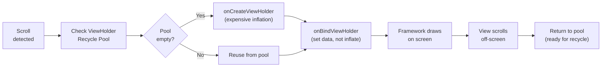

[← Back to main index](../../README.md) | [← Back to folder](../README.md)

---

## 26. RecyclerView Optimization

<details open>
<summary><strong>📱 RecyclerView Draw & Recycle Pipeline</strong></summary>



</details>

---

### ViewHolder & Recycling Best Practices

> [!WARNING]
> **Create ViewHolder in `onCreateViewHolder()` (inflation expensive).** Bind data in `onBindViewHolder()`
> (called on recycle). Never inflate in bind—reuse views!

Recycling pool · ViewHolder pattern · onCreateViewHolder efficiency · Avoid stale references

<details>
<summary>💻 Code Example</summary>

```kotlin
class UserAdapter : RecyclerView.Adapter<UserViewHolder>() {
    override fun onCreateViewHolder(parent: ViewGroup, viewType: Int): UserViewHolder {
        val view = LayoutInflater.from(parent.context).inflate(R.layout.item_user, parent, false)
        return UserViewHolder(view)
    }

    override fun onBindViewHolder(holder: UserViewHolder, position: Int) {
        holder.bind(items[position])  // Called on recycle; reuse view
    }

    override fun getItemCount() = items.size
}

class UserViewHolder(itemView: View) : RecyclerView.ViewHolder(itemView) {
    private val nameView: TextView = itemView.findViewById(R.id.name)
    private val avatarView: ImageView = itemView.findViewById(R.id.avatar)
    fun bind(user: User) {
        nameView.text = user.name
        avatarView.load(user.avatarUrl)  // Coil handles recycle cleanup
    }
}
```

</details>

<details>
<summary>🔩 Under the Hood</summary>

### ViewHolder Recycling Pool

**Framework maintains pool of ViewHolders:**
```
Scroll down → Visible ViewHolder moves off-screen
Framework adds to pool (scrap) → Rebinds with new data → Moves to screen
```

**Pool size:** Typically 3-5 visible items. Only create new holders if pool empty.

**Inflating in onBind = catastrophic:** Adds 10ms per bind (you see 60fps drop).

### Image Loading & Recycle

**Without Coil:**
```
Bind position 0 → Start loading image URL
Scroll → Position 0's ViewHolder recycled to position 10
Image loads → Displays wrong image (stale URL)
```

**With Coil:** Image library cancels old request on recycle, loads new request (no flicker).

### User vs Understander

| A user knows | An understander also knows |
|---|---|
| "Inflate in onCreate, bind in onBind" | ViewHolder pool managed by RecyclerView. onCreate creates once; onBind reuses. Every recycle saves layout inflation. |
| "Don't cache ViewHolder data" | If you cache, and item moves, cache stale. Always use getItem(position) in onBind. |
| "Image libraries handle recycling" | Glide/Coil register lifecycle callbacks. On ViewHolder destroy, requests cancelled (prevent memory leak). |

### Gotchas at depth

- **Large layouts:** If single item layout inflates 100 views, first scroll jank. Flatten hierarchy or use ViewStub for optional views.
- **Unbounded ViewHolder pool:** Some configs set pool size to 0 (all ViewHolders recreated). Causes frame drops on fast scroll.
- **Listener cleanup:** If ViewHolder registers listener (onClick), must unregister in onBind (or listener lives across recycles).

</details>

### DiffUtil for Efficient List Updates

> [!TIP]
> Extend `DiffUtil.ItemCallback<T>` with `areItemsTheSame()` + `areContentsTheSame()`. Use
> `ListAdapter.submitList()` to compute diff and update only changed items.

DiffUtil algorithm · ListAdapter · O(n) cost · Minimal UI updates

<details>
<summary>💻 Code Example</summary>

```kotlin
class UserDiffCallback : DiffUtil.ItemCallback<User>() {
    override fun areItemsTheSame(old: User, new: User) = old.id == new.id
    override fun areContentsTheSame(old: User, new: User) = old == new
}

class UserAdapter : ListAdapter<User, UserViewHolder>(UserDiffCallback()) {
    override fun onBindViewHolder(holder: UserViewHolder, position: Int) {
        holder.bind(getItem(position))
    }
}

// Usage
viewModel.users.onEach { users ->
    adapter.submitList(users)  // DiffUtil computes changes, updates only changed rows
}.launchIn(viewLifecycleOwner.lifecycleScope)
```

</details>

**Impact:** Full refresh notifyDataSetChanged() = O(n) updates. DiffUtil = O(n) compute, but only rebind changed items (typically 1-2 items on scroll).

<details>
<summary>🔩 Under the Hood</summary>

### Myers' Diff Algorithm

**DiffUtil uses Myers algorithm** to find longest common subsequence. Compares old list vs. new list in background thread.

**Result:** Calculate moves, inserts, deletes with minimal rebuilds.

**Cost:** O(n*m) comparison, but fast in practice for small lists (<1000 items).

### ListAdapter & Coroutines

**submitList() async:**
```
Main thread: submitList(newList) called → returns
Background: DiffUtil computes diff
Main thread: Diff result posted back → notifyItemInserted/Remove/Changed
```

**No blocking.** UI stays smooth.

### User vs Understander

| A user knows | An understander also knows |
|---|---|
| "DiffUtil finds changed items" | Uses Myers algorithm (longest common subsequence). O(n*m) time, but <100ms for typical lists. |
| "submitList is async" | ListAdapter offloads diff to background thread. Avoids jank on main thread. |
| "areContentsTheSame triggers rebind" | If true, item visually same, skip rebind. If false, rebind called. Custom equality check lets you optimize. |

### Gotchas at depth

- **List mutation:** Never mutate list after submitList(). Framework compares by reference. Create new list (copy old + changes).
- **Identity vs. equality:** areItemsTheSame checks ID (identity). areContentsTheSame checks equality (content). Both needed.
- **Large diffs:** DiffUtil on 10K items = 1 second compute. Run on IO dispatcher for large lists.

</details>

---

